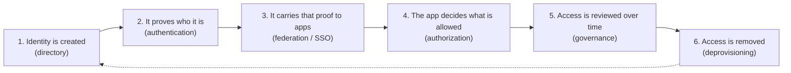

# IAM Security With Labs

A beginner-friendly path into Identity and Access Management (IAM): concepts first, in small steps with diagrams, then hands-on labs that mirror what IAM engineers do at work.

## What IAM is, in one sentence

IAM decides **who (or what) can access which resources, under what conditions**, and how that access is proven, granted, reviewed and removed.

## Aiming for a specific job?

- [Role guide: workforce IAM security engineer](docs/role-guide.md) maps a real job description, line by line, to the chapters and labs here.
- [Tool comparison](docs/tool-comparison.md): OpenBao, CyberArk, SailPoint and Okta side by side.

## The big picture

Everything in this repo is one of those six steps, or a special case of them (privileged users, customers, machines, cloud).

## Learning path

Read the chapters in order. Each one takes 15 to 30 minutes and follows the same shape: one-sentence summary, an everyday analogy, baby steps, a diagram, key terms, common mistakes and a short self-check.

| # | Chapter | The question it answers |
|---|---|---|
| 00 | [Foundations](docs/00-foundations.md) | What are identity, authentication and authorization? |
| 01 | [Directories](docs/01-directories.md) | Where do identities live? |
| 02 | [Authentication](docs/02-authentication.md) | How do you prove who you are? |
| 03 | [Federation and SSO](docs/03-federation-sso.md) | How does one login reach many apps? |
| 04 | [Authorization](docs/04-authorization.md) | How is "what can you do" decided? |
| 05 | [Identity governance (IGA)](docs/05-identity-governance.md) | How is access granted, reviewed and removed? |
| 06 | [Privileged access (PAM)](docs/06-privileged-access.md) | How are admin accounts kept safe? |
| 07 | [Customer identity (CIAM)](docs/07-customer-identity.md) | How is identity different for customers? |
| 08 | [Non-human identity](docs/08-non-human-identity.md) | How do services, bots and AI agents get access? |
| 09 | [Secrets and certificates](docs/09-secrets-certificates.md) | How are passwords, keys and certificates managed? |
| 10 | [Cloud IAM](docs/10-cloud-iam.md) | How do AWS, Azure and GCP permissions work? |
| 11 | [Cross-cutting topics](docs/11-cross-cutting.md) | Hybrid identity, threat detection, zero trust, compliance |
| 12 | [Leading an IAM program](docs/12-iam-program-leadership.md) | How do you plan and build IAM for employees, contractors and partners at scale? |
| 13 | [Workforce identity lifecycle](docs/13-workforce-identity-lifecycle.md) | How does a person flow from the HR system to every app? |
| 14 | [Provisioning and integration patterns](docs/14-provisioning-and-integration-patterns.md) | How do you integrate any app or vendor, including weak ones? |
| 15 | [Okta and Auth0](docs/15-okta-and-auth0.md) | How do the concepts map onto real identity platforms? |
| 16 | [Acquisitions and migrations](docs/16-acquisitions-and-migrations.md) | How do you merge two companies' identity systems? |
| 17 | [IAM engineering: code, CI/CD and AWS](docs/17-iam-engineering-code-cicd-aws.md) | How is identity built and run like software? |
| 18 | [Delivery, rollout and communication](docs/18-delivery-rollout-and-communication.md) | How do you ship a change and explain it simply? |
| -- | [Glossary](docs/glossary.md) | Every term in one place |

## Suggested pace

| Week | Chapters | Goal |
|---|---|---|
| 1 | 00 to 02 | Explain identity, AuthN and AuthZ without notes |
| 2 | 03 to 04 | Draw the SAML and OIDC flows from memory |
| 3 | 05 to 07 | Explain joiner/mover/leaver and why PAM exists |
| 4 | 08 to 11 | Read a cloud IAM policy and say what it allows |
| 5 | 12 to 18 | Trace a hire from HR to an app; plan an acquisition and a rollout |
| 6+ | [Labs](labs/README.md) | Build each concept with your own hands |

## Labs

Start at [labs/README.md](labs/README.md). They are grouped by the job role they prepare you for.

| Lab | What you practise |
|---|---|
| [00 Setup](labs/00-setup/README.md) | Tools, accounts and budget alerts |
| [01 AWS IAM](labs/01-aws-iam/README.md) | Policies, roles, AssumeRole, explicit versus implicit deny |
| [02 AKS identity](labs/02-aks-identity/README.md) | Entra ID login, Azure RBAC, Kubernetes RBAC, workload identity |
| [03 CyberArk Conjur](labs/03-cyberark-conjur/README.md) | Secrets under policy for humans and machines |
| [04 SailPoint-style IGA](labs/04-sailpoint-iga/README.md) | Joiner, mover, leaver, SoD, certification, reconciliation |
| [05 SCIM provisioning](labs/05-scim-provisioning/README.md) | Both sides of SCIM: idempotent sync, bad-feed guard, a vendor that fails to deactivate |

## How to study

1. Read one chapter.
2. Close it and redraw the diagram on paper.
3. Answer the "check yourself" questions out loud.
4. Only then move on. Each chapter builds on the previous one.
