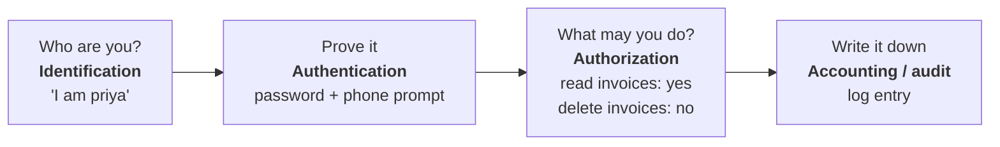
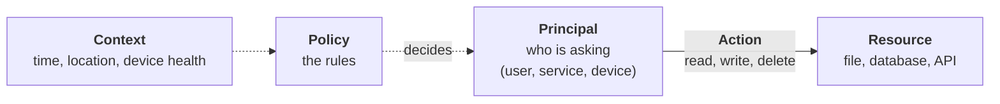
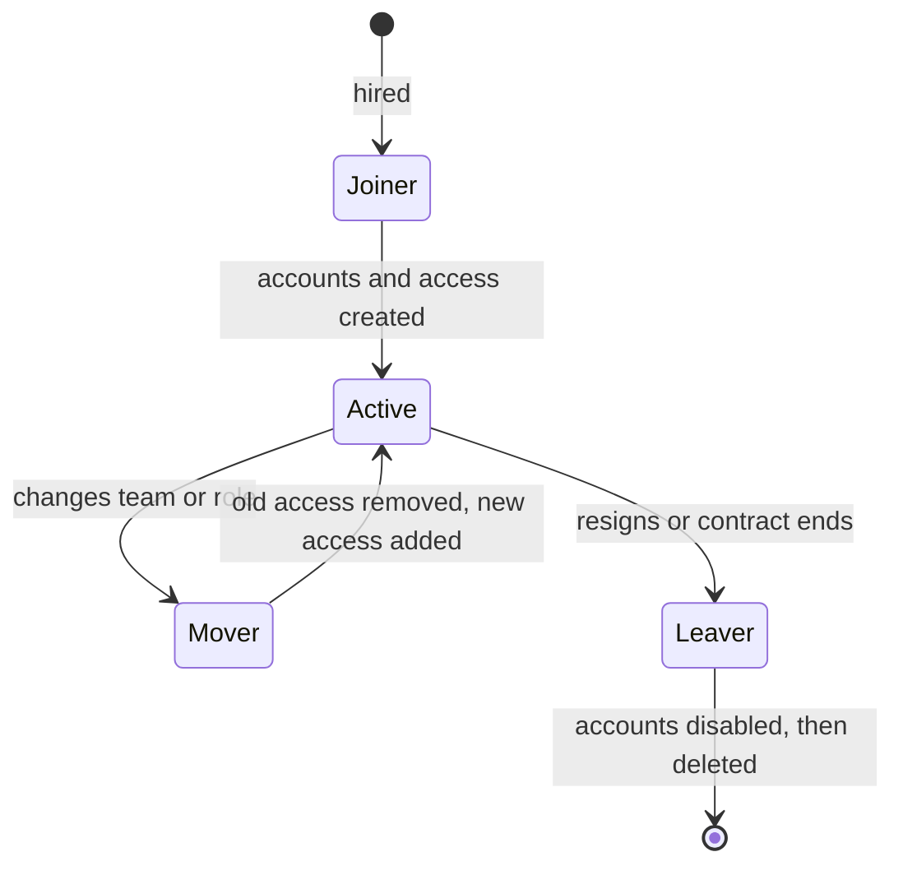

# 00. Foundations

## In one sentence

IAM is the set of people, processes and technology that makes sure the right identity gets the right access to the right resource at the right time, and nothing more.

## Everyday analogy: a hotel

| Hotel | IAM term | Meaning |
|---|---|---|
| You, the guest | **Identity** | A person or thing that needs access |
| Your booking record | **Account** | The record of that identity in one system |
| Showing your passport at the desk | **Authentication** | Proving you are who you claim to be |
| The key card you are handed | **Token / session** | Portable proof that you already authenticated |
| The card opens room 412 and the gym, not the kitchen | **Authorization** | What you are allowed to do |
| The door lock log | **Audit / accounting** | A record of what happened |
| Checkout: the card stops working | **Deprovisioning** | Access is removed when no longer needed |

## Baby steps

### Step 1. Identity versus account

An **identity** is the real thing: Priya the accountant, or the payroll service. An **account** is how one system knows that identity. Priya is one identity with many accounts (email, HR system, laptop login). A big part of IAM is linking all of those accounts back to one identity.

### Step 2. The three questions

Every access request is three questions asked in order.

The most common beginner mistake is mixing up the middle two:

- **Authentication (AuthN)** = *who you are*. The answer is an identity.
- **Authorization (AuthZ)** = *what you may do*. The answer is allow or deny.

A valid login never means "allowed to do everything". You are authenticated once, then authorized on every single action.

### Step 3. The parts of every access decision

Read any access rule as a sentence: *principal* may perform *action* on *resource* when *condition*. For example: "Finance staff may read invoices from a company laptop."

### Step 4. The identity lifecycle

Identities are not static. People join, change jobs and leave. This is called **joiner, mover, leaver (JML)**.

Most real IAM incidents come from the lifecycle going wrong: a leaver whose account still works, or a mover who kept the old access and gained new access on top.

### Step 5. Two guiding principles

- **Least privilege:** give the minimum access needed to do the job, for the minimum time.
- **Separation of duties (SoD):** no single person can complete a risky process alone. The person who creates a vendor should not also approve payments to it.

## Key terms

| Term | Plain meaning |
|---|---|
| Principal / subject | Whoever is asking for access |
| Credential | What you use to prove identity: password, key, certificate |
| Entitlement | A specific piece of access, such as membership of a group |
| Provisioning | Creating accounts and granting access |
| Deprovisioning | Removing them |
| Identity provider (IdP) | The system that authenticates users |

## Common mistakes

- Saying "authentication" when you mean "authorization".
- Thinking IAM is only about logins. Most of the work is lifecycle and governance.
- Granting access "temporarily" with no end date.

## Check yourself

1. A user logs in successfully but gets "403 Forbidden" on a page. Did authentication or authorization fail?
2. Name the three stages of the identity lifecycle.
3. Rewrite as principal/action/resource/condition: "Nurses can view patient records during their shift."

Answers

1. Authorization. Authentication worked (they logged in); they are not permitted to do that action.
2. Joiner, mover, leaver.
3. Principal: nurses. Action: view. Resource: patient records. Condition: during their shift.

Next: [01. Directories](01-directories.md)
