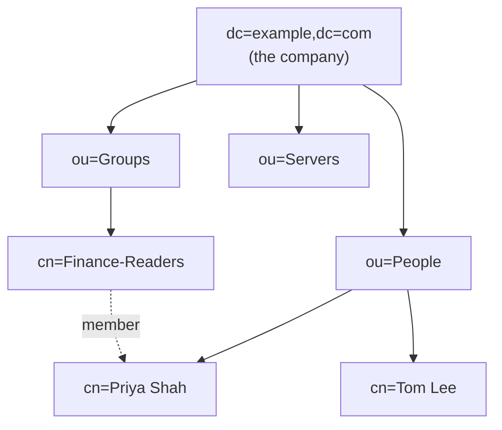
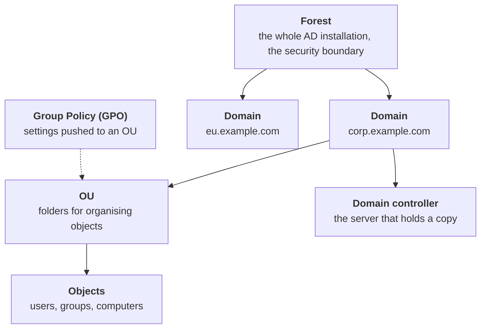
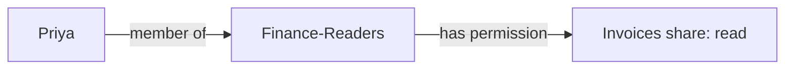

# 01. Directories

## In one sentence

A directory is the database where identities, their attributes and their groups are stored, so every other system can ask "who is this and what groups are they in?"

## Everyday analogy

A directory is a company phone book that also records which teams each person belongs to. Instead of every app keeping its own list of staff, they all look in the same book.

## Baby steps

### Step 1. What a directory stores

Three kinds of thing:

- **Users:** `priya`, with attributes such as email, department and manager.
- **Groups:** `Finance-Readers`, a list of users.
- **Other objects:** computers, service accounts, printers.

### Step 2. It is shaped like a tree

Directories are hierarchical. Each object has a unique path called a **distinguished name (DN)**.



Priya's DN reads from the leaf up to the root: `cn=Priya Shah,ou=People,dc=example,dc=com`.

- `dc` = domain component (the company's domain, split by dots)
- `ou` = organizational unit (a folder)
- `cn` = common name (the object itself)

### Step 3. LDAP is the language

**LDAP** (Lightweight Directory Access Protocol) is how applications talk to a directory. Two operations matter most:

- **Bind:** "here is a username and password, are they correct?"
- **Search:** "give me every user in the Finance department."

A search filter looks like this:

```
(&(objectClass=user)(department=Finance))
```

Read it as: objects that are users **and** whose department is Finance.

### Step 4. The directories you will meet

| Directory | Where it lives | Notes |
|---|---|---|
| **Active Directory (AD)** | On-premises Windows servers called domain controllers | The default in most enterprises. Speaks LDAP and Kerberos. |
| **Microsoft Entra ID** (formerly Azure AD) | Cloud | Not "AD in the cloud". Flat, no OUs, speaks OIDC/SAML. |
| **OpenLDAP** | Linux servers | Open source, common in labs and older Unix estates. |
| **Okta / Ping directories** | Cloud | Built into identity provider products. |

### Step 5. Active Directory in five words



- **Forest:** the top-level container and the true security boundary.
- **Domain:** a partition inside the forest.
- **OU:** a folder used to organise objects and apply policy.
- **Domain controller:** a server holding a copy of the directory. There are several, and they replicate.
- **Group Policy:** configuration (password length, screen lock) applied to everything in an OU.

### Step 6. Why groups matter so much

You almost never grant access to a user directly. You grant it to a group, then put users in the group.



When Priya leaves Finance, you remove her from one group and every permission that came with it disappears.

## Key terms

| Term | Plain meaning |
|---|---|
| Attribute | One fact about an object, such as `mail` or `department` |
| Schema | The rules for which attributes an object may have |
| Authoritative source | The system that is "the truth" for an attribute, usually HR |
| Replication | Copying directory changes between servers |
| sAMAccountName / UPN | AD's short login name / the email-style login name |

## Common mistakes

- Assuming Entra ID is the same thing as Active Directory. They are different products with different protocols.
- Granting permissions directly to users instead of groups.
- Nesting groups so deeply that nobody can tell who has access.

## Check yourself

1. What does `ou=People` mean in a DN?
2. Which is the security boundary in AD: the domain or the forest?
3. Why grant access to groups rather than users?

<details><summary>Answers</summary>

1. An organizational unit (folder) named People.
2. The forest.
3. Access follows the group, so adding or removing one membership changes everything at once and stays manageable at scale.
</details>

Next: [02. Authentication](02-authentication.md)
