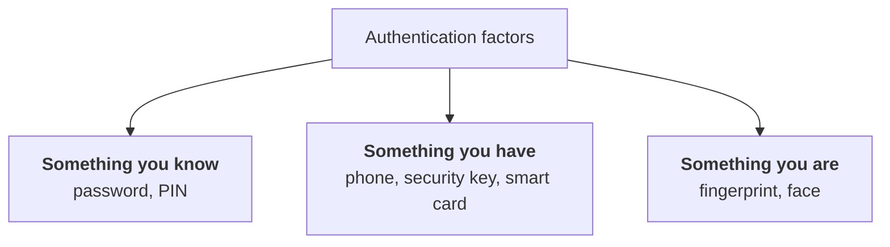
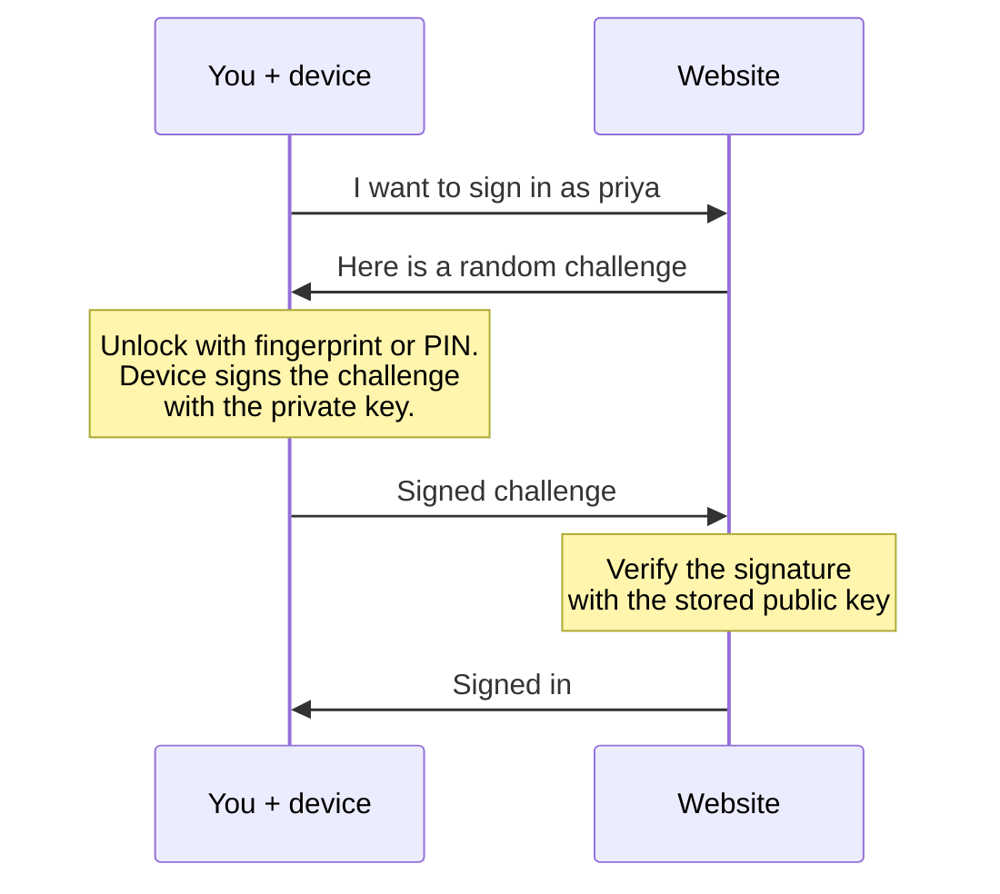
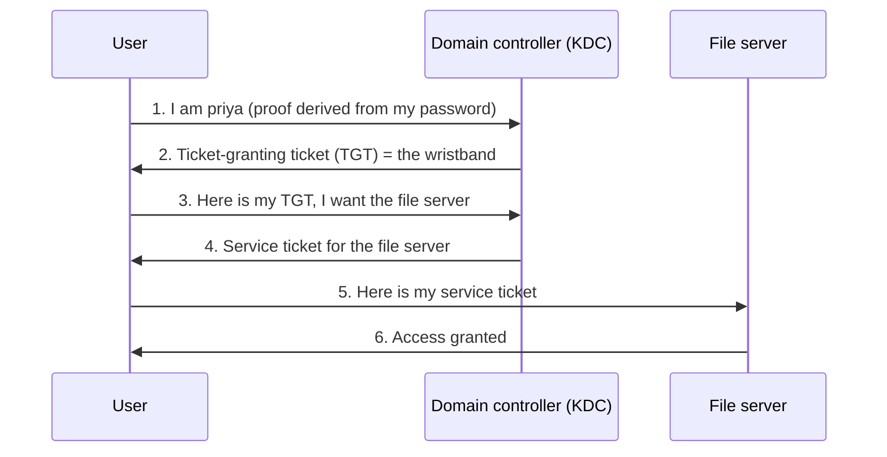
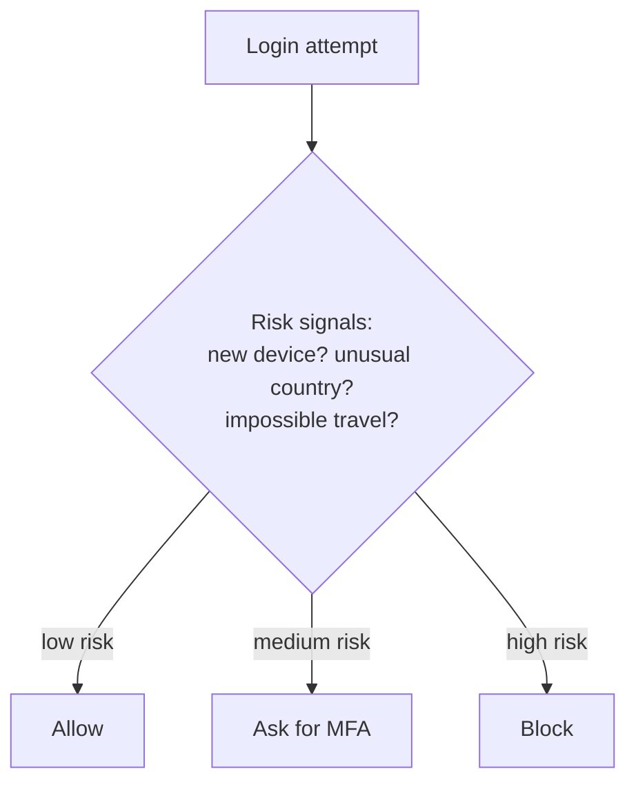

# 02. Authentication

## In one sentence

Authentication is proving that you are the identity you claim to be.

## Everyday analogy

At an airport you say your name (identification) and show a passport (authentication). The passport works because the officer trusts whoever issued it and can check the photo against your face.

## Baby steps

### Step 1. The three kinds of proof

These are called **factors**.

**Multi-factor authentication (MFA)** means using two or more *different kinds*. A password plus a PIN is not MFA, because both are things you know.

### Step 2. Why passwords alone fail

- People reuse them, so one breach unlocks many sites.
- They can be guessed, phished or stolen from a database.
- Attackers try leaked passwords everywhere (**credential stuffing**) or one common password against many accounts (**password spraying**).

### Step 3. The MFA ladder, weakest to strongest

| Method | How it works | Weakness |
|---|---|---|
| SMS code | Code texted to your phone | SIM swap, interception |
| TOTP app | 6-digit code that changes every 30 seconds | Can be phished in real time |
| Push notification | Tap "approve" on your phone | **MFA fatigue**: user approves a prompt they did not start |
| Push with number matching | Type the number shown on screen | Much better, still phishable in some attacks |
| **FIDO2 / passkey** | A cryptographic key bound to the real website | **Phishing-resistant** |

### Step 4. How a passkey (FIDO2 / WebAuthn) works

A passkey is a key pair. The **private key** never leaves your device. The website stores only the **public key**.

It resists phishing because the key is tied to the real site's domain. A fake site at `examp1e.com` simply gets no valid signature.

### Step 5. Kerberos: how Windows networks log in

Kerberos is the authentication protocol inside Active Directory. The idea is **tickets**: you prove yourself once, then present tickets instead of your password.

Analogy: a theme park. You show ID at the gate once and get a wristband. For each ride you swap the wristband for a ride ticket.

- **KDC** = key distribution center, which runs on the domain controller.
- **TGT** = ticket-granting ticket, valid for about 10 hours by default.
- **Service ticket** = valid for one specific service.
- The password is never sent over the network.

### Step 6. Sessions and tokens

After you authenticate, the system gives you something to carry so you do not log in on every click: a **session cookie** or a **token**. Whoever holds it is treated as you. This is why stealing a token is as good as stealing a password, and why tokens expire.

### Step 7. Adaptive (risk-based) authentication

Modern systems look at **context** before deciding how much proof to ask for.

Microsoft calls this **Conditional Access**. The general term is adaptive or risk-based authentication.

## Key terms

| Term | Plain meaning |
|---|---|
| Credential | The thing used to prove identity |
| Passwordless | Signing in with no password, usually a passkey |
| SSO | Single sign-on: log in once, reach many apps (next chapter) |
| NTLM | An older Windows authentication protocol being retired in favour of Kerberos |
| Step-up authentication | Asking for stronger proof before a sensitive action |

## Common mistakes

- Calling two passwords "two-factor".
- Treating SMS as strong MFA.
- Forgetting that the session token after login needs protecting too.

## Check yourself

1. Is a password plus a security question MFA?
2. Why is a passkey phishing-resistant?
3. In Kerberos, what is a TGT used for?

Answers

1. No. Both are "something you know".
2. The private key only signs challenges for the genuine site's domain, and the key itself never leaves the device.
3. To request service tickets without re-entering the password.

Next: [03. Federation and SSO](03-federation-sso.md)
