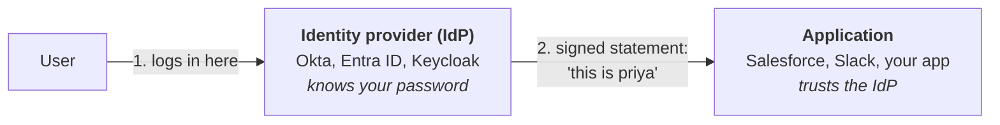
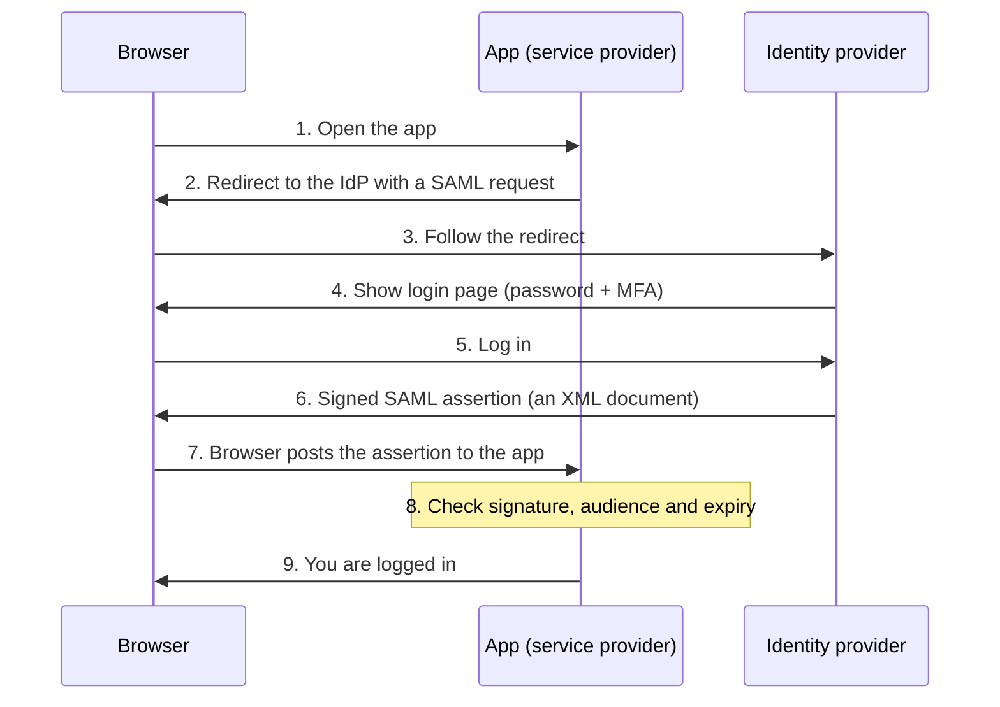
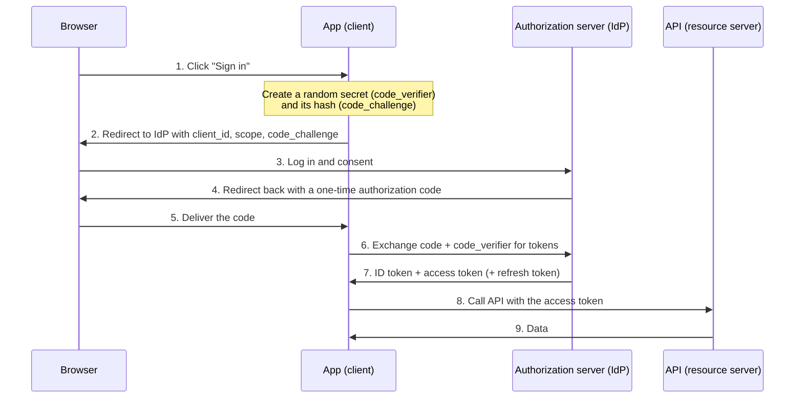
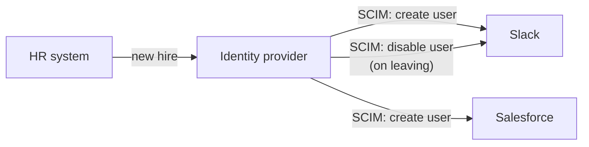

# 03. Federation and SSO

## In one sentence

Federation lets one system (the identity provider) vouch for a user to another system (the application), so the user logs in once and the application never sees their password.

## Everyday analogy

Your passport is issued by your government, yet a foreign border accepts it. The border does not know you; it **trusts the issuer** and checks that the document is genuine. Federation is the same: the app trusts the identity provider's signed statement about you.

## Baby steps

### Step 1. Two roles



- **IdP:** authenticates the user and issues a signed statement.
- **Application:** called the **service provider (SP)** in SAML and the **relying party (RP)** or **client** in OIDC. Same idea, different names.

### Step 2. Trust is set up in advance

Before any login, an administrator exchanges configuration between the two: the IdP's signing certificate or keys, and the URLs each side will use. After that the app can check that a statement really came from the IdP and was not altered.

### Step 3. Three protocols, three jobs

| Protocol | Job | Format | Typical use |
|---|---|---|---|
| **SAML 2.0** | Authentication (SSO) | XML | Enterprise web apps |
| **OAuth 2.0** | **Delegated authorization** (access to an API) | Usually JWT access tokens | APIs, mobile apps |
| **OpenID Connect (OIDC)** | Authentication, built on top of OAuth 2.0 | JWT | Modern web and mobile login |

The sentence to remember: **OAuth is about access to APIs. OIDC adds "who the user is" on top of OAuth. SAML is the older XML way of doing SSO.**

### Step 4. SAML login, step by step



The **assertion** is the signed XML saying "this is priya, here are her attributes, valid for the next few minutes, intended for this app only".

### Step 5. OAuth 2.0: the four roles

Analogy: valet parking. You give the valet a special key that starts the car but does not open the boot. You have delegated limited access without handing over your full key.

| Role | Who | In the analogy |
|---|---|---|
| **Resource owner** | The user | You |
| **Client** | The app wanting access | The valet |
| **Authorization server** | Issues tokens (the IdP) | The valet key maker |
| **Resource server** | The API holding the data | The car |

The limits on the token are called **scopes**, for example `calendar.read`. A scope is a named slice of access the user consents to.

### Step 6. OIDC login: authorization code flow with PKCE

This is the flow to know. It is what "Sign in with Google" does.



**PKCE** (said "pixie") stops someone who steals the code in step 4 from using it, because they do not have the `code_verifier` from step 1.

### Step 7. The three tokens

| Token | Who it is for | What it says | Lifetime |
|---|---|---|---|
| **ID token** | The client app | Who the user is | Minutes |
| **Access token** | The API | What the client may do (scopes) | Minutes to an hour |
| **Refresh token** | The authorization server | "Give me a new access token" | Days to months |

A common error is sending the ID token to an API. APIs take access tokens.

### Step 8. Inside a JWT

A **JSON Web Token** is three base64url parts joined by dots: `header.payload.signature`.

```json
{
  "iss": "https://idp.example.com",
  "sub": "user-1234",
  "aud": "invoice-api",
  "exp": 1790000000,
  "scope": "invoices.read"
}
```

| Claim | Meaning | What to check |
|---|---|---|
| `iss` | Issuer | Is it the IdP I trust? |
| `sub` | Subject, the user's ID | Who is this? |
| `aud` | Audience | Was this token meant for **me**? |
| `exp` | Expiry | Has it expired? |
| signature | | Does it verify against the IdP's public key? |

A JWT is **signed, not encrypted**. Anyone can read the payload, so never put secrets in it.

### Step 9. SCIM: federation's partner for provisioning

SSO logs users in, but the account still has to exist in the app. **SCIM** is a standard API that lets the IdP create, update and disable accounts in apps automatically.



## Other OAuth flows to recognise

| Flow | Use |
|---|---|
| Authorization code + PKCE | Users signing in (web, mobile, single-page apps) |
| Client credentials | Service to service, no user involved |
| Device code | TVs and CLI tools with no browser |
| Implicit, password (ROPC) | Deprecated. Do not use. |

## Common mistakes

- Saying "OAuth login". OAuth alone does not authenticate users; OIDC does.
- Not validating `aud`, so a token meant for another app is accepted.
- Long-lived access tokens with no refresh or revocation plan.

## Check yourself

1. Which token should an API accept: ID token or access token?
2. What problem does PKCE solve?
3. SSO works but new hires have no account in the app. Which standard fixes that?

<details><summary>Answers</summary>

1. The access token.
2. It stops a stolen authorization code being exchanged for tokens by an attacker.
3. SCIM.
</details>

Next: [04. Authorization](04-authorization.md)
