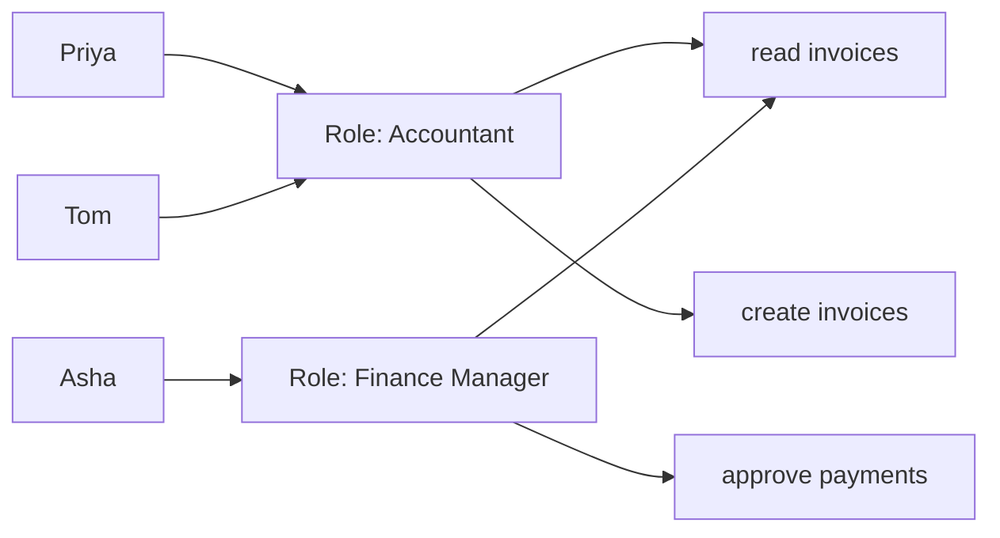
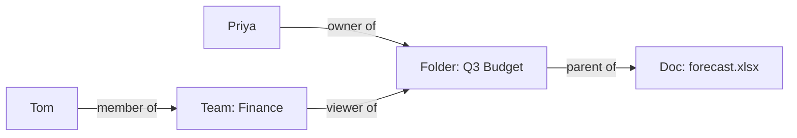
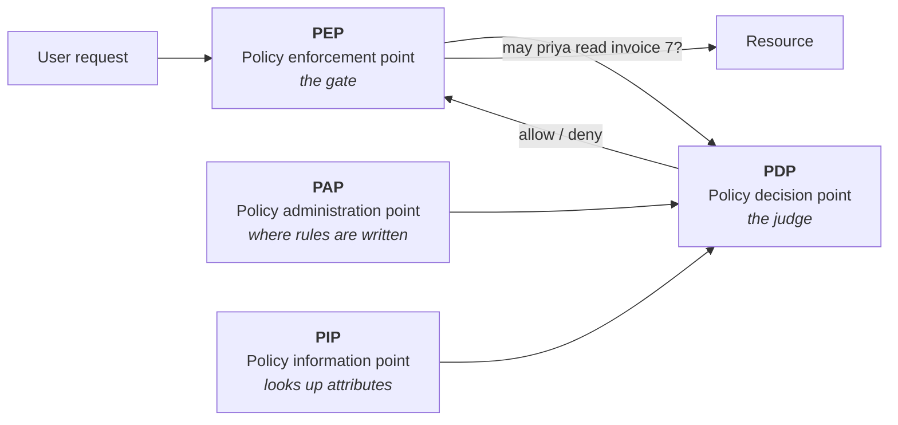

# 04. Authorization

## In one sentence

Authorization decides whether an already-authenticated identity may perform a specific action on a specific resource.

## Everyday analogy

A hospital badge proves who you are at the front door. Whether it opens the pharmacy depends on your job (role), your current shift (attribute) and whether the patient is yours (relationship). Those are the three main authorization models.

## Baby steps

### Step 1. The simplest model: access control lists (ACL)

Each resource carries a list of who can do what.

| File | Priya | Tom |
|---|---|---|
| invoices.xlsx | read, write | read |

This works for ten files. It does not work for ten million.

### Step 2. RBAC: role-based access control

Put permissions into **roles**, then give users roles.



- **Strength:** simple to understand and audit. "What can an Accountant do?" has one answer.
- **Weakness:** **role explosion**. "Accountant, UK, part-time, night shift" becomes its own role, and soon there are more roles than people.

### Step 3. ABAC: attribute-based access control

Decide using **attributes** of the user, the resource and the context.

> Allow if `user.department == resource.department` and `user.clearance >= resource.classification` and `time is within working hours`.

- **Strength:** very flexible. One rule replaces hundreds of roles.
- **Weakness:** harder to answer "who can access this?" just by looking.

### Step 4. ReBAC: relationship-based access control

Decide using **relationships** between things. This is how Google Docs sharing works.



Tom can view `forecast.xlsx` because he is in a team that can view the folder that contains it. Nobody granted Tom that document directly.

### Step 5. Which model when

| Model | Decide by | Good for | Example product |
|---|---|---|---|
| RBAC | Job role | Enterprise apps, cloud consoles | AD groups, Kubernetes RBAC |
| ABAC | Attributes and context | Fine-grained, dynamic rules | AWS IAM conditions |
| ReBAC | Relationships | Sharing, hierarchies, multi-tenant apps | Google Zanzibar, OpenFGA, SpiceDB |

Real systems mix them: roles for the coarse shape, attributes for the conditions.

### Step 6. Where the decision is made

Good design separates **asking** from **deciding**. These four names come up constantly.



- **PEP:** the gate that stops the request and asks (an API gateway, a piece of middleware).
- **PDP:** the engine that evaluates policy and answers allow or deny.
- **PAP:** where humans write the policy.
- **PIP:** where the PDP fetches extra facts (department, device health).

### Step 7. Policy as code

Instead of scattering `if user.is_admin` through application code, write the rules in one place in a policy language. Two to know:

**Rego** (Open Policy Agent):

```rego
allow if {
    input.user.role == "accountant"
    input.action == "read"
    input.resource.type == "invoice"
}
```

**Cedar** (AWS):

```
permit (
    principal in Role::"accountant",
    action == Action::"read",
    resource in Folder::"invoices"
);
```

### Step 8. Two rules that apply everywhere

- **Default deny:** if no rule allows it, the answer is no.
- **Explicit deny wins:** if one rule allows and another denies, deny wins.

## Key terms

| Term | Plain meaning |
|---|---|
| Permission | One allowed action on one kind of resource |
| Role | A named bundle of permissions |
| Coarse-grained | "Can use the Finance app" |
| Fine-grained | "Can read invoice 7 but not invoice 8" |
| Scope (OAuth) | What a *client app* may do on the user's behalf. Not the same as a user's permission. |

## Common mistakes

- Using OAuth scopes as if they were the user's permissions. The API still has to check what the user may do.
- Checking authorization only in the user interface. It must be enforced on the server.
- **IDOR / broken object-level authorization:** the API checks that you are logged in but not that invoice 8 belongs to you.

## Check yourself

1. Which model suits "a document's owner can share it with anyone"?
2. What is role explosion?
3. A request matches one allow rule and one deny rule. What is the outcome?

<details><summary>Answers</summary>

1. ReBAC.
2. Creating so many narrowly specific roles that they become unmanageable.
3. Deny.
</details>

Next: [05. Identity governance](05-identity-governance.md)
