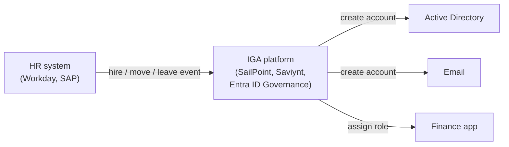
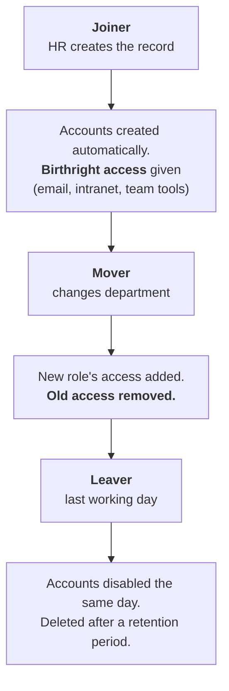
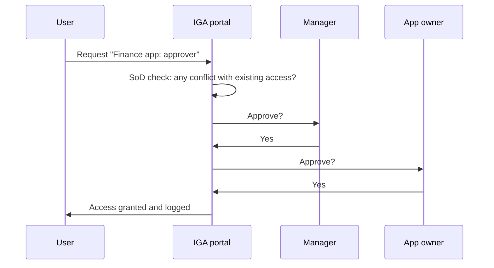
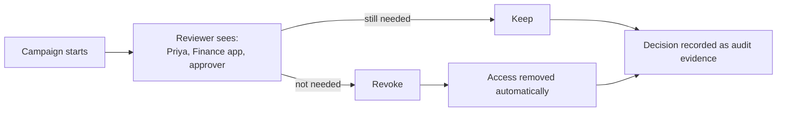

# 05. Identity governance and administration (IGA)

## In one sentence

IGA manages the full life of access: how it is requested, approved, granted, reviewed and removed, with evidence that each step happened.

## Everyday analogy

A gym membership desk. Someone signs you up, decides which classes your plan includes, checks every year that you still want it, and cancels your card when you leave. Without the desk, old cards would work forever.

## Baby steps

### Step 1. Why governance exists

Authentication and authorization answer "can Priya do this *now*?" Governance answers:

- **Should** she have this access at all?
- Who approved it, and when?
- Does she still need it?
- Was it removed when she left?

Auditors ask exactly these questions.

### Step 2. HR is the source of truth

Automated lifecycle starts from the HR system.

### Step 3. Joiner, mover, leaver in detail

- **Birthright access:** what everyone in a role gets automatically on day one.
- The mover step is where things go wrong. If old access is not removed, people accumulate permissions over the years. This is **privilege creep**.

### Step 4. Access requests

For anything beyond birthright, the user asks.

### Step 5. Separation of duties (SoD)

Some combinations of access are **toxic** because together they let one person commit fraud.

| Access A | Access B | Why it is toxic |
|---|---|---|
| Create vendor | Approve payment | Could pay a fake vendor |
| Write code | Deploy to production | Could ship unreviewed changes |
| Request access | Approve access | Could self-approve |

The IGA tool blocks or flags requests that would create such a pair.

### Step 6. Access reviews (certifications)

Every quarter or year, managers and app owners look at a list and confirm or revoke.

The well-known failure is **rubber-stamping**: a manager clicking "approve all" on 400 lines without reading them.

### Step 7. Role mining and orphaned accounts

- **Role mining:** analysing who already has what to discover sensible roles.
- **Orphaned account:** an account with no known owner, usually a leaver's account that was missed. A favourite of attackers.
- **Reconciliation:** comparing what the IGA tool thinks exists with what actually exists in each app, to catch access granted behind its back.

## Key terms

| Term | Plain meaning |
|---|---|
| Entitlement | One grantable item of access |
| Access certification | A formal periodic review of who has what |
| Provisioning connector | The integration that lets the IGA tool create accounts in an app |
| Attestation | A signed-off statement that access is correct |
| SOX, PCI DSS, HIPAA | Regulations that require access controls and reviews |

## Common mistakes

- Handling joiners and leavers well and forgetting movers.
- Disabling the main account on departure but missing accounts in apps outside SSO.
- Treating access reviews as a tick-box exercise.

## Check yourself

1. What is privilege creep and which lifecycle stage causes it?
2. Give one example of a toxic combination.
3. What is an orphaned account?

Answers

1. Accumulating access over time because old access is not removed. Caused by the mover stage.
2. Creating a vendor and approving its payments.
3. An account with no valid owner, often left behind by a leaver.

Next: [06. Privileged access](06-privileged-access.md)
