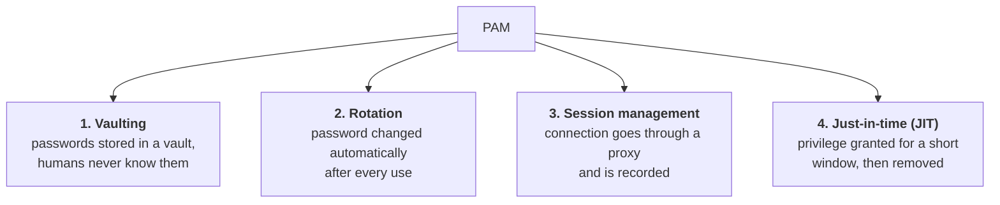
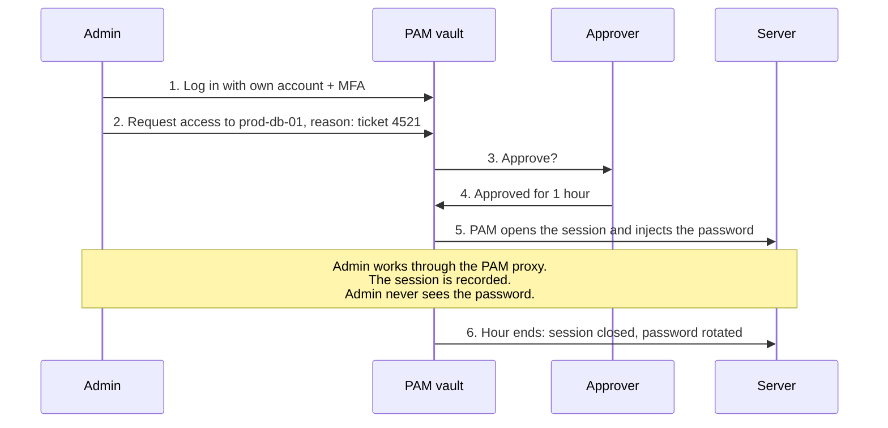
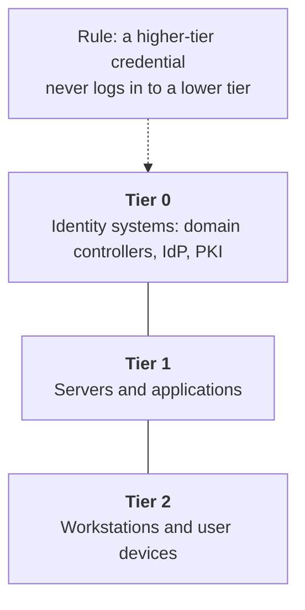

# 06. Privileged access management (PAM)

## In one sentence

PAM protects the small number of accounts that can do the most damage, by locking up their credentials, granting their power only when needed and recording what is done with it.

## Everyday analogy

A bank's master key is not on anyone's keyring. It sits in a safe. To use it you sign it out, a camera records you, and it goes back afterwards, at which point the lock is changed.

## Baby steps

### Step 1. What makes an account "privileged"

An account is privileged if it can change security settings, read everyone's data or control other accounts.

| Privileged account | Where |
|---|---|
| Domain Admin | Active Directory |
| root | Linux |
| Local Administrator | Windows machines |
| Global Administrator | Microsoft Entra ID |
| AWS account root user | AWS |
| Database admin (`sa`, `sys`) | Databases |
| Service accounts with broad rights | Everywhere |

Attackers aim for these. A normal breach becomes a disaster at the moment a privileged account is taken.

### Step 2. The problems PAM solves

- Admin passwords written in spreadsheets or shared between a team.
- The same local admin password on every laptop.
- Admins who have full power all day, even while reading email.
- No record of who did what while logged in as `root`.

### Step 3. The four core PAM controls

### Step 4. Checking out a privileged session

### Step 5. Standing privilege versus just-in-time

| | Standing privilege | Just-in-time |
|---|---|---|
| When is the power active? | Always | Only when requested |
| If the account is phished | Attacker is admin immediately | Attacker has an ordinary account |
| Example | Permanent Domain Admin | Entra PIM: activate Global Admin for 1 hour |

The goal is **zero standing privilege (ZSP)**: nobody is an admin by default.

### Step 6. Separate admin accounts and tiering

An admin should have two accounts: `priya` for email and browsing, `priya-adm` for administration. If `priya` opens a malicious attachment, the admin credentials are not on that session.

**Tiering** takes this further: credentials for the most critical systems are never used on less trusted machines.

### Step 7. Break-glass accounts

If the identity provider or MFA is down, nobody can log in to fix it. A **break-glass account** is an emergency admin account that bypasses the usual path. It has a very long password stored offline (often split between two people), is excluded from normal policies, and raises a loud alert whenever it is used.

## Key terms

| Term | Plain meaning |
|---|---|
| Vault | Secure store for privileged credentials |
| Jump host / bastion | A hardened server you must pass through to reach others |
| PAW | Privileged access workstation: a locked-down machine used only for admin work |
| LAPS | Microsoft tool that gives every machine a unique, rotated local admin password |
| Privilege escalation | An attacker going from ordinary user to admin |
| Lateral movement | An attacker hopping from machine to machine using stolen credentials |

## Products you will hear about

CyberArk, BeyondTrust, Delinea, HashiCorp Vault (secrets and dynamic credentials), Microsoft Entra PIM, AWS IAM Identity Center with temporary elevation.

## Common mistakes

- Vaulting human admin passwords and ignoring service accounts.
- Using the admin account for email and web browsing.
- Having no tested break-glass account.

## Check yourself

1. Name the four core PAM controls.
2. Why does JIT reduce the damage from phishing?
3. What is a break-glass account for?

Answers

1. Vaulting, rotation, session management, just-in-time access.
2. The phished account has no admin rights unless someone has activated them, and activation needs approval or MFA.
3. Emergency access when the normal login path is unavailable.

Next: [07. Customer identity](07-customer-identity.md)
