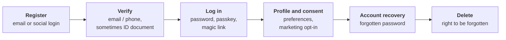
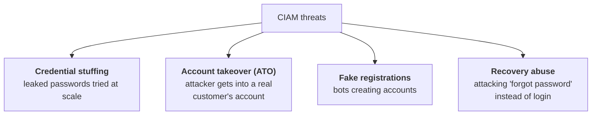

# 07. Customer identity (CIAM)

## In one sentence

CIAM is identity for people outside your company (customers, patients, citizens), where sign-up must be easy, scale is huge and privacy law applies.

## Everyday analogy

Employee identity is a staff entrance: everyone is known, badges are issued, rules are mandatory. Customer identity is the shop's front door: anyone can walk in, you want them to enjoy it, and you must not be careless with what you learn about them.

## Baby steps

### Step 1. Workforce versus customer identity

| | Workforce IAM | CIAM |
|---|---|---|
| Who | Employees, contractors | Customers, the public |
| How accounts start | Created by HR | **Self-registration** |
| Scale | Thousands | Millions |
| Priority | Control and compliance | Ease of use *and* security |
| Friction | Mandatory MFA is acceptable | Too much friction loses the sale |
| Law | Employment policy | GDPR, CCPA, consent rules |

### Step 2. The customer journey

### Step 3. Social login

"Sign in with Google" is OIDC from chapter 03. Your app is the client and Google is the identity provider. The customer avoids creating another password, and you avoid storing one.

### Step 4. Progressive profiling

Do not ask for twenty fields at sign-up. Ask for an email now, the delivery address at first purchase and a date of birth only when age matters. Collect data at the moment it is needed.

### Step 5. Consent and privacy

- Record **what** the customer agreed to and **when**.
- Let them see, export and delete their data.
- Collect only what you need (**data minimisation**).

### Step 6. The threats are different

Defences: breached-password checks, rate limiting, bot detection, risk-based MFA (only challenge when something looks wrong) and passkeys.

Account recovery deserves special attention. It is a second way in, so it must be at least as strong as the login itself.

### Step 7. B2B and multi-tenancy

When your customers are other companies, each one is a **tenant**. They expect to bring their own identity provider (federation), manage their own users (**delegated administration**) and have their data separated from other tenants.

## Key terms

| Term | Plain meaning |
|---|---|
| Self-service | Users register and recover accounts without staff help |
| Magic link | A one-time login link sent by email |
| Identity proofing | Checking a real-world identity, for example with an ID document |
| Tenant | One customer organisation within a shared platform |
| ATO | Account takeover |

## Products you will hear about

Auth0 (Okta Customer Identity), Microsoft Entra External ID, Amazon Cognito, Ping Identity, ForgeRock, Keycloak.

## Common mistakes

- A strong login with a weak "forgot password" flow.
- Forcing every customer through heavy MFA, then wondering why sign-ups drop.
- Error messages that reveal whether an email is registered (**user enumeration**).

## Check yourself

1. Name two differences between workforce IAM and CIAM.
2. What is progressive profiling?
3. Why is account recovery a security risk?

Answers

1. Any two of: self-registration, much larger scale, user experience priority, privacy and consent law.
2. Collecting profile data gradually, at the point it is needed.
3. It is an alternative path into the account, and is often weaker than the login.

Next: [08. Non-human identity](08-non-human-identity.md)
