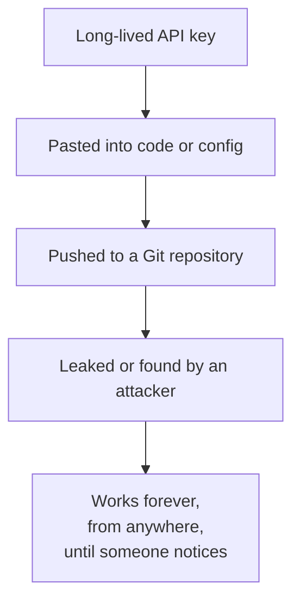
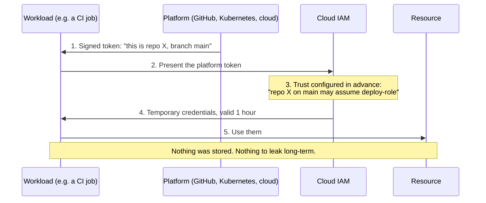
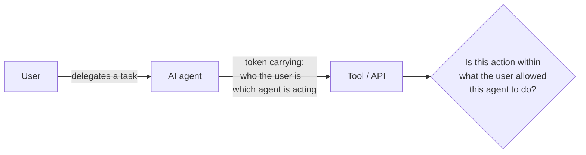

# 08. Non-human identity (NHI)

## In one sentence

Non-human identities are the accounts and credentials used by software (services, scripts, pipelines, bots and AI agents) rather than by people.

## Everyday analogy

A delivery robot in an office needs to get through doors too. It cannot remember a password or tap a phone, so it needs its own kind of badge, and someone must own it and take the badge back when the robot is retired.

## Baby steps

### Step 1. Why this matters

In most organisations machine identities outnumber human ones many times over. They often have broad access, no MFA, no owner and credentials that never expire. Many large breaches begin with a leaked API key.

### Step 2. The kinds of non-human identity

| Type | Example |
|---|---|
| Service account | An AD account a Windows service runs as |
| API key | A long string an app sends to call an API |
| OAuth client | An app registration using the client credentials flow |
| Cloud workload identity | An AWS IAM role on an EC2 instance, an Azure managed identity |
| Kubernetes service account | The identity of a pod |
| CI/CD identity | A GitHub Actions workflow deploying to the cloud |
| AI agent | An LLM agent calling tools on a user's behalf |

### Step 3. The core problem: static secrets

A static secret is like a house key that can be copied without limit and never changes.

### Step 4. The fix: short-lived credentials from a proven identity

Instead of *giving* the workload a secret, let the platform **vouch for it**, then issue a token that expires quickly.

This pattern is called **workload identity federation**. It is chapter 03's federation applied to machines: the platform is the identity provider, and the cloud trusts its signed token.

### Step 5. The same idea in each platform

| Platform | Mechanism |
|---|---|
| AWS | IAM roles for EC2, ECS and Lambda; IRSA or Pod Identity for EKS |
| Azure | Managed identities; workload identity federation |
| GCP | Service accounts attached to resources; Workload Identity Federation |
| Kubernetes | Projected service account tokens |
| GitHub Actions | OIDC tokens exchanged for cloud roles |
| Any platform | **SPIFFE/SPIRE**: an open standard giving each workload a verifiable ID |

### Step 6. Lifecycle applies to machines too

Every non-human identity needs:

1. **An owner:** a named human or team.
2. **A purpose:** what it is for.
3. **Least privilege:** only the access that purpose needs.
4. **Rotation or expiry:** credentials that do not live forever.
5. **Decommissioning:** removal when the system is retired.

### Step 7. AI agents

An AI agent acts for a user and can call tools. That raises new questions.

- The agent should have **its own identity**, not borrow the user's full session.
- Its access should be **narrower** than the user's and scoped to the task.
- The audit log should record both the user and the agent.
- Risky actions should require a human to confirm.

OAuth token exchange ("on-behalf-of") is the usual building block.

## Key terms

| Term | Plain meaning |
|---|---|
| Machine identity / workload identity | An identity for software |
| Secret sprawl | Secrets scattered across code, configs and chat messages |
| Client credentials flow | OAuth flow for service-to-service calls |
| mTLS | Both sides of a connection prove identity with certificates |
| SPIFFE ID | A standard name for a workload, e.g. `spiffe://example.com/payments` |

## Common mistakes

- Secrets committed to source control.
- One service account shared by many applications, so nobody dares to rotate it.
- Giving a service account admin rights "to make it work".

## Check yourself

1. Why are static API keys risky?
2. What does workload identity federation replace?
3. Name three things every non-human identity should have.

Answers

1. They do not expire, can be copied and work from anywhere if leaked.
2. Stored long-lived secrets, with short-lived tokens issued on the basis of a platform-signed identity.
3. Any three of: owner, purpose, least privilege, rotation or expiry, decommissioning.

Next: [09. Secrets and certificates](09-secrets-certificates.md)
