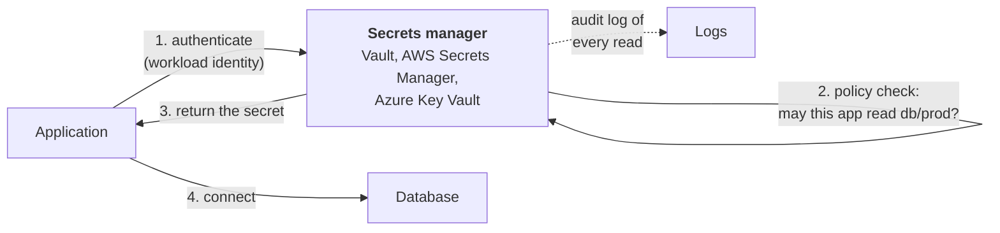
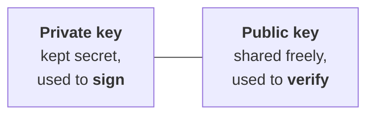
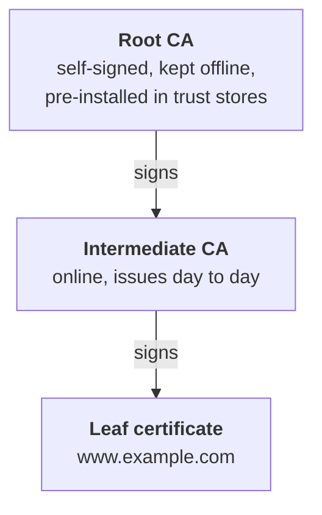
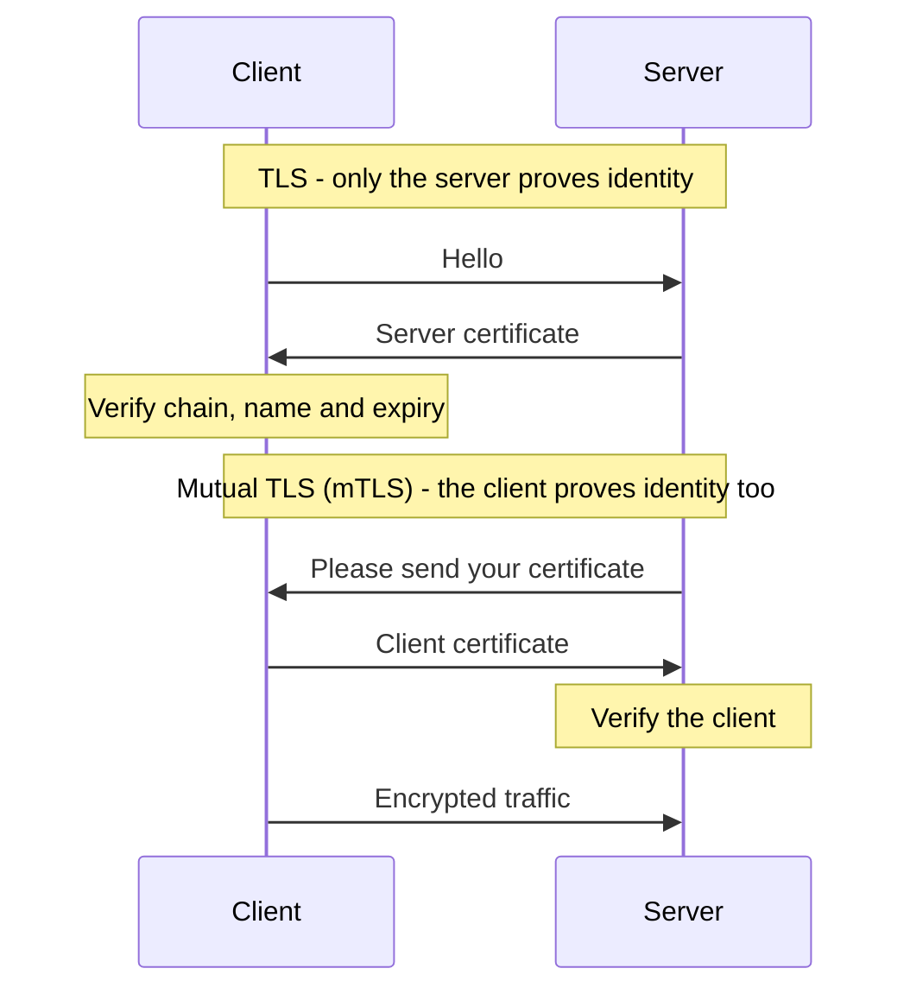
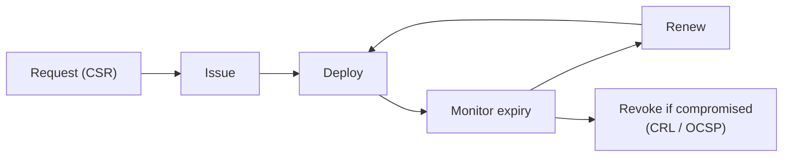

# 09. Secrets and certificates

## In one sentence

Secrets management stores and rotates credentials safely, and public key infrastructure (PKI) issues the certificates that let machines and people prove identity cryptographically.

## Everyday analogy

A secret is a house key: whoever holds a copy gets in. A certificate is a passport: it states who you are and is stamped by an authority others trust, so it can be checked without phoning anyone.

## Part A. Secrets

### Step 1. What counts as a secret

Passwords, API keys, database connection strings, tokens, private keys, encryption keys.

### Step 2. Where secrets should not be

Source code, config files in Git, container images, chat messages, wiki pages, environment files on shared drives.

### Step 3. A secrets manager

What it gives you: one encrypted store, access control on each secret, an audit trail and automatic rotation.

### Step 4. Static versus dynamic secrets

| | Static secret | Dynamic secret |
|---|---|---|
| Created | Once, by a human | On demand, by the secrets manager |
| Lifetime | Until someone rotates it | Minutes or hours |
| Shared? | Often by many apps | Unique per request |
| If leaked | Works until noticed | Expires on its own |

With dynamic secrets, Vault creates a brand-new database user for each application request and deletes it when the lease ends.

### Step 5. Rotation

Changing a secret on a schedule or after each use. Rotation limits how long a stolen secret remains useful. It only works if applications fetch the secret at run time rather than having it baked in.

## Part B. Certificates and PKI

### Step 6. Key pairs

Public key cryptography uses two mathematically linked keys.

If a signature verifies with your public key, it must have been made with your private key. That is proof of identity without revealing any secret.

### Step 7. What a certificate is

A certificate binds a **public key** to a **name**, and is signed by a **certificate authority (CA)**.

| Field | Example |
|---|---|
| Subject | `www.example.com` |
| Public key | (the key) |
| Issuer | Example Issuing CA |
| Valid from / to | 1 Jan 2026 to 1 Apr 2026 |
| Signature | The CA's signature over all of the above |

### Step 8. The chain of trust

Your browser trusts the leaf because it trusts the root and can follow the signatures down. The root stays offline so that a compromise of the intermediate can be recovered from.

### Step 9. TLS and mutual TLS

mTLS is common between microservices and is the basis of smart card login.

### Step 10. Certificate lifecycle

The most common PKI incident is the dullest one: **a certificate expired and nobody noticed**, taking a service down. Automation (the ACME protocol, cert-manager) exists to prevent it.

### Step 11. Active Directory Certificate Services (ADCS)

ADCS is Microsoft's on-premises CA, used for smart cards, Wi-Fi and device certificates. Misconfigured **certificate templates** are a well-known route for attackers to become domain admin, so ADCS is treated as a Tier 0 system.

## Key terms

| Term | Plain meaning |
|---|---|
| KMS | Key management service: holds encryption keys, performs crypto operations |
| HSM | Hardware security module: tamper-resistant hardware that holds keys |
| CSR | Certificate signing request |
| CRL / OCSP | Ways to check whether a certificate has been revoked |
| Envelope encryption | Encrypt data with a data key, then encrypt that key with a master key |

## Common mistakes

- Encrypting a secret and storing the decryption key beside it.
- Wildcard certificates copied onto dozens of servers.
- No inventory of certificates and their expiry dates.

## Check yourself

1. What is the difference between a static and a dynamic secret?
2. Why is the root CA kept offline?
3. What does mTLS add to ordinary TLS?

Answers

1. A static secret is long-lived and shared; a dynamic secret is generated on demand and expires quickly.
2. If it were compromised, every certificate beneath it would be untrustworthy and there would be no way to recover.
3. The client also presents a certificate, so both sides are authenticated.

Next: [10. Cloud IAM](10-cloud-iam.md)
