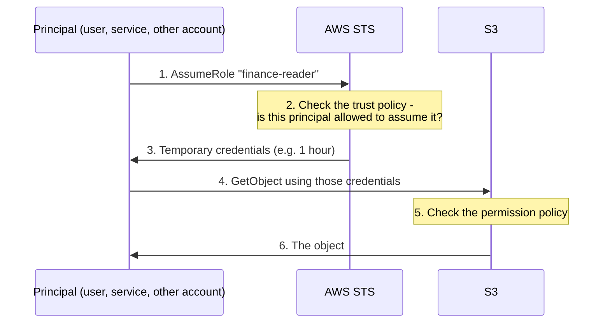
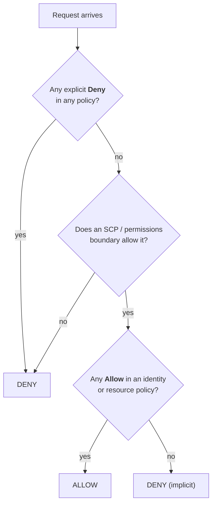
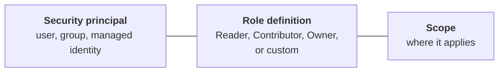
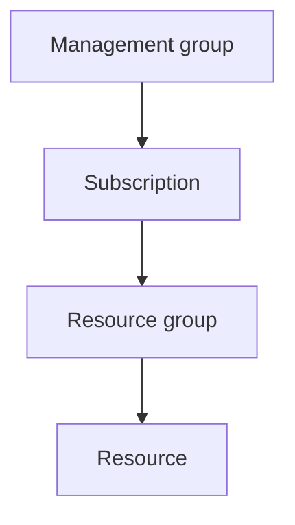
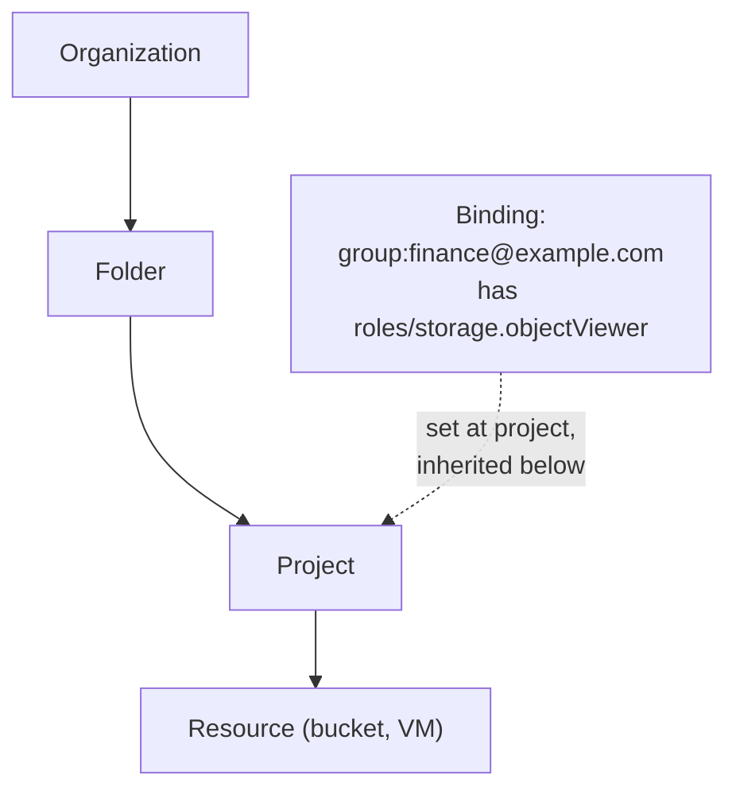
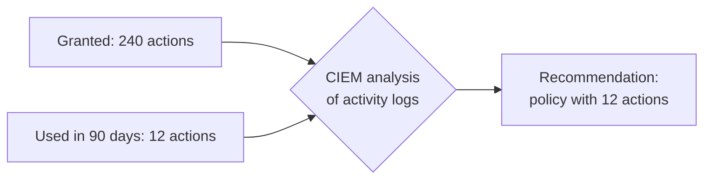

# 10. Cloud IAM

## In one sentence

Cloud IAM is the permission system inside AWS, Azure and GCP that decides which principal may call which cloud API on which resource.

## Everyday analogy

In the cloud, everything is an API call: creating a server, reading a file, deleting a database. Cloud IAM is the bouncer standing in front of every one of those calls with a rulebook.

## Baby steps

### Step 1. The same sentence as chapter 00

Every cloud permission is still: **principal** may do **action** on **resource** under **condition**. Each cloud just spells it differently.

| Idea | AWS | Azure | GCP |
|---|---|---|---|
| Human identity | IAM user / Identity Center user | Entra ID user | Google account |
| Machine identity | IAM role | Managed identity / service principal | Service account |
| Bundle of permissions | Policy | Role definition | Role |
| Attaching it | Attach policy to a principal | Role assignment at a scope | Policy binding on a resource |
| Hierarchy | Organization > OU > Account | Management group > Subscription > Resource group | Organization > Folder > Project |

### Step 2. AWS: reading a policy

An AWS policy is a JSON document. Read it top to bottom.

```json
{
  "Version": "2012-10-17",
  "Statement": [
    {
      "Effect": "Allow",
      "Action": ["s3:GetObject", "s3:ListBucket"],
      "Resource": [
        "arn:aws:s3:::finance-reports",
        "arn:aws:s3:::finance-reports/*"
      ],
      "Condition": {
        "Bool": { "aws:MultiFactorAuthPresent": "true" }
      }
    }
  ]
}
```

| Field | Meaning here |
|---|---|
| `Effect` | Allow (or Deny) |
| `Action` | Read objects and list the bucket |
| `Resource` | Only the `finance-reports` bucket and its contents |
| `Condition` | Only if the caller signed in with MFA |

In words: *allow reading the finance-reports bucket, but only with MFA.*

### Step 3. AWS: users versus roles

- An **IAM user** has long-lived credentials (a password, access keys). Avoid these where possible.
- An **IAM role** has **no** permanent credentials. Someone or something **assumes** it and receives temporary credentials.



A role has two policies:

- **Trust policy:** *who may assume this role.*
- **Permission policy:** *what the role may do once assumed.*

### Step 4. AWS: how a decision is made



Three rules: default is deny, an explicit deny always wins, and guardrails (below) can only narrow access, never widen it.

### Step 5. AWS guardrails

| Tool | What it does |
|---|---|
| **Service control policy (SCP)** | Sets the maximum permissions for a whole account or OU |
| **Permissions boundary** | Sets the maximum permissions for one user or role |
| **Resource policy** | Attached to the resource (e.g. an S3 bucket policy), can grant cross-account access |

### Step 6. Azure RBAC

A role assignment is three things.



Scopes nest, and assignments inherit downwards:



A Reader at the subscription is a Reader on everything inside it.

Azure has **two** role systems, which confuses beginners:

- **Entra ID roles** (Global Administrator, User Administrator) control the directory.
- **Azure RBAC roles** (Owner, Contributor, Reader) control Azure resources.

### Step 7. GCP IAM

GCP attaches an **allow policy** to a resource. The policy is a list of **bindings**: *these principals have this role*.



Role types: **basic** (Owner, Editor, Viewer: too broad, avoid), **predefined** (per service, use these) and **custom**.

### Step 8. Cross-account access

A principal in one account uses a role in another. Both sides must agree: the target role's trust policy names the source account, and the source principal has permission to assume that role. This is how central security or deployment tooling reaches many accounts.

### Step 9. CIEM: finding excess permissions

Cloud permissions grow quickly, and most granted permissions are never used. **Cloud infrastructure entitlement management (CIEM)** tools compare *granted* with *used* and suggest tighter policies.



Built-in equivalents: AWS IAM Access Analyzer, Azure permissions insights, GCP IAM Recommender.

## Key terms

| Term | Plain meaning |
|---|---|
| ARN | Amazon Resource Name: the unique ID of an AWS resource |
| STS | Security Token Service: issues temporary credentials |
| Service principal | An application's identity in Entra ID |
| Wildcard (`*`) | "Everything". `Action: *` on `Resource: *` is full admin. |
| Privilege escalation path | A chain of permissions that lets a principal grant itself more |

## Common mistakes

- `"Action": "*", "Resource": "*"` to "get it working".
- Long-lived access keys for humans or CI pipelines.
- Using the AWS root user or a permanent Global Administrator for daily work.
- Public resource policies (`"Principal": "*"`) set by accident.

## Check yourself

1. What are the two policies on an AWS role?
2. A policy allows `s3:GetObject` and an SCP denies it. What happens?
3. What three things make up an Azure role assignment?

<details><summary>Answers</summary>

1. The trust policy (who may assume it) and the permission policy (what it may do).
2. Denied. An explicit deny always wins.
3. Security principal, role definition and scope.
</details>

Next: [11. Cross-cutting topics](11-cross-cutting.md)
