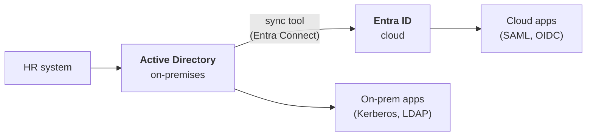
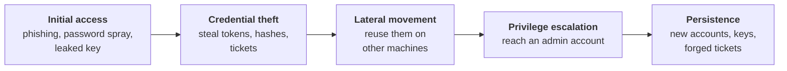
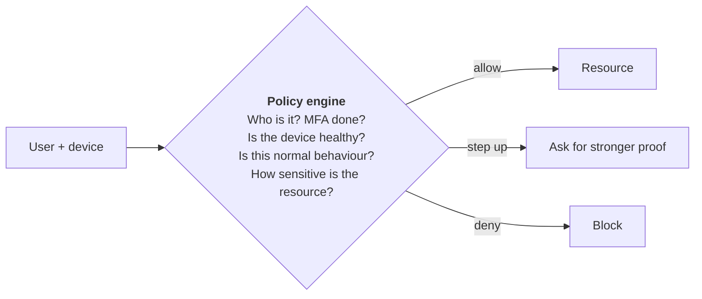
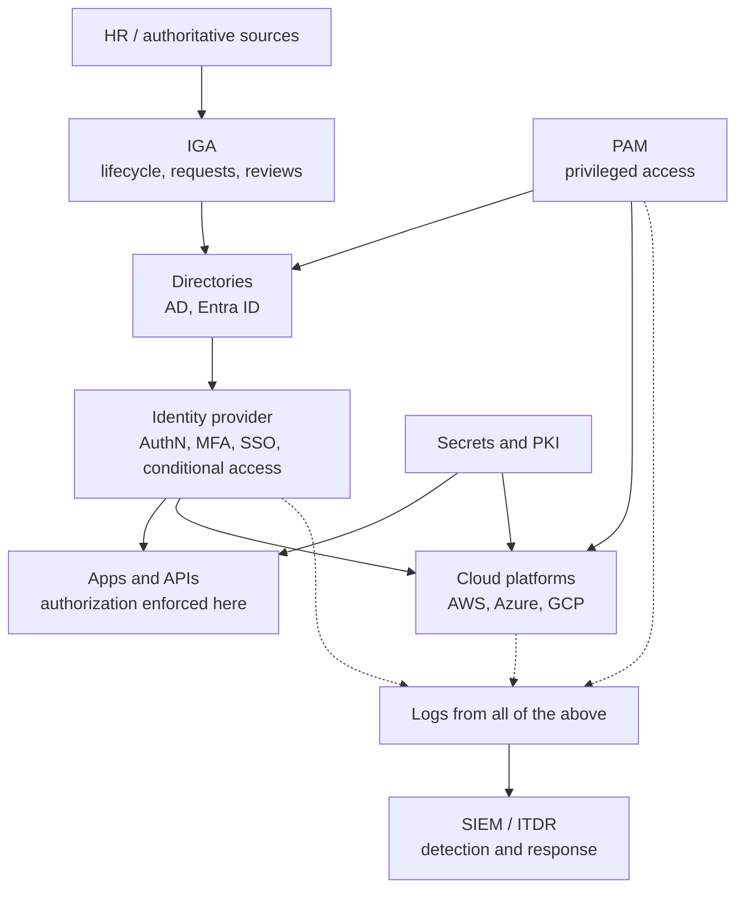

# 11. Cross-cutting topics

These five topics do not belong to one pillar. They run across all of them.

## A. Hybrid identity

### In one sentence

Hybrid identity connects an on-premises directory (Active Directory) to a cloud identity provider (Entra ID, Okta) so users have one identity in both.

### Baby steps

Most companies started with Active Directory and added cloud later. They run both, with a sync tool in between.

Three ways to sign in to the cloud when the account originates on-premises:

| Method | Where the password is checked | Trade-off |
|---|---|---|
| **Password hash sync** | In the cloud, against a synced hash | Simplest; works even if on-prem is down |
| **Pass-through authentication** | On-prem, through an agent | Password never stored in the cloud; depends on on-prem |
| **Federation (AD FS)** | On-prem federation servers | Most complex; being retired in most organisations |

A related project is **retiring legacy authentication**: older protocols (NTLM, basic auth, LDAP simple bind) cannot do MFA, so attackers target them. Switching them off is one of the highest-value things an IAM team does.

## B. Identity threat detection and response (ITDR)

### In one sentence

ITDR is spotting and stopping attacks that abuse identities, since attackers today mostly log in rather than break in.

### The attack path to recognise

### Attacks to know by name

| Attack | What happens | Main defence |
|---|---|---|
| Password spraying | One common password tried on many accounts | MFA, banned-password lists |
| Credential stuffing | Leaked passwords from other sites reused | MFA, breached-password checks |
| MFA fatigue | Flooding a user with push prompts until they approve | Number matching, passkeys |
| Adversary-in-the-middle phishing | A proxy site steals the session token after MFA | Phishing-resistant MFA, token binding |
| Kerberoasting | Requesting service tickets and cracking them offline | Long random service account passwords, gMSA |
| Pass-the-hash / pass-the-ticket | Reusing a stolen hash or ticket instead of a password | Tiering, Credential Guard |
| Golden ticket | Forging tickets after stealing the `krbtgt` key | Protect Tier 0, rotate `krbtgt` |
| Token theft | Stealing a session cookie or refresh token | Short lifetimes, device-bound tokens |
| Consent phishing | Tricking a user into granting a malicious OAuth app | Restrict user consent |

### Signals worth alerting on

Impossible travel, a new MFA device registered just after a risky login, a dormant account becoming active, a sudden burst of privilege grants, logins from legacy protocols.

## C. Zero trust

### In one sentence

Zero trust means no request is trusted because of where it comes from; every request is verified on identity, device and context.

### Baby steps

The old model was a castle: hard wall outside, trusted inside. Once an attacker got in, they could roam. Zero trust removes the idea of a trusted inside.

Three principles:

1. **Verify explicitly:** authenticate and authorize every request using all available signals.
2. **Use least privilege:** just enough access, just in time.
3. **Assume breach:** design so that one compromised account or device cannot reach everything.

Identity is the control plane of zero trust. That is why IAM skills are in demand.

## D. Compliance and audit

### In one sentence

Regulations require you to prove that access is controlled, and IAM produces most of that proof.

| Framework | Applies to | What it wants from IAM |
|---|---|---|
| SOX | Public companies' financial systems | Access reviews, SoD, change approval |
| PCI DSS | Card payment data | Unique IDs, MFA, least privilege, logging |
| HIPAA | US health data | Access controls, audit trails |
| GDPR | Personal data of people in the EU | Minimisation, consent, right to erasure |
| SOC 2 / ISO 27001 | Service providers generally | Documented, operating access controls |

What an auditor typically asks for:

- A list of who has access to system X, and who approved each entry.
- Evidence that leavers were removed on time.
- Evidence that access reviews happened and revocations were carried out.
- Evidence that privileged access is restricted and logged.

## E. Identity architecture

### In one sentence

Architecture is how all the pieces fit together so the whole is secure, resilient and manageable.

### The reference picture

### Questions an architect asks

- What is the **authoritative source** for each attribute?
- Where are the **trust boundaries**, and what crosses them?
- What happens if the **identity provider is down**? Is there a tested break-glass path?
- Which systems are **Tier 0**, and are they isolated?
- Can every access be traced to a **person, an approval and a reason**?

## Check yourself

1. Why is retiring legacy authentication valuable?
2. Name the three zero trust principles.
3. What is Kerberoasting, in one sentence?

Answers

1. Legacy protocols cannot enforce MFA, so they are a way around it.
2. Verify explicitly, use least privilege, assume breach.
3. Requesting Kerberos service tickets for service accounts and cracking them offline to recover the passwords.

Next: [12. Leading an IAM program](12-iam-program-leadership.md)
