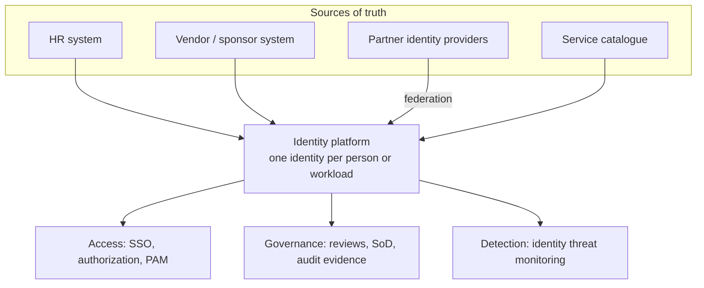
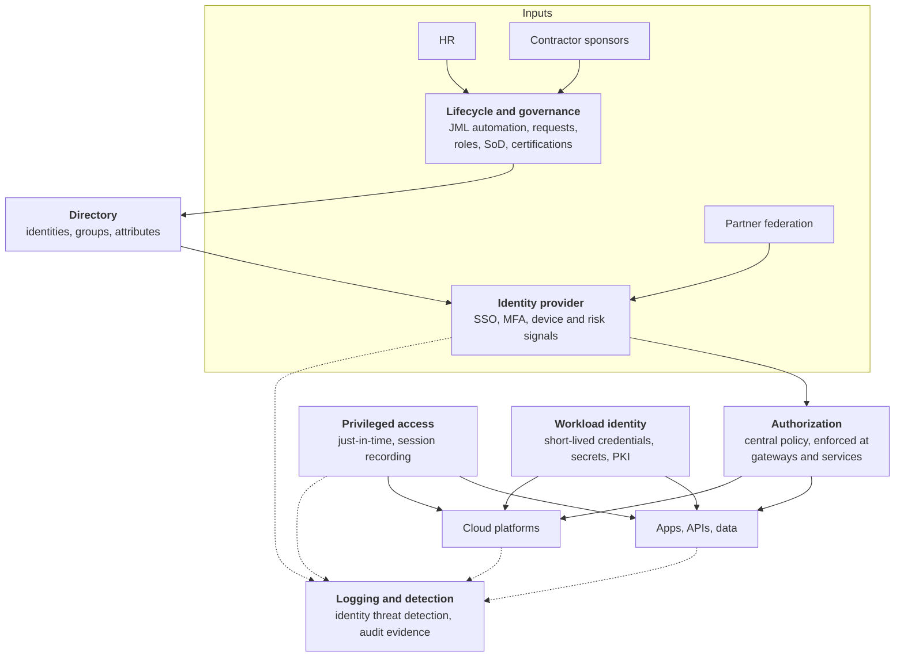
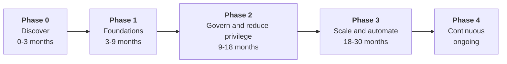
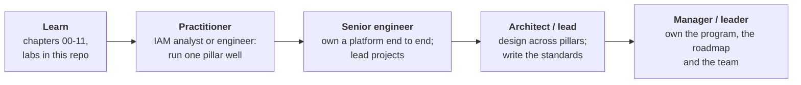

# 12. Leading an IAM program

## The role this chapter prepares you for

> "Design and build Identity and Access security solutions for a global population of employees, contractors, and external partners across all business verticals."

That sentence describes an IAM leader: someone who decides what gets built, in what order, and why, and who is accountable for the result. This chapter is the playbook for that job: how to start, what to build and how to plan it for scale, security and compliance.

It is written generically. Every company's internals differ, and the first step of the job is finding out how this one works.

## Part 1. Understand the personas

"All personas" is the heart of the job. Each population has a different source of truth, different risk and different needs.

| Persona | Source of truth | What makes it hard | Key controls |
|---|---|---|---|
| **Employees** | HR system | Movers accumulating access; global scale | Automated JML, SSO, phishing-resistant MFA, birthright roles |
| **Contractors** | Vendor management or a sponsor | No HR record; contracts end quietly | A named sponsor, a fixed end date, re-approval to extend |
| **External partners** | The partner's own company | You do not control their identity or devices | Federation to their IdP, least-privilege access, partner-admin delegation, regular attestation |
| **Privileged users** | The above, plus an admin role | Highest impact if compromised | Separate admin identity, just-in-time access, session recording |
| **Non-human** (services, pipelines, AI agents) | Service catalogue | Outnumber humans; often ownerless | Named owner, workload identity, short-lived credentials |

The design rule: **every identity has exactly one authoritative source and one accountable owner.** Most IAM failures trace back to an identity that had neither.

## Part 2. Initiation: the first 90 days

Do not start by choosing tools. Start by learning what exists and what the business needs.

### Days 1 to 30: listen and map

| Activity | Output |
|---|---|
| Meet stakeholders: security, HR, IT, legal and compliance, engineering leads, each business vertical | A list of what each needs and fears |
| Inventory identity systems: directories, identity providers, PAM, IGA, cloud accounts | A current-state diagram |
| Inventory populations and how each is onboarded and offboarded | A persona table like the one above, with real numbers |
| Read the last audit findings and the last identity-related incidents | A list of known gaps |
| Find the crown jewels: which systems matter most | A prioritised application list |

Questions to ask in every meeting:

- How does someone get access to your system today, and how long does it take?
- How do you know when someone should lose access?
- What would hurt most if the wrong person got in?
- What is the most painful part of access for your team?

### Days 31 to 60: assess and prioritise

Score the current state against a maturity model. A simple one:

| Level | Description |
|---|---|
| 1. Ad hoc | Manual tickets, shared accounts, no reviews |
| 2. Repeatable | SSO for main apps, MFA, basic joiner and leaver process |
| 3. Defined | Automated JML, roles, PAM for admins, regular reviews |
| 4. Managed | Just-in-time access, risk-based authentication, metrics drive decisions |
| 5. Optimised | Continuous verification, policy as code, self-service everywhere |

Then rank the gaps by **risk reduced per unit of effort**. Typical top findings:

1. Leavers and contractors whose access outlives them
2. Applications outside SSO, with their own passwords
3. Standing admin privilege
4. Service accounts with static secrets and no owner
5. No evidence for access reviews

### Days 61 to 90: commit to a plan

Produce three documents and get them agreed:

1. **Vision and principles** (one page). See part 3.
2. **Target architecture** (one diagram). See part 4.
3. **Roadmap** (quarters, with owners and metrics). See part 5.

Also deliver one visible **quick win** in this window, for example closing the leaver gap for the top ten applications. It earns the trust the longer plan depends on.

## Part 3. Principles

Principles let hundreds of teams make consistent decisions without asking you.

1. **One identity per person or workload**, from one authoritative source.
2. **Least privilege by default;** elevated access is temporary and requested.
3. **Phishing-resistant authentication** for everyone, strongest for the highest risk.
4. **No standing secrets:** workloads use short-lived, federated credentials.
5. **Every access has an owner, an approver and an expiry.**
6. **Paved road over gatekeeping:** the secure way must be the easiest way.
7. **Everything is logged and attributable** to a person or workload.
8. **The identity platform is Tier 0:** protect and operate it as the most critical system.

Principle 6 matters most for a leader. At scale you cannot review every team's design, so you build self-service components that are secure by default and make them easier to use than the alternatives.

## Part 4. Target architecture

Each box is a chapter of this repo. The leader's job is the lines between them: who feeds whom, where the trust boundaries are and what happens when one box fails.

## Part 5. Roadmap

Sequence by dependency and risk. A common shape:

| Phase | Build | Done when |
|---|---|---|
| **0. Discover** | Inventory, maturity score, principles, roadmap | Stakeholders have signed off the plan |
| **1. Foundations** | One identity source per persona; SSO for the critical apps; MFA for everyone; automated leaver process; break-glass tested | Leaver access removed within hours; critical apps behind SSO |
| **2. Govern and reduce privilege** | IGA with roles and requests; access reviews for regulated systems; PAM with just-in-time admin; contractor sponsor and expiry; partner federation | No standing admin on Tier 0; review evidence produced automatically |
| **3. Scale and automate** | Workload identity replacing static secrets; central authorization and policy as code; self-service onboarding for app teams; identity threat detection | New apps onboard without the IAM team; secret count falling |
| **4. Continuous** | Risk-based and continuous access evaluation; AI-agent identity; ongoing tuning from metrics | Metrics hold steady as the company grows |

Timelines depend on company size and starting point; treat the months as a shape, not a promise.

## Part 6. Designing for scale, security and compliance

### Scalability

| Concern | Design answer |
|---|---|
| Global users | Multi-region identity provider; no single region whose loss stops logins |
| Thousands of applications | Self-service onboarding with standard patterns (OIDC, SAML, SCIM); no per-app custom work |
| Many business verticals | Delegated administration: each vertical manages its own roles within central guardrails |
| Role explosion | Coarse roles plus attributes, not one role per situation |
| IAM team as a bottleneck | Paved-road libraries, templates and APIs; policy as code reviewed like software |
| Authorization latency | Decisions made close to the service, with policy distributed from a central source |

### Security

| Concern | Design answer |
|---|---|
| Phishing | Passkeys or security keys; retire SMS and legacy protocols |
| Stolen sessions | Short-lived tokens, device binding, re-evaluation on risk change |
| Privilege | Zero standing privilege; separate admin identities; tiering |
| Third parties | Federate, never issue passwords; least privilege; time-boxed access |
| Machine credentials | Workload identity and dynamic secrets |
| The identity platform itself | Treated as Tier 0: isolated admin, change control, tested recovery |
| Detection | Identity logs in the SIEM; alerts on the attacks in chapter 11 |

### Compliance

Build controls once and map them to every framework, instead of building per audit.

| Control | SOX | PCI DSS | SOC 2 / ISO 27001 | GDPR |
|---|---|---|---|---|
| Unique identity per user | Yes | Yes | Yes | |
| MFA | | Yes | Yes | |
| Timely leaver removal | Yes | Yes | Yes | |
| Periodic access review | Yes | Yes | Yes | |
| Separation of duties | Yes | | Yes | |
| Privileged access logged | Yes | Yes | Yes | |
| Data minimisation and erasure | | | | Yes |

The aim is **continuous evidence**: the system produces proof as a by-product of operating, so audits are a report and not a project.

## Part 7. Measure it

Pick a few metrics, publish them and let them drive the roadmap.

| Metric | What it tells you |
|---|---|
| Time from termination to access removed | Leaver risk |
| Percentage of apps behind SSO | Coverage |
| Percentage of users on phishing-resistant MFA | Authentication strength |
| Number of standing privileged accounts | Privilege risk |
| Number of static secrets, and those without an owner | Machine identity risk |
| Orphaned and dormant accounts | Hygiene |
| Access review completion and revocation rate | Whether reviews are real or rubber-stamped |
| Time to grant access to a new joiner | User experience |
| Time to onboard a new application | Whether the paved road works |

## Part 8. People and operating model

| Topic | Guidance |
|---|---|
| **Team shape** | Engineers for the platform (IdP, IGA, PAM, workload identity), plus someone owning governance and audit, plus on-call for a Tier 0 service |
| **Product mindset** | Treat employees and app teams as customers; measure their experience |
| **Stakeholders** | HR owns the identity data; app owners own access decisions; IAM owns the platform and the standards |
| **Governance forum** | A regular review of exceptions, risks and roadmap with security, IT, legal and business representatives |
| **Build or buy** | Buy commodity capability (IdP, IGA, PAM); build the glue and the paved road that fit your company |
| **Exceptions** | Allowed, but recorded with an owner and an expiry date |
| **Communication** | Explain every change in terms of what it protects and what it makes easier |

## Part 9. Risks to the program

| Risk | Mitigation |
|---|---|
| Poor HR data quality | Fix the source early; do not paper over it downstream |
| Big-bang migration | Move application by application, highest risk first |
| Users bypassing friction | Make the secure path the easy path |
| Legacy apps that cannot do SSO | Isolate, proxy or schedule retirement; record as an exception |
| Identity provider outage | Multi-region design and a tested break-glass path |
| Loss of sponsorship | Report metrics regularly; deliver something visible every quarter |

## Part 10. Your path to this role

This is a senior leadership role, typically reached after years of hands-on IAM work. A realistic route:

What to build at each stage:

| Stage | Evidence that you are ready for the next one |
|---|---|
| Learn | You can draw every diagram in this repo from memory and have completed the labs |
| Practitioner | You have integrated apps with SSO, run access reviews or operated a PAM or IGA tool in production |
| Senior engineer | You led a migration or rollout (for example MFA or SSO for an organisation) and can describe the trade-offs you made |
| Architect / lead | You have written a design or standard that other teams followed |
| Manager / leader | You can present a roadmap with metrics to executives and have grown other engineers |

Habits to start now, at any stage:

- After each lab, write a **one-page design note**: problem, options, decision, trade-offs. This is the core skill of an architect.
- For each chapter, practise explaining it to a non-technical person in two minutes. Leaders spend most of their time doing this.
- Keep a log of real incidents you read about and which control would have stopped them.

## Check yourself

1. Why should contractors have a sponsor and an end date?
2. What does "paved road" mean, and why does it matter at scale?
3. Name three metrics you would report to executives.
4. Why not start a new IAM program by selecting a tool?

Answers

1. They have no HR record, so without a sponsor and expiry nothing triggers removal when the contract ends.
2. Secure, self-service components that are easier to use than the alternatives. A central team cannot review everything, so the default path must be the secure one.
3. Any three from part 7, for example leaver removal time, SSO coverage and standing privileged accounts.
4. You do not yet know the populations, the systems, the risks or the constraints. Tools follow requirements.

Back to the [README](../README.md) or on to the [labs](../labs/README.md).
