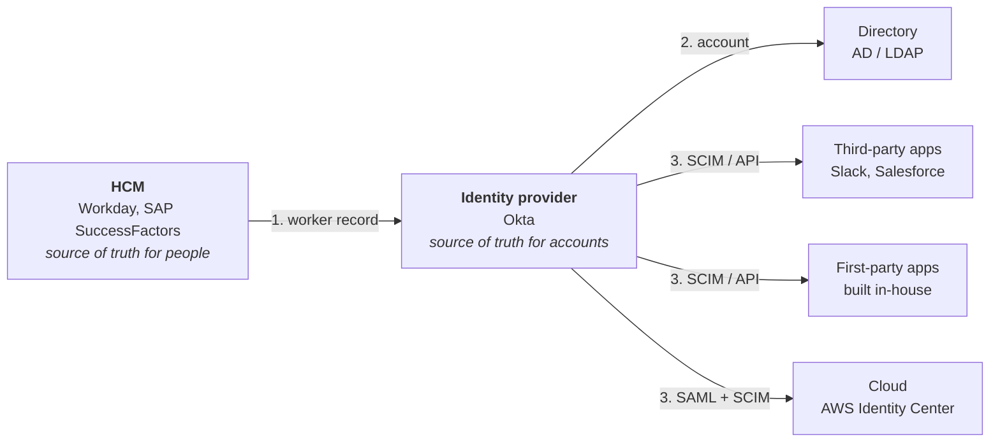
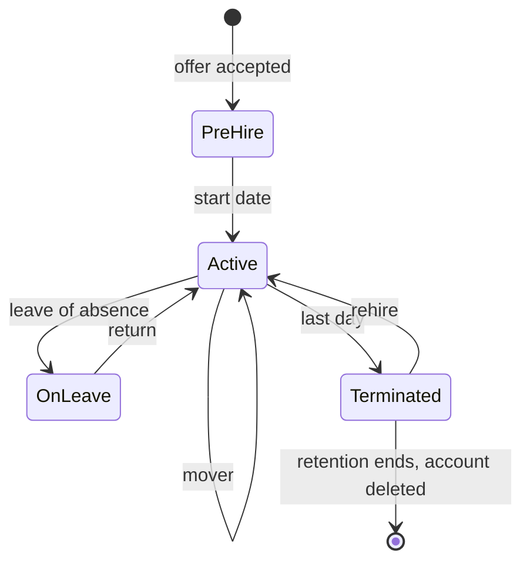
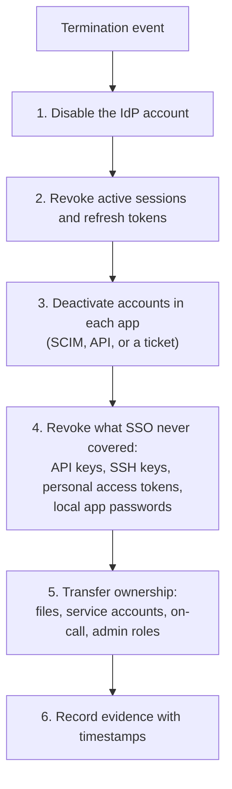

# 13. Workforce identity lifecycle, from HCM downstream

## In one sentence

A workforce identity is born as a record in the HR system and flows downstream to the identity provider and then to every application, and each change in HR must arrive everywhere it matters.

## Everyday analogy

A river. HR is the spring. The identity provider is the main channel. Applications are the fields it irrigates. If the spring is muddy (bad HR data), every field gets mud. If a channel is blocked (a broken integration), one field floods or dries out and nobody notices until the audit, or the breach.

## Baby steps

### Step 1. The chain

**Upstream** means closer to HR. **Downstream** means closer to applications. Data flows one way: downstream systems never write back to HR, with one common exception (the work email address, which the IdP generates and writes back to the HCM).

### Step 2. Who is the master of each attribute

Every attribute has exactly one system that is allowed to set it.

| Attribute | Mastered by | Why |
|---|---|---|
| Legal name, worker ID, hire date, manager, department, location, worker type | HCM | HR owns employment facts |
| Preferred name | HCM, sometimes self-service | The person owns it |
| Username, work email | Identity provider | Needs uniqueness logic HR does not have |
| Group and role membership | IdP rules or IGA | Derived from HR attributes |
| Password, MFA devices | Identity provider | Credentials never live in HR |

If two systems can both write an attribute, they will eventually disagree. Deciding the master up front is the most valuable half-hour in a lifecycle design.

### Step 3. The lifecycle events

"Joiner, mover, leaver" is the summary. The real list is longer, and the awkward events are where designs fail.

| Event | What should happen | What goes wrong |
|---|---|---|
| **Pre-hire** | Account created a few days before the start date, not yet usable; laptop and email prepared | Created too early (an unused, attackable account) or too late (first day with nothing working) |
| **Hire** | Account activated; birthright access granted; person enrols MFA | Activation runs in a time zone nobody considered |
| **Mover** | New access added, old access removed | Old access stays: privilege creep |
| **Manager change** | Approvals and reviews route to the new manager | Reviews go to someone who left |
| **Name change** | Display name, email alias and downstream usernames updated | Apps keyed on email create a second account |
| **Leave of absence** | Access suspended, not deleted | Account stays fully active for months |
| **Conversion** (contractor to employee) | Same identity continues with a new worker type | A second identity is created; the old one is orphaned |
| **Termination, planned** | Access removed at end of last day | Runs in the wrong time zone |
| **Termination, immediate** | Sessions killed and access removed within minutes | Sessions and tokens survive the account being disabled |
| **Rehire** | The old identity is reactivated with fresh access | Old access comes back with it |

### Step 4. Matching: one person, one identity

Each person needs a stable, unique key that never changes and is never reused. Use the HCM **worker ID**, not the email or the name. Emails change and get reused; worker IDs do not.

Without it you get:

- **Duplicates:** the same person twice (common on conversion and rehire).
- **Collisions:** two people matched to one account (two "J. Smith").

### Step 5. Contractors and partners have no HR record

| Population | Where the record comes from | Lifecycle trigger |
|---|---|---|
| Employees | HCM | HR events |
| Contractors | HCM as contingent workers, or a vendor management system | Contract end date, with a named sponsor who must renew |
| External partners | The partner's own identity provider, by federation | The partner removes them; you also re-attest regularly |

The rule for anyone without an HR record: **a named internal sponsor and an expiry date**. With no expiry, nothing ever triggers removal.

### Step 6. Deprovisioning is more than disabling

Disabling the account in the IdP stops new logins through SSO. On its own it does not do the rest of this list.

Steps 2 and 4 are the ones most often missed. An API token created by the user keeps working after their login is disabled unless something revokes it.

### Step 7. Design for failure

Integrations fail. A design that assumes they will not is not finished.

| Property | Meaning |
|---|---|
| **Idempotent** | Running the same sync twice gives the same result, with no duplicates |
| **Retried** | Temporary failures are retried with backoff; permanent ones go to a queue a human looks at |
| **Reconciled** | A regular job compares what should exist with what does, and reports drift |
| **Observable** | You can answer "was this leaver removed from this app, and when?" from logs |
| **Safe by default** | If the HR feed is empty or looks wrong, stop. Do not deactivate everyone |

The last row is a real failure mode: an empty or truncated feed read as "everyone left". Protect against it with a threshold: if a run would deactivate more than a set share of users, halt and alert. [Lab 05](../labs/05-scim-provisioning/README.md) lets you trigger this guard yourself.

### Step 8. Timing

| Question | Typical answer |
|---|---|
| How often does HR data sync? | Real-time for terminations where the HCM supports it; scheduled for the rest |
| When does an account activate? | Start date in the worker's own time zone |
| How fast must a termination propagate? | Minutes for involuntary; end of day for planned |
| How long is a disabled account kept? | Per retention policy, then deleted |

## Key terms

| Term | Plain meaning |
|---|---|
| HCM | Human capital management system: the HR system of record |
| Profile sourcing | Which system is the master for a user's profile (older name: profile mastering) |
| Birthright access | Access granted automatically from HR attributes |
| Contingent worker | A non-employee recorded in the HCM |
| Write-back | The IdP writing a value (usually email) back to the HCM |
| Drift | A difference between intended and actual state |

## Common mistakes

- Matching identities on email address.
- Treating disable as the whole of deprovisioning.
- No protection against a bad HR feed.
- Building joiner and leaver well, and leaving mover, conversion and rehire to tickets.

## Check yourself

1. Which attribute should be the matching key between HCM and IdP, and why?
2. A user is terminated and their IdP account is disabled. Name two things that might still work.
3. What should the sync do if tonight's HR feed contains zero workers?

Answers

1. The worker ID: it is unique, never changes and is never reused.
2. Existing sessions and refresh tokens; API keys, SSH keys or personal access tokens; local passwords in apps outside SSO.
3. Stop and alert. It should never treat an empty feed as everyone having left.

Next: [14. Provisioning and integration patterns](14-provisioning-and-integration-patterns.md)
