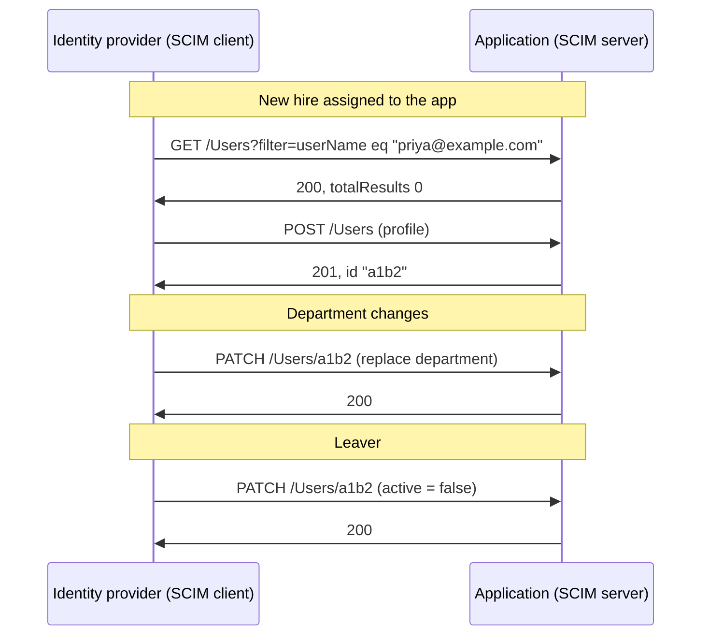
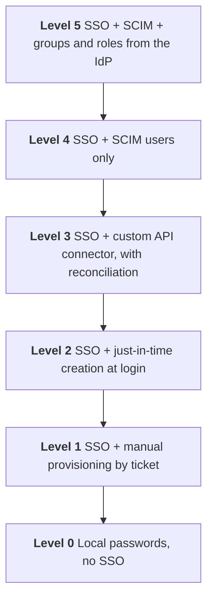
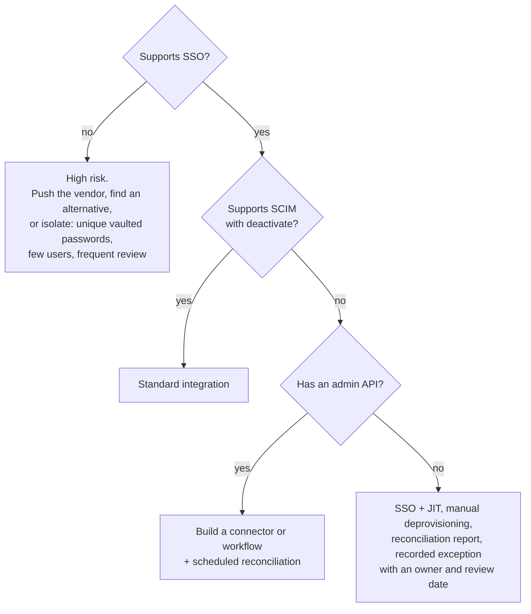

# 14. Provisioning and integration patterns

## In one sentence

Every application must be integrated for login (SSO) and for accounts (provisioning), and a small set of standard patterns covers almost all of them, including vendors whose identity support is weak.

## Everyday analogy

SSO is the key that opens the door. Provisioning is making sure there is a desk with your name on it inside, and that the desk is cleared when you leave. An app with SSO and no provisioning lets people in to find no desk, and leaves ex-employees' desks in place forever.

## Part A. SCIM in depth

### Step 1. What SCIM is

**SCIM** (System for Cross-domain Identity Management) is a standard REST API for managing users and groups. The identity provider is the **client**; the application is the **server**.



Look up first, then create. That makes the operation safe to repeat.

### Step 2. The endpoints

| Endpoint | Purpose |
|---|---|
| `/Users` | Create, read, update, deactivate users |
| `/Groups` | Manage groups and membership |
| `/ServiceProviderConfig` | What this server supports (patch, filter, bulk) |
| `/Schemas`, `/ResourceTypes` | Describes the attributes available |

### Step 3. A user in SCIM

```json
{
  "schemas": ["urn:ietf:params:scim:schemas:core:2.0:User"],
  "externalId": "E001",
  "userName": "priya@example.com",
  "name": { "givenName": "Priya", "familyName": "Shah" },
  "emails": [{ "value": "priya@example.com", "primary": true }],
  "active": true
}
```

| Field | Meaning |
|---|---|
| `id` | Assigned by the **application**; used in later URLs |
| `externalId` | The **identity provider's** key for this user (ideally the worker ID) |
| `userName` | Unique login name |
| `active` | `false` means deactivated |

### Step 4. Deactivate, do not delete

```json
{
  "schemas": ["urn:ietf:params:scim:api:messages:2.0:PatchOp"],
  "Operations": [{ "op": "replace", "path": "active", "value": false }]
}
```

Leavers are normally deactivated with `active: false`, not deleted. The application keeps the audit history and the data they owned, and a rehire can be reactivated.

### Step 5. Where SCIM integrations break

| Problem | Effect |
|---|---|
| Application supports create but not deactivate | Leavers keep accounts |
| `userName` is the email and the email changes | A duplicate account |
| No group support | Roles in the app are managed by hand |
| Rate limits | Large changes fail part-way; you need retry and reconciliation |
| Long-lived bearer token for the SCIM endpoint | A powerful static secret to protect and rotate |
| SCIM only on the vendor's most expensive plan | A commercial problem, not a technical one; raise it in procurement |

## Part B. The integration ladder

Not every application supports the standards. Rank each one and aim to move it up.



| Pattern | How accounts are created | How they are removed | Use when |
|---|---|---|---|
| **SCIM** | Pushed by the IdP | Pushed by the IdP | The vendor supports it |
| **Custom API connector** | Your code or a workflow calls the vendor's API | Same | Vendor has an API but no SCIM |
| **Just-in-time (JIT)** | On first SSO login, from the SAML or OIDC attributes | **Not removed**: blocked at login only | No SCIM; low-risk app |
| **Scheduled file or sync** | A file or batch job | Next run | Legacy systems |
| **Manual ticket** | A person | A person, if they remember | Last resort; needs reconciliation |

The JIT trap: the user cannot log in after leaving, but the account, its data, its licence and any API tokens it created still exist.

## Part C. Consulting with a vendor

Part of this role is assessing third parties and helping them improve.

### Step 6. The questions to ask every vendor

| Area | Ask |
|---|---|
| **SSO** | SAML 2.0 or OIDC? Can SSO be **enforced**, so local passwords are off? Is it on every plan? |
| **Provisioning** | SCIM 2.0? Create, update **and deactivate**? Groups and roles? |
| **Sessions** | Session lifetime? Can sessions be revoked by API when a user leaves? |
| **Tokens** | Can users create API keys or personal tokens? Are they revoked on deactivation? |
| **Admin access** | Is admin behind SSO too? Is there a break-glass account, and how is it protected? |
| **Authorization** | Can roles be driven from IdP groups? |
| **Logs** | Are login and admin events exportable to our SIEM? |
| **Multiple IdPs** | Needed for partners and acquisitions |

### Step 7. When the vendor falls short

Pick by risk, and write down the decision.



Then go back to the vendor with a specific request ("support `active: false` on PATCH"), a reason and a timeline. Vendors act on precise asks from customers, and offering to test their beta is one way to improve the identity capability of a third-party system.

### Step 8. First-party applications

For apps built in-house, the IAM team provides a **paved road**:

- A standard OIDC library and configuration, so teams do not write authentication themselves.
- A standard way to receive identity: groups and roles as token claims, or a SCIM endpoint template.
- Self-service registration of a new app, with secure defaults.
- Clear guidance on authorization: the IdP says who the user is and which groups they are in; the app enforces what that allows.

## Part D. LDAP still matters

Older and infrastructure software (network devices, Linux servers, some databases, older build tools) authenticates against LDAP.

| Pattern | When |
|---|---|
| Application binds to AD or LDAP directly | Legacy on-premises |
| An LDAP interface provided by the cloud IdP | The app only speaks LDAP but identities live in the cloud |
| Replace with SAML or OIDC | Whenever the application supports it |

Always use LDAPS or StartTLS, and a dedicated low-privilege bind account.

## Common mistakes

- Calling an app "integrated" when it has SSO and nothing else.
- Relying on JIT and never removing accounts.
- Accepting a vendor's "we support SCIM" without testing deactivation.
- Forgetting the admin accounts of the SaaS app itself.

## Check yourself

1. Why does an IdP send a GET with a filter before a POST?
2. What is the weakness of just-in-time provisioning?
3. A vendor has SSO, no SCIM, and an admin API. What do you build?

<details><summary>Answers</summary>

1. To check whether the user already exists, so the operation can be repeated without creating duplicates.
2. Accounts are created but never removed; leavers are only blocked at login.
3. A custom connector or workflow against the API, plus a scheduled reconciliation, and a request to the vendor for SCIM.
</details>

Practise this in [lab 05](../labs/05-scim-provisioning/README.md).

Next: [15. Okta and Auth0](15-okta-and-auth0.md)
