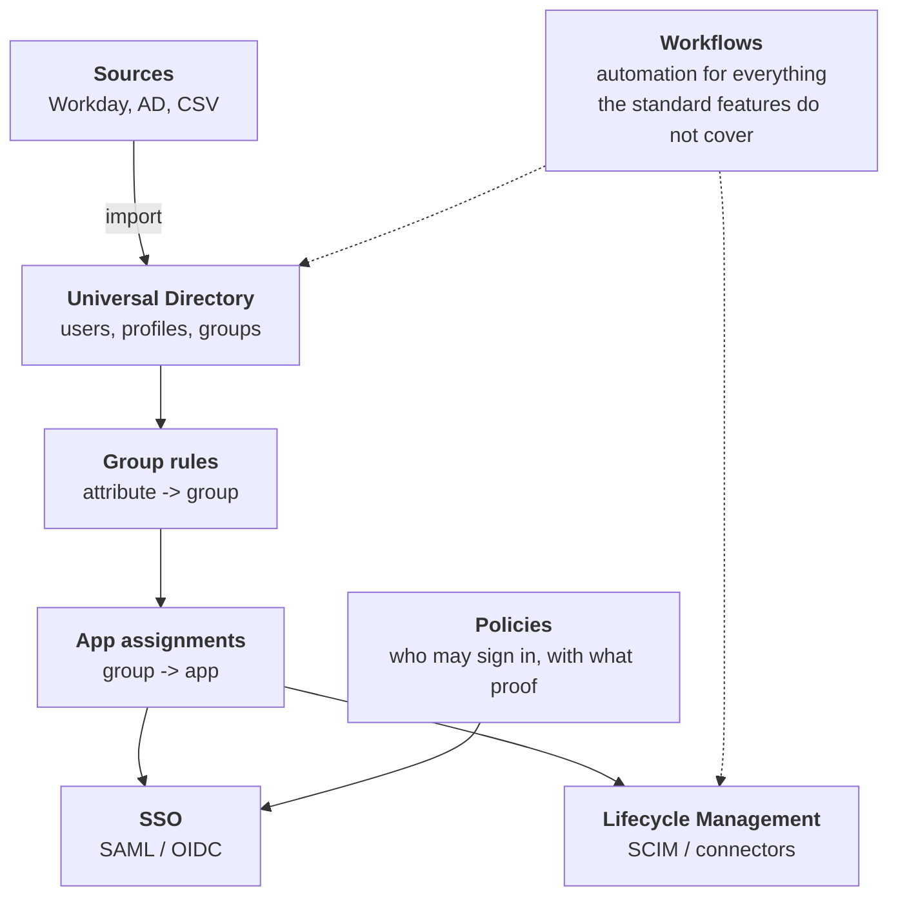
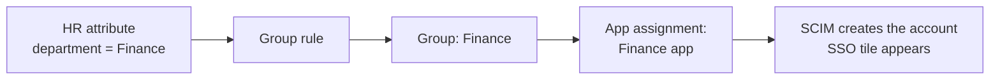
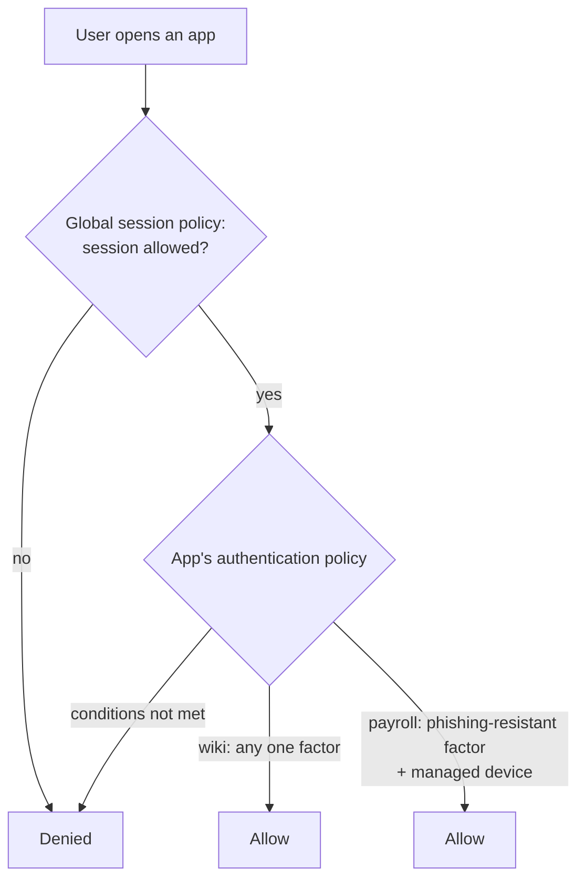
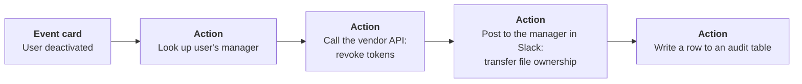
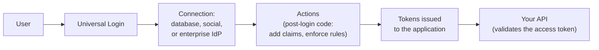

# 15. Okta and Auth0

## In one sentence

Okta is a cloud identity provider aimed at the workforce, and Auth0 (owned by Okta) is one aimed at developers building customer-facing login; both implement the concepts from chapters 02, 03 and 14 as a product.

Product details change. Treat this chapter as a map of the concepts and check names and steps against the vendor's current documentation.

## Part A. Okta

### Step 1. The building blocks

| Block | What it is | Concept chapter |
|---|---|---|
| **Universal Directory** | Okta's user store. Each user has an Okta profile; each app has its own app profile, with mappings between them | 01 |
| **Profile sourcing** | Which source is the master of a user's attributes, for example Workday | 13 |
| **Groups and group rules** | Rules such as "department equals Finance, add to the Finance group" | 04, 05 |
| **Applications** | An integration for SSO, provisioning or both, often from the Okta Integration Network catalogue | 03, 14 |
| **Lifecycle Management** | Provisioning to and from applications | 14 |
| **Policies** | Authentication and enrolment rules | 02 |
| **Workflows** | No-code automation | below |
| **System Log** | The audit trail; feeds your SIEM | 11 |

### Step 2. The chain that makes access automatic

Change the HR attribute and everything to the right follows. This is birthright access implemented in Okta: no tickets.

### Step 3. Okta Identity Engine (OIE)

OIE is Okta's current platform, replacing the older Classic Engine. The important change is how sign-in is decided.

| OIE concept | What it controls |
|---|---|
| **Global session policy** | Whether an Okta session may be created at all, and how long it lasts |
| **Authentication policy** (per app) | What proof is needed to open *this* app: which factor types, how recently, from what device |
| **Authenticators** | The methods available: password, Okta Verify, FastPass, FIDO2 security keys and passkeys |
| **Authenticator enrolment policy** | Which authenticators users must or may set up |
| **Device assurance** | Conditions on the device: managed, encrypted, operating system version |

Because policy is per application, a low-risk app can need less than a high-risk one:

**FastPass** is Okta's passwordless, device-bound authenticator. Together with FIDO2 it is how you reach phishing-resistant sign-in.

### Step 4. User states

Lifecycle events move a user between states. Knowing them lets you read the System Log and debug provisioning.

| State | Meaning |
|---|---|
| Staged | Created, not yet activated (the pre-hire state) |
| Provisioned | Activation started, user has not finished setup |
| Active | Normal |
| Suspended | Temporarily blocked (leave of absence) |
| Deprovisioned | Deactivated (leaver); app accounts are deprovisioned |

### Step 5. Okta Workflows

Workflows is a no-code automation tool for identity processes that the standard features do not cover.

A flow is a chain of **cards**:

| Piece | Meaning |
|---|---|
| **Event** | What starts the flow: an Okta event, a schedule, or an API call |
| **Connector** | A pre-built integration (Okta, Slack, Google Workspace, generic HTTP) |
| **Card** | One step: an action or a function (branch, loop, text or list handling) |
| **Table** | Simple storage inside Workflows |
| **Helper flow** | A reusable sub-flow, also used for loops and error handling |

Typical uses, each tied to a problem from earlier chapters:

| Use | Problem solved |
|---|---|
| Custom deprovisioning for an app without SCIM | Chapter 14, the API connector pattern |
| Revoke sessions and tokens on termination | Chapter 13, step 6 |
| Contractor expiry: remind the sponsor, then suspend | Chapter 13, step 5 |
| Time-boxed group membership | Chapter 06, just-in-time access |
| Username and email generation with uniqueness checks | Chapter 13, step 2 |
| Scheduled reconciliation report | Chapter 14 |

Engineering cautions for Workflows:

- Flows are **production code**. Name them, document them, handle errors and export them to version control.
- Design for retries and rate limits. A flow that fails half-way through a leaver process is a security gap.
- When logic becomes complex, move it to real code (chapter 17) and let the flow call it.

### Step 6. Hooks and APIs

| Mechanism | Use |
|---|---|
| **Management API** | Everything in the admin console, as REST. The basis for Terraform and scripts |
| **Event hooks** | Okta notifies your service after something happened (asynchronous) |
| **Inline hooks** | Okta calls your service *during* a process and waits, for example to add a claim to a token |

### Step 7. Other Okta capabilities to recognise

- **Okta Identity Governance:** access requests and access certifications.
- **Org2Org:** connects one Okta org to another; used in hub-and-spoke and acquisition designs (chapter 16).
- **Inbound federation:** Okta trusts an external IdP, used for partners and acquisitions.
- **LDAP interface and AD agents:** bridge to directory-based systems.

## Part B. Auth0

### Step 8. The building blocks

Auth0 is built for developers adding login to their own applications.

| Auth0 term | Meaning |
|---|---|
| **Tenant** | Your isolated Auth0 environment (use separate ones for development and production) |
| **Application** | A client that users sign in to: single-page, web, native or machine-to-machine |
| **API** | A resource server you protect, with its own audience and scopes |
| **Connection** | A source of users: a database, a social provider or an enterprise IdP (SAML, OIDC, AD) |
| **Universal Login** | The hosted login page |
| **Actions** | Your own code (Node.js) that runs at set points, such as after login |
| **Organizations** | Models business customers, each with its own members and connections |

### Step 9. Okta versus Auth0

| | Okta (Workforce) | Auth0 |
|---|---|---|
| Primary users | Employees, contractors, partners | Customers and business customers |
| Typical buyer | IT and security | Product engineering |
| Strength | App catalogue, lifecycle, policies, Workflows | Developer flexibility, custom login, Actions |
| Extensibility | Workflows, hooks | Actions |

For the target role, "or equivalent" also covers Microsoft Entra ID and Ping Identity. The concepts transfer: directory, sourcing, groups, assignments, policies, provisioning and an automation layer.

## Practise for free

Both vendors offer free developer or trial tenants. A good first exercise in each:

1. Create two users and a group.
2. Add one OIDC application and sign in; decode the ID token.
3. Add one SAML application; inspect the assertion with a browser SAML tracer.
4. Okta: write a group rule and an authentication policy that requires a stronger factor for one app.
5. Okta: point SCIM provisioning at the server from [lab 05](../labs/05-scim-provisioning/README.md) (this needs the server reachable over HTTPS).
6. Auth0: write a post-login Action that adds a custom claim.

These steps have not been scripted or tested in this repo; follow the vendor's current quick-start for the exact screens.

## Common mistakes

- Assigning apps to individual users instead of groups driven by rules.
- One permissive authentication policy shared by every app.
- Workflows with no error handling, owner or documentation.
- Configuring a production tenant by hand with no record of what changed (see chapter 17).

## Check yourself

1. In Okta, what links an HR attribute to an account in an application?
2. What is the difference between the global session policy and an authentication policy?
3. When would you choose an inline hook over an event hook?

Answers

1. A group rule puts the user in a group, the group is assigned to the app, and provisioning creates the account.
2. The global session policy decides whether an Okta session can exist; an authentication policy decides what is needed to open a particular app.
3. When Okta must wait for your answer during the process, for example to add a claim to a token. Event hooks only notify afterwards.

Next: [16. Acquisitions and migrations](16-acquisitions-and-migrations.md)
