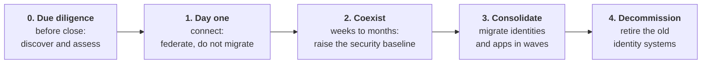
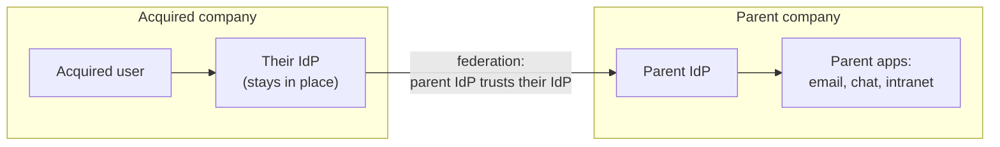
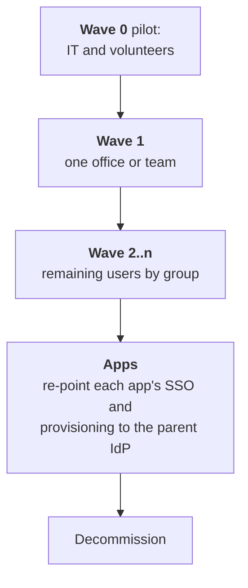

# 16. Acquisitions and identity migrations

## In one sentence

When one company buys another, two complete identity systems must first be connected so people can work together immediately, and then merged without locking anyone out.

## Everyday analogy

Two families moving into one house. On day one everyone needs a front-door key. Over the following months you decide whose furniture stays, merge two kitchens into one and change the address on everything. You do not throw out one family's belongings on the first evening.

## Baby steps

### Step 1. Why it is hard

The acquired company arrives with its own:

- HR system and worker IDs
- identity provider and MFA
- email domain and usernames
- directory, groups and naming conventions
- applications, some the same as yours and some unknown
- security standards, often lower

And the business wants collaboration from the first day. The dual mission from the role description shows up at full strength here: **speed and risk at the same time**.

### Step 2. The phases

### Step 3. Phase 0: due diligence

Find out what you are inheriting. Access before close is usually restricted, so prepare the questions in advance.

| Ask | Why |
|---|---|
| How many people, of what types, in which countries? | Scale and legal constraints |
| Which HR system, IdP and directory? | Integration design |
| Is MFA enforced for everyone? | Immediate risk |
| How many applications, and which are behind SSO? | Migration size |
| Who has admin rights, and how are they protected? | Immediate risk |
| Any known incidents or audit findings? | Inherited risk |
| Any contracts that restrict moving data or systems? | Constraints |

### Step 4. Phase 1: day one by federation

Do not migrate anything yet. Make the two identity providers trust each other.

The acquired user keeps signing in where they always have. The parent IdP accepts that sign-in and gives access to a small, chosen set of parent applications. Nobody learns a new password on a stressful day.

| Pattern | How | Use when |
|---|---|---|
| **Inbound federation** | Parent IdP trusts the acquired IdP over SAML or OIDC | The standard day-one choice |
| **Hub and spoke** | A central IdP (hub) with each company's IdP as a spoke | Many acquisitions; some stay separate long-term |
| **Org-to-org connector** | Vendor feature linking two tenants of the same IdP product | Both companies use the same vendor |
| **Guest or sponsored accounts** | Create accounts for them in the parent IdP | Very small acquisitions |

A shadow account is still created in the parent IdP for each federated user, so matching rules (step 6) matter from the first day.

### Step 5. Phase 2: coexist and raise the baseline

While both systems run, close the biggest gaps in the acquired environment without waiting for the migration:

1. Enforce MFA where it is missing.
2. Lock down admin accounts.
3. Make sure leavers are removed in **both** systems.
4. Send their identity logs to your monitoring.

Risk reduction should not wait for consolidation, which can take a year.

### Step 6. Phase 3: consolidate

#### Decide the source of truth

Until the acquired workers are in the parent HCM, their HR system stays authoritative for them. The moment HR data moves is the moment lifecycle automation can switch over. Coordinate this date with HR; it drives everything else.

#### Match and merge identities

| Problem | Example | Answer |
|---|---|---|
| **Collision** | Both companies have `jsmith` | A deterministic naming rule; decide who keeps what before migrating |
| **Duplicate** | A contractor already known to both | Match on a strong key; merge, do not create a second identity |
| **Domain change** | `@acquired.com` to `@parent.com` | Keep the old address as an alias; apps keyed on email need a planned change |
| **New worker IDs** | Parent HCM issues new IDs | Keep a mapping table from old ID to new ID permanently |

#### Migrate in waves

For each application decide one of: **migrate** (re-point to the parent IdP), **merge** (move users into the parent's tenant of the same product) or **retire**.

#### Credentials

| Option | Trade-off |
|---|---|
| Users re-enrol in the parent IdP | Cleanest; needs support capacity on migration days |
| Keep federating to the old IdP for a while | No disruption, but the old system must keep running |
| Import password hashes | Seamless, only possible if formats are compatible; MFA still needs re-enrolment |

MFA devices almost never transfer. Plan enrolment and a verified recovery process, because attackers target exactly this moment with fake "set up your new account" messages.

### Step 7. Phase 4: decommission

The job is not done until the old IdP, directory and trust relationships are removed. Leftover federation trusts and forgotten admin accounts in a retired system are a standing risk.

Checklist:

- All users and apps moved, or explicitly retired
- Trusts and connectors removed
- Service accounts and API tokens revoked
- Logs archived for the retention period
- Domains and certificates transferred or allowed to expire deliberately

### Step 8. Scalable patterns

If the company acquires regularly, build a repeatable playbook, not a one-off project.

| Pattern | Why it scales |
|---|---|
| A standard day-one federation template | Hours to connect, not weeks |
| A fixed, small set of day-one apps | Predictable and reviewable |
| A standard questionnaire for due diligence | Nothing is forgotten |
| Attribute mapping and matching rules as code | Tested and reusable |
| Dry-run mode for every migration script | See the changes before making them |
| A baseline every acquisition must meet by a set date | Risk is bounded |
| The same playbook run in reverse for divestitures | Separating a business is the same problem backwards |

### Step 9. Migrations without an acquisition

The same method applies when you replace your own identity system (for example, moving from an on-premises IdP to a cloud one):

1. Run old and new in parallel.
2. Move applications in waves, lowest risk first.
3. Keep a rollback path for each wave.
4. Measure: logins succeeding, tickets raised, apps remaining.
5. Decommission deliberately.

## Key terms

| Term | Plain meaning |
|---|---|
| Day one | The day the deal closes and people must be able to collaborate |
| Inbound federation | Your IdP trusting someone else's |
| Hub and spoke | One central IdP connected to several others |
| Identity correlation | Deciding which records refer to the same person |
| Cutover | The moment a user or app switches to the new system |
| TSA | Transition services agreement: the seller keeps running systems for a fixed period after a divestiture |

## Common mistakes

- Migrating on day one instead of federating.
- Leaving the acquired company's weak controls untouched until consolidation.
- Matching people by email or name.
- No rollback plan for a migration wave.
- Never decommissioning the old identity provider.

## Check yourself

1. Why federate on day one instead of creating new accounts for everyone?
2. Name two identity problems that appear when merging two user populations.
3. What triggers the switch of lifecycle automation to the parent's processes?

Answers

1. It gives access immediately with no new credentials, and avoids a rushed migration during the most disruptive week.
2. Any two of: username collisions, duplicates, domain changes, new worker IDs.
3. The acquired workers' HR data moving into the parent HCM, which becomes their source of truth.

Next: [17. IAM engineering: code, CI/CD and AWS](17-iam-engineering-code-cicd-aws.md)
