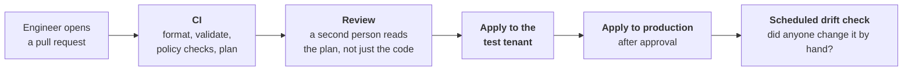
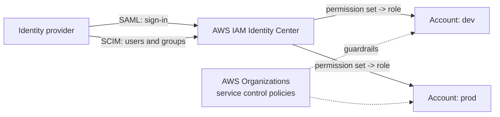
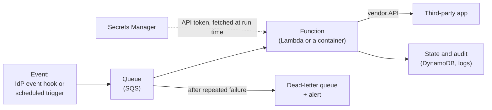

# 17. IAM engineering: code, CI/CD and AWS

## In one sentence

Modern IAM is built like software: configuration lives in Git, changes go through review and a pipeline, and custom integrations run as small services on a cloud platform.

## Everyday analogy

Clicking through an admin console is cooking from memory: it works until someone asks what you changed last Tuesday. Configuration as code is a written recipe that others can review, repeat and roll back.

## Part A. Identity configuration as code

### Step 1. Why

| Console clicks | Configuration as code |
|---|---|
| No record of who changed what, or why | Every change is a commit with an author and a reason |
| No review | Pull request review before it applies |
| Test and production drift apart | The same code applied to both |
| Rollback means remembering | Rollback means reverting a commit |
| Audit evidence gathered by hand | The Git history is the evidence |

The last row is a compliance win: change control for the identity platform is satisfied by the normal engineering process.

### Step 2. What it looks like

Terraform has providers for the major identity platforms. A group, and a rule that fills it from an HR attribute:

```hcl
resource "okta_group" "finance" {
  name        = "Finance"
  description = "Everyone in the Finance department"
}

resource "okta_group_rule" "finance" {
  name              = "department-finance"
  status            = "ACTIVE"
  group_assignments = [okta_group.finance.id]
  expression_type   = "urn:okta:expression:1.0"
  expression_value  = "user.department == \"Finance\""
}
```

The same approach covers applications, policies and AWS IAM. Check resource and argument names against the provider's current documentation before using them.

### Step 3. The pipeline



| Stage | What it catches |
|---|---|
| Validate and lint | Syntax errors |
| Policy checks | Forbidden changes, for example weakening an MFA policy or granting admin |
| Plan | Exactly what will change, shown to the reviewer |
| Test tenant | Mistakes, before real users meet them |
| Drift check | Manual console changes that bypassed review |

### Step 4. Protect the pipeline itself

A pipeline that can change the identity provider is a Tier 0 system.

- No long-lived credentials in CI. Use OIDC federation from the CI system to the cloud (chapter 08), and short-lived or tightly scoped tokens for the identity platform.
- Only the pipeline can write to production; humans get read-only by default.
- Branch protection: no direct pushes, required review.
- The pipeline's own permissions are least privilege.

## Part B. Code you will read and write

The role asks for frequent reading and occasional writing in Java or Python. These are the kinds of code you will meet.

### Step 5. An application validating tokens (Java)

Most in-house services are **resource servers**: they receive an access token and must validate it. In Spring Security this is configuration, not hand-written cryptography.

```java
@Bean
SecurityFilterChain api(HttpSecurity http) throws Exception {
    http
        .authorizeHttpRequests(auth -> auth
            .requestMatchers("/invoices/**").hasAuthority("SCOPE_invoices.read")
            .anyRequest().authenticated())
        .oauth2ResourceServer(oauth2 -> oauth2.jwt(Customizer.withDefaults()));
    return http.build();
}
```

with the issuer set in configuration:

```properties
spring.security.oauth2.resourceserver.jwt.issuer-uri=https://idp.example.com
```

What to look for when reviewing code like this:

| Question | Why |
|---|---|
| Is the issuer pinned? | Otherwise tokens from any IdP might be accepted |
| Is the audience checked? | Otherwise a token meant for another API is accepted (chapter 03) |
| Is every route covered, with deny as the default? | Missing routes are open routes |
| Does it check the user may access *this object*, not only that they are logged in? | Broken object-level authorization (chapter 04) |
| Is any token or secret written to logs? | Logs are widely readable |

### Step 6. A lifecycle integration (Python)

The other common kind is glue: read from one system, write to another. The shape is always the same, and [lab 05](../labs/05-scim-provisioning/README.md) is a working example.

```python
def sync(desired_users, app):
    existing = app.list_users()                # 1. read actual state
    plan = diff(desired_users, existing)       # 2. compare with desired state
    guard_against_mass_deactivation(plan)      # 3. safety check
    for change in plan:
        app.apply(change)                      # 4. idempotent, retried
        audit_log(change)                      # 5. evidence
```

The five properties to check in any such code are the ones from chapter 13: idempotent, retried, reconciled, observable, safe by default.

### Step 7. Engineering habits that matter in IAM

| Habit | Reason |
|---|---|
| **Dry-run mode** on anything that changes accounts | See the plan before a thousand accounts change |
| **Tests** for mapping and matching logic | A wrong mapping silently grants wrong access |
| **Pagination and rate-limit handling** | Identity APIs have both; ignoring them loses users part-way |
| **Structured audit logs** | Who or what changed which identity, when and why |
| **No secrets in code** | Chapter 09 |
| **Small, reviewable changes** | A reviewer can only verify what they can read |

## Part C. Running identity services on AWS

### Step 8. Workforce access to AWS

The standard design connects the IdP to **AWS IAM Identity Center**:



- Users and groups come from the IdP by SCIM; nobody has an IAM user or long-lived access key.
- A **permission set** becomes an IAM role in each assigned account; people get temporary credentials (chapter 10).
- Group membership in the IdP decides who gets which permission set, so AWS access follows the same lifecycle as everything else.

### Step 9. A small identity service

Custom connectors and automations are usually event-driven and serverless.



| Component | Role | Why |
|---|---|---|
| Queue | Buffers events | Survives the vendor API being down; smooths rate limits |
| Function | Does the work | Small, single purpose |
| Dead-letter queue and alert | Catches what keeps failing | A failed deprovision must reach a human |
| Secrets Manager | Holds the vendor API token | Rotatable, audited, not in code |
| IAM role for the function | Least privilege | It may read one secret and one queue, nothing else |
| Logs, metrics, alarms | Observability | "Was this leaver removed, and when?" |

### Step 10. Operating it

Running a service means owning it after launch:

- **Alarms** on failures and on queue depth, not just dashboards.
- **Runbooks** for the common failures.
- **Deployments** through the same pipeline as the rest of the code, with rollback.
- **Regions and recovery:** identity services are dependencies of everything else, so decide what happens when one is unavailable.
- **Cost and quotas:** know the API limits of both AWS and the vendor.

## Common mistakes

- Production identity configuration changed by hand, with code and reality drifting apart.
- CI holding a permanent super-admin API token.
- A sync script with no dry run and no deactivation threshold.
- Failures logged but never alerted on.

## Check yourself

1. Name two things a reviewer gains from configuration as code.
2. Why put a queue between the event and the function?
3. Why is the CI pipeline for identity configuration a Tier 0 system?

<details><summary>Answers</summary>

1. Any two of: an exact plan of the change, history and authorship, repeatable environments, easy rollback, audit evidence.
2. So events are not lost when the downstream API is slow or down, and can be retried.
3. Whoever controls it can change authentication policy and grant access for the whole company.
</details>

Next: [18. Delivery, rollout and communication](18-delivery-rollout-and-communication.md)
