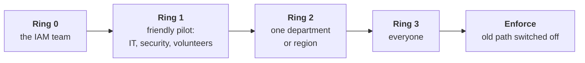

# 18. Delivery, rollout and communication

## In one sentence

An identity solution only reduces risk once people are using it, so designing the rollout and explaining it clearly are as much a part of the job as the engineering.

## Everyday analogy

A new bridge is not finished when the concrete sets. It is finished when traffic has moved onto it and the old ferry has stopped running. Until then you are paying for both and getting the safety of neither.

## Part A. The dual mission

The role has two goals that pull against each other: **reduce risk** and **meet the speed of the business**.

| If you optimise only for | You get |
|---|---|
| Risk | Controls people route around: shared accounts, shadow IT, permanent exceptions |
| Speed | Access nobody reviews and accounts nobody removes |

The resolution is usually to make the secure option the fastest one. Examples:

| Friction | Secure and faster alternative |
|---|---|
| Ticket and three-day wait for app access | Birthright access from HR attributes |
| Password plus code every time | Passwordless sign-in on a trusted device |
| Security review for every new app | A self-service template that is secure by default |
| Quarterly review of 400 lines | Review only access that is unusual or unused |

When they cannot both be satisfied, say so plainly, state the trade-off and let the risk owner decide.

## Part B. From problem to production

### Step 1. Start from the problem

Under ambiguity, the first job is to make the problem precise.

| Vague request | Questions that sharpen it |
|---|---|
| "We need SSO for the new tool." | Who uses it? What data is in it? Does it support SAML, OIDC, SCIM? Who owns it? |
| "Contractor access is a mess." | Where do contractor records come from? Who sponsors them? What happens at contract end today? |
| "Integrate the company we bought." | How many people? Which IdP? What must work on day one? |

### Step 2. Write a short design note

One or two pages. This is the main written artefact of the role.

| Section | Content |
|---|---|
| **Problem** | What is wrong today, for whom, with evidence |
| **Goals and non-goals** | What this will and will not do |
| **Options** | Two or three, including "do nothing" |
| **Recommendation** | The choice and the reasons |
| **Trade-offs and risks** | What you give up; what could go wrong |
| **Rollout** | Phases, rollback, success measure |
| **Open questions** | What you do not know yet |

Share it early. A design note is a tool for getting disagreement before the work, when it is cheap.

### Step 3. Decide without waiting for certainty

| Type of decision | Approach |
|---|---|
| **Reversible** (a group rule, a policy for a pilot group) | Decide, try it, adjust |
| **Hard to reverse** (username format, matching key, IdP choice) | Slow down, write it up, get review |

Collaboration over process means bringing the people affected into the decision, not replacing the decision with a form.

## Part C. Rollout strategy

### Step 4. Roll out in rings

Each ring answers a question before the next begins: does it work, can support cope, did anything break?

### Step 5. The rollout plan

| Element | Detail |
|---|---|
| **Scope** | Who and what, per ring |
| **Entry criteria** | What must be true before a ring starts |
| **Success measure** | For example: sign-in success rate, enrolment rate, tickets per hundred users |
| **Rollback** | How to return to the old state, and who may decide to |
| **Support** | Help desk briefed, known issues written down, an escalation path |
| **Communication** | What users are told, when and by whom |
| **Exceptions** | How they are requested, who approves, when they expire |
| **End state** | The date the old way stops working |

### Step 6. Techniques that reduce risk

| Technique | Example |
|---|---|
| **Report-only mode** | Run a new sign-in policy without enforcing it and see who would be blocked |
| **Dry run** | A provisioning job prints its plan without changing anything |
| **Parallel run** | Old and new provisioning both run; compare results |
| **Feature flag by group** | Add users to a pilot group to opt them in |
| **Change windows** | Avoid month-end for Finance, launches for Engineering |

### Step 7. Finish

A rollout with a long tail of exceptions has not delivered its security benefit. Set an enforcement date, track the remaining users and systems to zero, and remove the old path. An MFA rollout at 95 percent leaves the attacker the other 5.

### Step 8. A worked example: phishing-resistant MFA

| Phase | Action | Measure |
|---|---|---|
| Prepare | Inventory apps and devices that cannot support it; agree an exception process | List complete |
| Ring 0 and 1 | IAM team, then volunteers, enrol | Enrolment success, time to enrol |
| Report-only | New policy evaluated but not enforced for everyone | Who would fail, and why |
| Ring 2 | Enforce for one department | Tickets per hundred users |
| Ring 3 | Enforce for all, highest-risk groups first | Coverage percentage |
| Enforce | Remove weaker factors; close exceptions | Weak factors remaining: zero |

## Part D. Communication

### Step 9. Explain IAM in plain language

The role description calls this "absolutely necessary". The method:

1. Start with what the listener cares about, not the protocol.
2. Use one analogy.
3. Say what changes for them.
4. Stop.

| Concept | For an engineer | For anyone |
|---|---|---|
| SSO | "The app trusts a signed assertion from the IdP." | "You sign in once with your company account, and that opens your other tools." |
| SCIM | "The IdP pushes user changes to the app's API." | "When someone joins or leaves, their accounts are created and removed automatically." |
| MFA | "A second factor of a different type." | "A stolen password alone is not enough to get in." |
| Least privilege | "Scope permissions to the task." | "People get the access their job needs, so one mistake or one stolen account does less damage." |
| Federation with a partner | "We trust their IdP as an external identity source." | "Their people sign in with their own company account; we never hold their passwords." |

Practise each until you can say it in under thirty seconds.

### Step 10. Match the message to the audience

| Audience | They want to know | Lead with |
|---|---|---|
| Executives | Risk, cost, timeline | The outcome and the number |
| App owners | What they must do, and when | The ask and the deadline |
| Engineers | How it works and how to integrate | The interface and an example |
| End users | What changes for them | What to do, and where to get help |
| Auditors | Evidence the control operates | The control and the proof |
| Vendors | Exactly what you need from them | The specific gap and the standard |

### Step 11. Product mindset

Treat identity as a product, with employees and application teams as its customers.

| Product question | In IAM |
|---|---|
| Who are the users? | Employees, contractors, partners, app owners, help desk |
| What are they trying to do? | Get to work on day one; ship an app; pass an audit |
| Where is the friction? | Measure it: time to access, sign-in failures, tickets |
| What is the roadmap? | Ordered by risk reduced and friction removed |
| How do we know it worked? | Adoption and outcome metrics, not "we shipped it" |

### Step 12. Working with stakeholders

| Stakeholder | What they own | What you need from them |
|---|---|---|
| HR | Worker data | Data quality, event timing |
| IT and help desk | Devices, support | Rollout capacity, feedback |
| Security | Risk appetite, detection | Priorities, log requirements |
| Engineering teams | First-party apps | Adoption of the paved road |
| Legal and compliance | Regulatory requirements | Which controls need evidence |
| Procurement | Vendor contracts | Identity requirements in the contract |
| Business leaders | Outcomes and deadlines | Sponsorship, decisions on trade-offs |

When there is disagreement, bring data, state the options and the trade-off, and agree who decides.

## Part E. Stories to prepare

Roles like this are assessed through past examples. Prepare one for each, using situation, action and result. Until you have production experience, use lab work and say that it is lab work.

| Theme | Prompt |
|---|---|
| Lifecycle | "Tell me about an identity lifecycle you designed." |
| Ambiguity | "Describe a decision you made with incomplete information." |
| Vendor | "A vendor's product did not support what you needed. What did you do?" |
| Rollout | "How did you roll out a change that affected everyone?" |
| Simplifying | "Explain SCIM to a non-technical stakeholder." |
| Risk versus speed | "When did security and delivery conflict, and how did you resolve it?" |
| Failure | "Tell me about an integration that broke and what you changed afterwards." |
| Migration | "How would you integrate an acquired company's identities?" |

## Check yourself

1. What is the purpose of report-only mode?
2. Why does a rollout need an enforcement date?
3. Explain SSO in one sentence to someone who is not technical.

Answers

1. To see who a new policy would block before it blocks anyone.
2. The security benefit only arrives when the old path is closed; the remaining exceptions are what an attacker uses.
3. For example: "You sign in once with your company account and that opens your other work tools."

Next: [19. Federal ICAM and zero trust](19-federal-icam-and-zero-trust.md), or back to the [role guide](role-guide.md).
