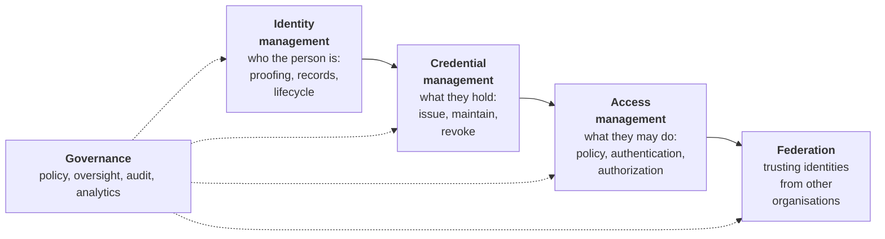
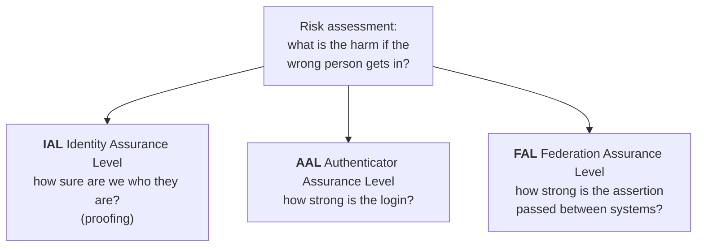
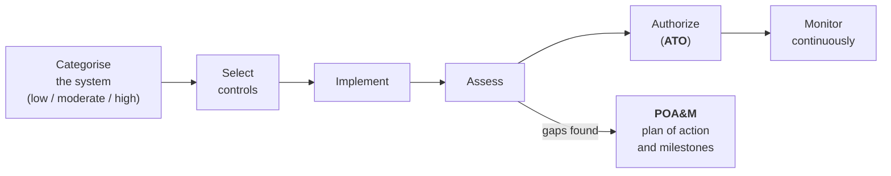
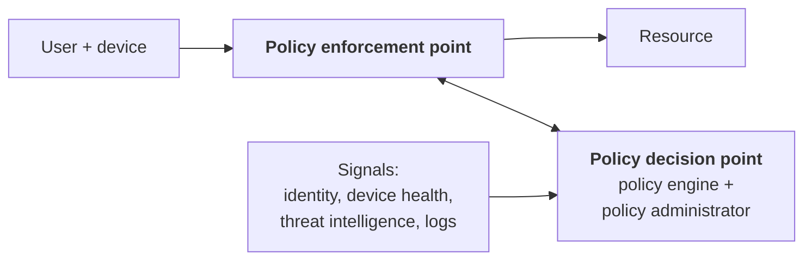
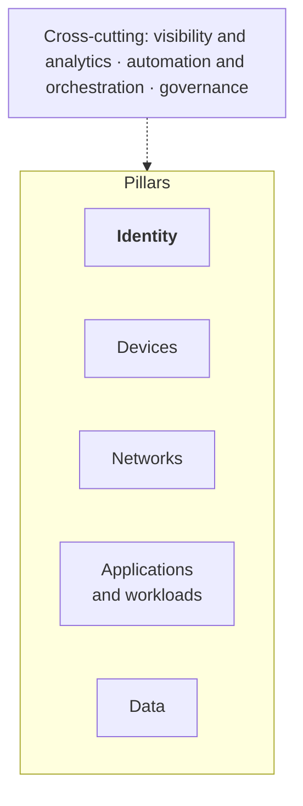

# 19. Federal ICAM and zero trust

## In one sentence

ICAM is the United States federal government's name and framework for identity and access management, with stronger credentials, formal assurance levels, mandated controls and a zero trust strategy that puts identity first.

Federal policy is revised often. Use this chapter to learn the map, then check each document's current version before quoting it.

## Everyday analogy

Commercial IAM is a company deciding its own building security. Federal ICAM is building to a published code: the lock grades are defined, the inspector has a checklist, and you must show paperwork that every door meets it.

## Baby steps

### Step 1. What ICAM stands for

**I**dentity, **C**redential and **A**ccess **M**anagement. The extra word matters: the federal model treats the **credential** (the card or authenticator a person holds) as its own discipline.

**FICAM** is the federal government's ICAM architecture. It describes five practice areas:

| Practice area | Commercial equivalent | Chapter |
|---|---|---|
| Identity management | Lifecycle from the HR system | [13](13-workforce-identity-lifecycle.md) |
| Credential management | MFA enrolment, certificates, PKI | [02](02-authentication.md), [09](09-secrets-certificates.md) |
| Access management | SSO, authorization, PAM | [03](03-federation-sso.md), [04](04-authorization.md), [06](06-privileged-access.md) |
| Federation | Partner and cross-organisation trust | [03](03-federation-sso.md) |
| Governance | IGA, reviews, reporting | [05](05-identity-governance.md), [20](20-governance-program-work.md) |

### Step 2. How federal differs from commercial

| | Commercial | Federal |
|---|---|---|
| Rules come from | The company's own risk appetite, plus regulations for its industry | Law, executive orders, OMB memoranda and NIST standards |
| Main credential | Passkey, authenticator app | **PIV** smart card (civilian agencies), **CAC** (Department of Defense) |
| Assurance | Chosen informally | Formal levels from NIST SP 800-63 |
| Controls | Frameworks such as ISO 27001, SOC 2 | NIST SP 800-53 control catalogue |
| Deploying a system | Internal approval | A formal **authorization to operate (ATO)** |
| Cloud services | Vendor assessment | **FedRAMP** authorization |
| Pace | Fast | Deliberate, documented, change-controlled |

### Step 3. PIV and CAC

A **PIV card** (Personal Identity Verification) is a smart card issued to federal employees and contractors after identity proofing and a background check. It holds certificates and private keys; the user inserts it and enters a PIN.

It is multi-factor in one object (something you have plus something you know) and phishing-resistant, because authentication is a cryptographic exchange with the real system (chapter 09, mutual TLS).

| Term | Meaning |
|---|---|
| HSPD-12 | The 2004 presidential directive requiring a common identification standard |
| FIPS 201 | The standard that defines the PIV card |
| CAC | Common Access Card, the Department of Defense equivalent |
| Derived credential | A credential issued to a phone or other device based on an existing PIV |
| PIV-I | "PIV-interoperable": cards issued by non-federal organisations to a compatible standard |

Modernisation today often means supporting PIV alongside other phishing-resistant authenticators such as FIDO2, since cards do not work well on every device.

### Step 4. Assurance levels: NIST SP 800-63

The Digital Identity Guidelines define three separate scales. Each system picks the level it needs based on the harm a mistake would cause.

| Level | IAL (proofing) | AAL (authentication) | FAL (federation) |
|---|---|---|---|
| 1 | Self-asserted; no proofing | Single factor | Signed assertion |
| 2 | Evidence checked, remotely or in person | Two factors; a phishing-resistant option must be offered | Stronger protections such as encrypted assertions |
| 3 | In-person or supervised proofing | Hardware-based, phishing-resistant authenticator | Holder-of-key: the user also proves possession of a key |

How to use this in conversation: "This system handles sensitive personal data, so I would expect IAL2 and AAL2, moving to phishing-resistant authentication in line with the zero trust strategy."

A fourth revision of SP 800-63 was finalised in 2025. Ask which revision the agency is working to.

### Step 5. Controls: NIST SP 800-53

SP 800-53 is the catalogue of security controls federal systems must implement. Identity work touches these families most:

| Family | Name | Examples |
|---|---|---|
| **AC** | Access Control | AC-2 account management; AC-5 separation of duties; AC-6 least privilege |
| **IA** | Identification and Authentication | IA-2 multi-factor authentication; IA-5 authenticator management |
| **AU** | Audit and Accountability | Logging who did what |
| **PS** | Personnel Security | Screening, termination and transfer |

When you recommend an improvement in a federal setting, name the control it supports. "Automating leaver removal strengthens AC-2 and PS-4" lands better than "it's best practice".

### Step 6. How a system gets approved

| Term | Meaning |
|---|---|
| FISMA | The law requiring agencies to secure their systems |
| RMF | Risk Management Framework: the process above (NIST SP 800-37) |
| ATO | Authorization to operate: a senior official formally accepts the risk |
| POA&M | The tracked list of weaknesses, with owners and dates |
| FedRAMP | The programme that authorizes cloud services for federal use |
| Authorization boundary | What is inside the system being authorized |

For an IAM practitioner: every identity gap you find becomes a POA&M item, and every tool you recommend must fit inside an authorization boundary or be FedRAMP authorized.

### Step 7. Zero trust in the federal government

| Document | What it is |
|---|---|
| Executive Order 14028 (2021) | Directed agencies to move to zero trust |
| OMB M-22-09 | The federal zero trust strategy, with specific goals for agencies |
| OMB M-19-17 | Federal ICAM policy |
| NIST SP 800-207 | Defines zero trust architecture |
| CISA Zero Trust Maturity Model | A way to measure progress |

**NIST SP 800-207** describes the same decision structure as chapter 04:

**The CISA Zero Trust Maturity Model** has five pillars and three capabilities that cut across them:

Each pillar is scored on four stages:

| Stage | Identity pillar, simplified |
|---|---|
| **Traditional** | Passwords or basic MFA; manual account management; access reviewed rarely |
| **Initial** | MFA in place; some automation; first integration between identity stores |
| **Advanced** | Phishing-resistant MFA; consolidated identity; automated lifecycle; risk assessed at sign-in |
| **Optimal** | Continuous validation; fully automated just-in-time and just-enough access; real-time risk analysis |

This model is the usual backbone of a federal identity roadmap: assess the current stage, set a target stage and date, and plan the steps between.

### Step 8. What M-22-09 asks of identity

In plain terms:

1. One centralised identity system per agency, integrated with applications.
2. **Phishing-resistant MFA** for staff, contractors and partners.
3. Authorization that considers the **device** as well as the user.
4. Public-facing systems offer phishing-resistant options to citizens.

Almost every federal IAM modernisation programme traces back to these.

### Step 9. Background checks and public trust

Many federal contractor roles require a **public trust** determination. This is a background investigation for positions with access to sensitive but unclassified systems. It is not a security clearance. The employer sponsors it after an offer. Answer the forms accurately and completely; this repo cannot advise on eligibility.

## Key terms

| Term | Plain meaning |
|---|---|
| ICAM / FICAM | Federal identity, credential and access management, and its architecture |
| PIV / CAC | Federal smart card credentials |
| IAL / AAL / FAL | Assurance levels for proofing, authentication and federation |
| SP 800-53 | The control catalogue |
| SP 800-63 | Digital identity guidelines |
| SP 800-207 | Zero trust architecture |
| ATO | Formal approval to operate a system |
| POA&M | Tracked remediation plan |
| CDM | Continuous Diagnostics and Mitigation, a CISA programme that includes identity capabilities |

## Common mistakes

- Treating federal ICAM as commercial IAM with different logos, and missing assurance levels and control mapping.
- Recommending a cloud product without asking about FedRAMP status.
- Presenting zero trust as a product to buy, when it is a strategy measured over years.
- Quoting a memo or revision without checking it is current.

## Check yourself

1. What does the C in ICAM add that "IAM" leaves out?
2. Which scale describes how strong a login is: IAL, AAL or FAL?
3. Name the five pillars of the CISA Zero Trust Maturity Model.
4. What is a POA&M?

Answers

1. Credential management: issuing, maintaining and revoking the authenticators people hold, such as PIV cards.
2. AAL, the Authenticator Assurance Level.
3. Identity, devices, networks, applications and workloads, data.
4. A plan of action and milestones: the tracked list of known weaknesses with owners and target dates.

Next: [20. Governance programme work](20-governance-program-work.md)
