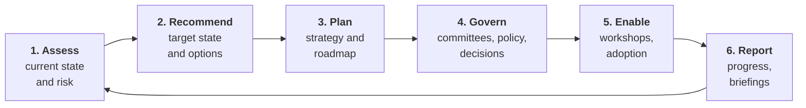
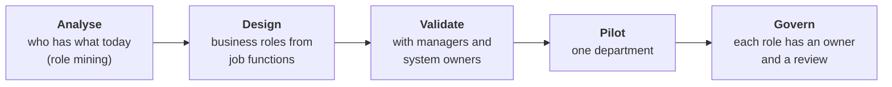
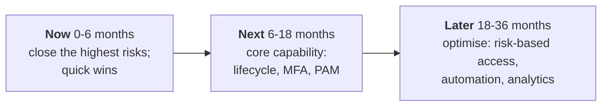
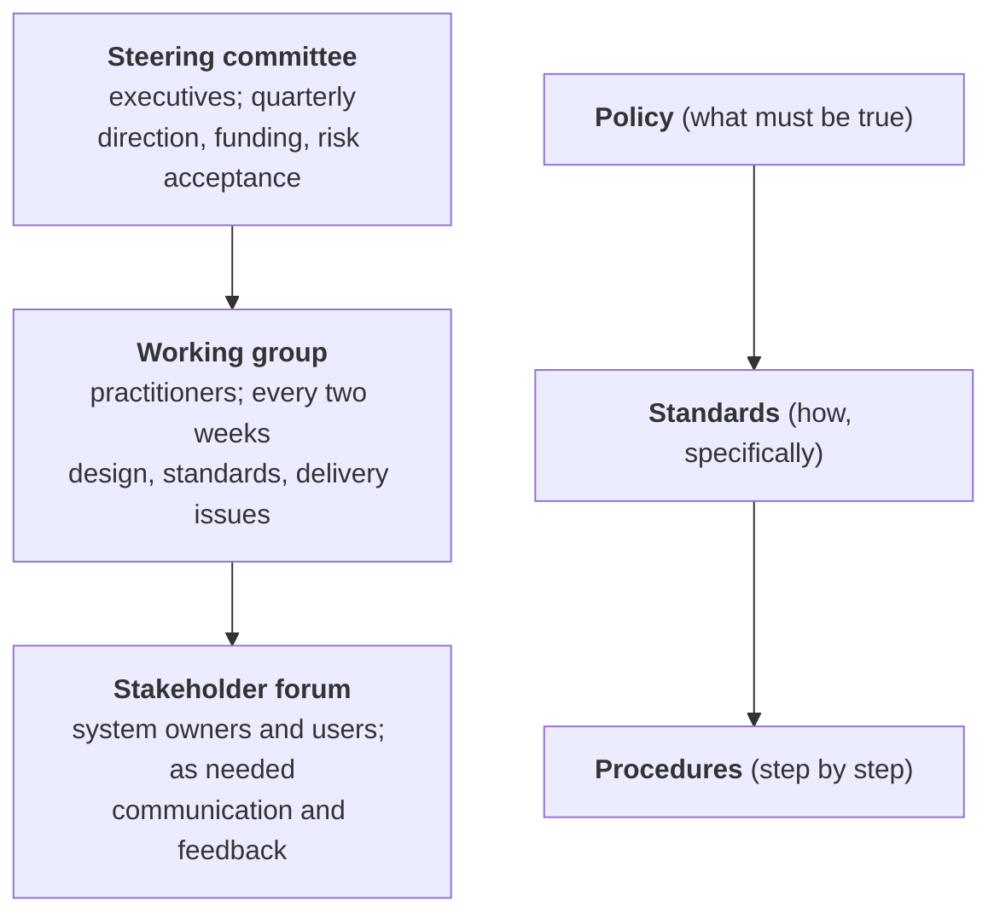
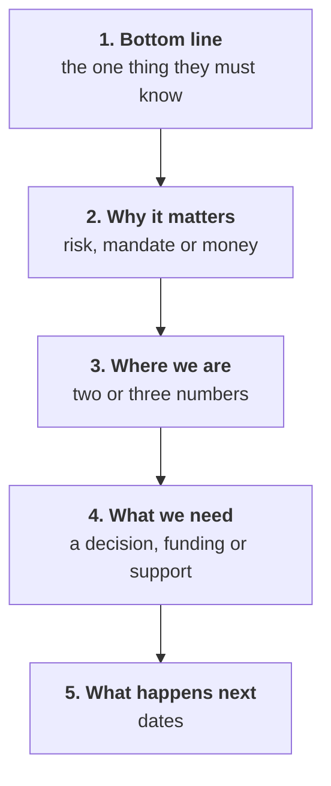

# 20. Governance programme work

## In one sentence

In a governance or advisory role you improve an organisation's identity programme by assessing it, recommending changes, building agreement and tracking progress, more than by configuring tools yourself.

## Everyday analogy

A building inspector and renovation planner in one. You survey the house, write up what is unsafe, agree priorities with the owners, plan the work in stages they can afford, and report each month on what has been fixed.

## The work, as a cycle

The rest of this chapter takes each step and gives you the artefact you would produce.

## Step 1. Assess the current state

### How to gather it

| Method | Gives you |
|---|---|
| Interviews with system owners, security, HR, help desk | How things really work, and where it hurts |
| Document review: policies, prior audits, architecture diagrams | What is supposed to happen |
| Data: account lists, review results, ticket volumes | What actually happens |
| Walk-throughs of joiner, mover and leaver | Where the process breaks |

### A maturity assessment

Score each capability on a simple scale, with evidence.

| Capability | 1 Ad hoc | 2 Repeatable | 3 Defined | 4 Managed | 5 Optimised |
|---|---|---|---|---|---|
| **Lifecycle** | Tickets | Some automation | Joiner and leaver automated from HR | Mover automated; measured | Continuous reconciliation |
| **Authentication** | Passwords | MFA for some | MFA for all | Phishing-resistant for most | Risk-based, continuous |
| **Access model** | Direct grants | Groups | Roles defined | Roles plus attributes; requests governed | Policy as code |
| **Certification** | None | Annual, manual | Regular, tool-based | Risk-based, with revocation tracked | Continuous, exception-driven |
| **Privileged access** | Shared passwords | Vaulted | Rotated, sessions recorded | Just-in-time | Zero standing privilege |
| **Governance** | None | Informal | Committee and policies | Metrics drive decisions | Embedded in delivery |

In a federal setting, present the same findings against the CISA Zero Trust Maturity Model stages (chapter 19).

### An identity risk assessment

For each finding, write one line in this form:

| Finding | Risk | Likelihood | Impact | Rating | Recommendation | Control |
|---|---|---|---|---|---|---|
| Leaver accounts in 12 applications are removed by ticket, taking up to 10 days | A former worker or an attacker uses a live account | High | High | High | Automate deprovisioning; interim weekly reconciliation | AC-2, PS-4 |
| Access reviews approve 99 percent of items in under a minute each | Reviews do not detect inappropriate access | High | Medium | Medium | Risk-based reviews; show usage data to reviewers | AC-2, AC-6 |
| Administrators use standing privileged accounts for daily work | One phished account gives full control | Medium | High | High | Separate admin identities; just-in-time elevation | AC-6, IA-2 |

Write findings as facts with evidence, and risks as consequences. Avoid blame.

### Evaluating access control effectiveness

A control can exist on paper and not work. Test both.

| Question | Test |
|---|---|
| **Design:** would the control prevent the risk if followed? | Read the policy and procedure |
| **Operation:** is it actually followed? | Sample: pick 25 leavers and check when each account was disabled |
| **Coverage:** does it apply everywhere? | Count systems in and out of scope |
| **Evidence:** can it be shown? | Ask for the record |

## Step 2. Recommend

A recommendation people can act on has six parts:

| Part | Example |
|---|---|
| **Finding** | Contractors have no end date in 40 percent of records |
| **Risk** | Access continues after the engagement ends |
| **Recommendation** | Require a sponsor and an end date; expire automatically |
| **Options** | (a) policy and manual check, (b) workflow in the IGA tool, (c) integrate the vendor management system |
| **Effort and dependencies** | (b) is eight weeks, needs sponsor data from procurement |
| **Measure** | Share of contractor records with a valid end date |

Give options with trade-offs, then say which you recommend. Decision-makers want a recommendation, not a menu.

### Role-based and attribute-based access initiatives

A frequent piece of work is helping an organisation move from individual grants to a managed access model.

| Decision | Guidance |
|---|---|
| Top-down or bottom-up? | Both. Top-down from job functions gives meaning; bottom-up from existing access gives realism |
| How many roles? | Fewer than you think. If roles approach the number of people, the model has failed |
| Where does ABAC fit? | Use roles for the coarse shape and attributes for conditions such as location, clearance or project |
| Who owns a role? | A named business owner who approves its contents and certifies it |
| What about exceptions? | Allow requested access on top of roles, time-limited and reviewed |

Roles and attributes together:

> A user with the role *Claims Processor* may open case files (**role**) where the case's region equals the user's region and the user's training is current (**attributes**).

### Evaluating an emerging technology

Use the same template every time so evaluations are comparable.

| Section | Questions |
|---|---|
| **Problem** | What gap does it close? Is that gap a priority? |
| **Fit** | Does it work with the current identity provider, directory and IGA tool? |
| **Standards** | Does it use open standards (SAML, OIDC, SCIM, FIDO2)? |
| **Security and compliance** | Assurance level supported; in federal settings, FedRAMP status and control mapping |
| **Maturity** | Who else runs it at this scale? What is the vendor's stability? |
| **Cost and effort** | Licence, integration, operation, training |
| **Risks** | Lock-in, migration, skills |
| **Recommendation** | Adopt, pilot, watch or reject, and why |

Topics you are likely to be asked about: passkeys and passwordless sign-in, identity threat detection and response, non-human and AI-agent identity, identity data fabrics and virtual directories, decentralised or verifiable credentials, continuous access evaluation.

## Step 3. Strategy and roadmap

### Strategy on a page

| Element | Content |
|---|---|
| **Vision** | One sentence: where identity should be in three years |
| **Drivers** | Mandates, risks, business change |
| **Principles** | Five to eight, such as one identity per person and phishing-resistant by default (chapter 12) |
| **Target state** | A diagram |
| **Priorities** | Three to five outcomes |
| **Measures** | How progress is shown |

### Roadmap

Each roadmap item needs: the outcome, the owner, dependencies, a rough cost, the risk it reduces, and the measure of done. Sequence by risk reduced, by dependency, and by what the organisation can absorb at once.

Common modernisation moves a roadmap will contain:

| From | To |
|---|---|
| On-premises directory as the centre | Cloud identity provider, with the directory kept for legacy |
| Legacy web access management | Standards-based SSO (SAML, OIDC) |
| Many identity stores | A consolidated or virtualised identity source |
| Passwords and one-time codes | Phishing-resistant MFA |
| Ticket-based provisioning | HR-driven lifecycle |
| Annual spreadsheet reviews | Tool-based, risk-based certification |
| Standing admin accounts | Vaulted, just-in-time privileged access |

## Step 4. Governance: committees, policy and decisions

### The governance framework

### A committee charter

| Section | Content |
|---|---|
| Purpose | Why the body exists |
| Scope | What it decides and what it does not |
| Membership | Roles, not names; who chairs |
| Decision rights | What needs a vote, what can be delegated, how ties are settled |
| Cadence | How often, and what is prepared beforehand |
| Inputs and outputs | Metrics in; decisions, actions and risk acceptances out |
| Escalation | Where unresolved issues go |

### Who decides what

| Decision | Responsible | Accountable | Consulted | Informed |
|---|---|---|---|---|
| Who may access a system | System owner | Business owner | Security, IAM | Users |
| Identity standards | IAM team | Chief information security officer | Architecture, system owners | All teams |
| Accepting an exception | Risk owner | Authorizing official or CISO | IAM, security | Committee |
| Worker data quality | HR | HR leadership | IAM | System owners |

### Supporting a committee well

- Send papers ahead; state the decision you need in the first line.
- Bring options and a recommendation, not an open question.
- Record decisions, owners and dates; circulate within a day.
- Track actions to closure and report them at the next meeting.

## Step 5. Enable: workshops and adoption

### Running a workshop

| Stage | What to do |
|---|---|
| **Before** | One clear objective; the right people; pre-reading; an agenda with times |
| **Open** | State the objective and what will be produced by the end |
| **Diverge** | Everyone contributes: current pain points, on sticky notes or a shared board |
| **Converge** | Group, prioritise, agree |
| **Close** | Read back decisions, owners and next steps |
| **After** | Summary within a day |

Useful formats: a joiner-mover-leaver walk-through with the people who do each step; a role design session with managers; a risk prioritisation session with system owners.

### Supporting adoption

A new process fails when people do not know about it, cannot do it, or see no reason to. Address all three.

| Barrier | Response |
|---|---|
| Awareness | Explain what is changing, why and when, in the reader's terms |
| Ability | Guides, training, a named contact, a pilot group to learn from |
| Motivation | Show what gets easier; have leaders use it first |
| Reinforcement | Measure adoption; follow up with teams that lag; close the old route |

Rollout in rings is covered in [chapter 18](18-delivery-rollout-and-communication.md).

## Step 6. Report

### Tracking modernisation objectives

Pick a small set of outcome measures and report the same ones every period.

| Objective | Measure | Baseline | Target | Now |
|---|---|---|---|---|
| Phishing-resistant MFA | Share of users enrolled | 12% | 95% | 61% |
| Timely leaver removal | Median hours from termination to disabled | 96 | 4 | 9 |
| Applications behind SSO | Count of in-scope apps | 40 of 210 | 190 | 131 |
| Access certification | Completed on time; revocation rate | 70%; 0.5% | 100%; meaningful | 94%; 4% |
| Privileged accounts vaulted | Share under management | 20% | 100% | 72% |

The numbers above are illustrative, to show the format.

### A status report

| Section | Content |
|---|---|
| Overall status | Green, amber or red, with one sentence of reason |
| Progress this period | Three to five outcomes delivered |
| Planned next period | Three to five |
| Metrics | The table above |
| Risks and issues | Each with an owner and a mitigation |
| Decisions needed | Who must decide what, by when |

### An executive briefing

Executives have a few minutes. Lead with the conclusion.

Example opening: "We are on track to meet the phishing-resistant MFA target by March. Sixty-one percent of staff are enrolled. Two legacy systems cannot support it, and I need a decision today on whether to fund their replacement or accept the risk for another year."

Rules: no acronyms without explanation, numbers before narrative, one page, and always end with what you need from them.

### Compliance and reporting coordination

| Activity | Your part |
|---|---|
| Access certification campaigns | Schedule, brief reviewers, chase completion, confirm revocations happened |
| Audit requests | Gather evidence, explain controls, track findings |
| Findings and remediation | Keep the remediation plan current; report overdue items |
| Policy exceptions | Maintain the register; ensure each has an owner and an expiry |

## Technologies named in governance roles

You are expected to recognise each and be deep in at least one.

| Product | Category | In one line |
|---|---|---|
| SailPoint | IGA | Lifecycle, requests, roles, certification |
| Microsoft Entra ID | Access management and directory | Microsoft's cloud identity provider; conditional access, PIM, governance features |
| Okta | Access management | SSO, MFA, lifecycle, Workflows ([chapter 15](15-okta-and-auth0.md)) |
| CyberArk | PAM | Vaulting, rotation, session recording ([chapter 06](06-privileged-access.md)) |
| Radiant Logic | Identity data | Unifies identity data from many directories into one view, without migrating them; often called a virtual directory or identity data fabric |
| ForgeRock | Access management and CIAM | An identity platform now part of Ping Identity |
| Active Directory, LDAP | Directory | [Chapter 01](01-directories.md) |

See also the [tool comparison](tool-comparison.md).

## Certifications named in governance roles

| Certification | Body | Focus |
|---|---|---|
| Security+ | CompTIA | Entry-level security; a common baseline for government contractor roles |
| CISSP | ISC2 | Broad security leadership; requires years of experience |
| CISM | ISACA | Security management |
| CISA | ISACA | Auditing |
| CGRC | ISC2 | Governance, risk and compliance; the Risk Management Framework |
| Microsoft Identity and Access Administrator (SC-300) | Microsoft | Entra ID administration |
| SailPoint certifications | SailPoint | Product-specific |
| Certified Identity and Access Manager (CIAM) | Identity Management Institute | IAM management |

For someone new to the field, Security+ and then SC-300 give the quickest credible base. Check each body's current requirements before committing.

## Common mistakes

- Presenting findings without recommendations, or recommendations without options.
- A roadmap that is a list of tools, not outcomes.
- Status reports that describe activity ("held six meetings") instead of progress.
- Committees that discuss and do not decide.
- Role models designed without the managers who must own them.

## Check yourself

1. What is the difference between testing a control's design and its operation?
2. What six parts make a recommendation actionable?
3. What should the first sentence of an executive briefing contain?
4. Where does ABAC fit alongside RBAC?

Answers

1. Design: would it work if followed. Operation: is it actually followed, shown by sampling real cases.
2. Finding, risk, recommendation, options, effort and dependencies, measure.
3. The bottom line: the one thing they need to know or decide.
4. Roles give the coarse shape of access; attributes add conditions such as location, clearance or project.

Back to the [governance role guide](role-guide-governance-icam.md).
