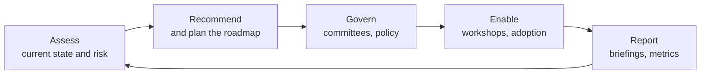

# Role guide: IAM / ICAM governance and strategy

This guide maps a second kind of IAM role to the material in this repo. Compare it with the [workforce IAM engineer guide](role-guide.md): the subject is the same, the daily work is different.

## The role in plain words

You help a large organisation, often a government agency, **modernise** how it governs identity and access. The verbs in the job description are *support, assist, develop recommendations, evaluate, coordinate, facilitate, track and report*. That tells you the job is advisory and programme-focused: you assess, recommend, build agreement and report progress. Others usually configure the tools.

## The two roles side by side

| | Workforce IAM engineer | IAM / ICAM governance and strategy |
|---|---|---|
| Main output | Working integrations and automation | Assessments, roadmaps, recommendations, briefings |
| Typical day | Design, code, configure, troubleshoot | Interview, analyse, write, facilitate, present |
| Depth needed | Protocols and platform internals | Governance processes, frameworks, communication |
| Breadth needed | Lifecycle, federation, cloud | The whole identity programme, plus policy and compliance |
| Success looks like | Leavers removed in minutes; apps onboarded quickly | The organisation moves up a maturity level and can prove it |
| Interview weight | Technical depth, troubleshooting, design | Scenarios, frameworks, stakeholder and communication examples |

## What the job description asks for, and where it is covered

### Identity governance and strategy

| The JD says | Study | Artefact to practise |
|---|---|---|
| Develop and implement enterprise IAM/ICAM strategies and roadmaps | [12](12-iam-program-leadership.md), [19](19-federal-icam-and-zero-trust.md), [20](20-governance-program-work.md) | A one-page strategy and a now/next/later roadmap |
| Modernise identity governance and access management | [20](20-governance-program-work.md) step 3 | A from/to table for a sample organisation |
| Recommend improvements to identity lifecycle processes | [13](13-workforce-identity-lifecycle.md), [20](20-governance-program-work.md) step 2 | A six-part recommendation |
| Support governance committees, working groups and forums | [20](20-governance-program-work.md) step 4 | A committee charter |
| Evaluate emerging identity technologies and best practices | [20](20-governance-program-work.md) step 2 | A one-page technology evaluation |

### Identity lifecycle management

| The JD says | Study | Practise |
|---|---|---|
| Provisioning, deprovisioning and role management | [05](05-identity-governance.md), [13](13-workforce-identity-lifecycle.md), [14](14-provisioning-and-integration-patterns.md) | [Lab 05](../labs/05-scim-provisioning/README.md) |
| Joiner, mover and leaver workflows | [05](05-identity-governance.md), [13](13-workforce-identity-lifecycle.md) | [Lab 04](../labs/04-sailpoint-iga/README.md) |
| Role-based and attribute-based access control initiatives | [04](04-authorization.md), [20](20-governance-program-work.md) step 2 | Design roles for one department from lab 04's data |
| Review governance processes; recommend continuous improvement | [20](20-governance-program-work.md) step 1 | A maturity assessment |
| Coordinate compliance and reporting | [11](11-cross-cutting.md), [20](20-governance-program-work.md) step 6 | A status report |

### Access management and security

| The JD says | Study | Practise |
|---|---|---|
| Authentication and access control solutions | [02](02-authentication.md), [03](03-federation-sso.md), [04](04-authorization.md) | Explain SSO and MFA in plain language |
| Privileged access management initiatives | [06](06-privileged-access.md) | [Lab 03](../labs/03-cyberark-conjur/README.md) |
| Evaluate access control effectiveness and policy compliance | [20](20-governance-program-work.md) step 1 | Lab 04 reconciliation as a control test |
| Identity risk assessments and remediation planning | [11](11-cross-cutting.md), [20](20-governance-program-work.md) step 1 | A risk table with ratings and recommendations |
| Security reviews and architecture discussions | [11](11-cross-cutting.md), [12](12-iam-program-leadership.md) | Draw the reference architecture from memory |

### Stakeholder engagement and programme support

| The JD says | Study | Practise |
|---|---|---|
| Coordinate with security, system owners, application teams and business leaders | [18](18-delivery-rollout-and-communication.md) | A stakeholder map with what each needs |
| Executive briefings, status reports, programme documentation | [20](20-governance-program-work.md) step 6 | A one-page briefing, spoken in two minutes |
| Support adoption of new processes | [18](18-delivery-rollout-and-communication.md), [20](20-governance-program-work.md) step 5 | An adoption plan |
| Facilitate workshops | [20](20-governance-program-work.md) step 5 | A workshop agenda |
| Track and report against modernisation objectives | [20](20-governance-program-work.md) step 6 | A metrics table |

### Required experience areas

| Area | Chapter |
|---|---|
| Identity governance and administration (IGA) | [05](05-identity-governance.md) |
| Role-based access control | [04](04-authorization.md) |
| Attribute-based access control | [04](04-authorization.md) |
| Authentication and authorization services | [02](02-authentication.md), [03](03-federation-sso.md), [04](04-authorization.md) |
| Identity lifecycle management | [13](13-workforce-identity-lifecycle.md) |
| Access certification processes | [05](05-identity-governance.md), [20](20-governance-program-work.md) |
| Privileged access management concepts | [06](06-privileged-access.md) |

### Preferred experience

| Area | Chapter |
|---|---|
| Federal identity and access management programmes | [19](19-federal-icam-and-zero-trust.md) |
| Enterprise identity modernisation | [20](20-governance-program-work.md), [16](16-acquisitions-and-migrations.md) step 9 |
| Zero trust strategies | [11](11-cross-cutting.md), [19](19-federal-icam-and-zero-trust.md) |
| Cloud-based identity ecosystems | [10](10-cloud-iam.md), [15](15-okta-and-auth0.md) |
| IAM governance frameworks and roadmaps | [12](12-iam-program-leadership.md), [20](20-governance-program-work.md) |

Technologies and certifications are summarised at the end of [chapter 20](20-governance-program-work.md).

## Study order for this role

| Stage | Read | Produce |
|---|---|---|
| 1. Fundamentals | 00, 02, 03, 04 | Plain-language explanations of each |
| 2. Governance core | 05, 06, 13 | Labs 04 and 05 |
| 3. Federal and zero trust | 11, 19 | A one-page summary of the mandates and the maturity model |
| 4. Programme work | 12, 18, 20 | One of each artefact: assessment, risk table, roadmap, charter, briefing, status report |
| 5. Interview | [Interview guide for this role](../interview/07-governance-icam-interview.md) | Spoken answers and two mock interviews |

## Build a small portfolio

Governance roles are judged on the documents you can produce. Create one sample of each, based on an imaginary agency or on lab 04's data, and be ready to walk through them:

1. A maturity assessment on one page.
2. An identity risk table with five findings.
3. A roadmap in now, next and later.
4. A governance committee charter.
5. An executive briefing on one page.
6. A monthly status report.

Label them clearly as samples. They show how you think, which is what the interviewer is assessing.

## Honest gaps

The posting asks for seven or more years in security or identity and three or more supporting IAM programmes. This repo cannot supply that. What it can do is let you speak the language accurately, show the artefacts, and connect your existing experience to identity governance. Be exact about what you have done and what you have studied.
