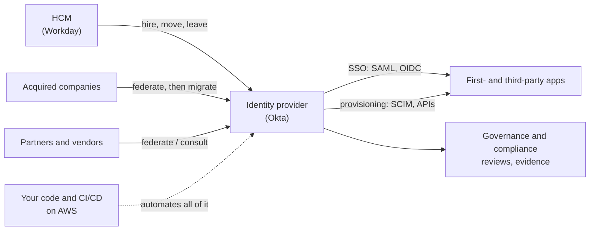

# Role guide: workforce IAM security engineer

This guide maps one target role to the material in this repo, line by line, so you know what to study, what to build and what to be able to say.

## The role in plain words

> Design and build Identity and Access security solutions for a global population of employees, contractors and external partners across all business verticals.

It is a **senior, hands-on engineering role**, not a people-management one. You design the solution, build and operate it, integrate vendors and explain it to people who are not IAM specialists. The dual mission is the key phrase: **reduce risk while keeping the business fast**. Every design decision in this guide is judged against both halves.

That picture is the whole job. Each arrow is a section below.

## What the job description asks for, and where it is covered

### Areas of work

| The JD says | What it means in practice | Study | Build |
|---|---|---|---|
| Federated authentication | Putting every app behind the IdP using SAML or OIDC | [03](03-federation-sso.md), [15](15-okta-and-auth0.md) | A free Okta or Auth0 tenant with one SAML and one OIDC app |
| User provisioning and deprovisioning | Accounts created and removed automatically in every app | [13](13-workforce-identity-lifecycle.md), [14](14-provisioning-and-integration-patterns.md) | [Lab 05](../labs/05-scim-provisioning/README.md), [lab 04](../labs/04-sailpoint-iga/README.md) |
| Identity governance | Requests, roles, SoD, access reviews | [05](05-identity-governance.md) | [Lab 04](../labs/04-sailpoint-iga/README.md) |
| Compliance | Producing evidence that controls work | [11](11-cross-cutting.md), [12](12-iam-program-leadership.md) | Lab 04 and lab 05 reconciliation output |
| Access management | Authentication policy, MFA, authorization, privileged access | [02](02-authentication.md), [04](04-authorization.md), [06](06-privileged-access.md) | [Lab 01](../labs/01-aws-iam/README.md), [lab 02](../labs/02-aks-identity/README.md) |
| Vendors and service providers: consult, integrate, improve | Assessing a vendor's identity capability and getting it to an acceptable level | [14](14-provisioning-and-integration-patterns.md) | Lab 05: you run the vendor's side of SCIM |
| Solution design, implementation, rollout strategy | Owning a change from design note to full adoption | [18](18-delivery-rollout-and-communication.md) | A design note after every lab |

### Requirements

| The JD says | Study | Evidence you should be able to show |
|---|---|---|
| Architecting, building and operating identity lifecycle and access control solutions | [12](12-iam-program-leadership.md), [13](13-workforce-identity-lifecycle.md) | A lifecycle you designed end to end, including failure handling |
| Communication and a product-focused mindset; explaining IAM simply | [18](18-delivery-rollout-and-communication.md) | Two-minute plain-language explanations of SSO, SCIM, MFA |
| Collaboration over process; comfortable with ambiguity | [18](18-delivery-rollout-and-communication.md) | A story where you made a decision with incomplete information |
| OpenID Connect, SCIM, OAuth, SAML, LDAP | [01](01-directories.md), [03](03-federation-sso.md), [14](14-provisioning-and-integration-patterns.md) | Draw each flow from memory; read a token, an assertion and a SCIM request |
| Workforce identity lifecycle from HCM downstream | [13](13-workforce-identity-lifecycle.md) | Explain every lifecycle event, including the awkward ones (rehire, conversion, leave) |
| Okta Workflows, Okta Identity Engine, Auth0 or equivalent | [15](15-okta-and-auth0.md) | A tenant you configured yourself |
| Acquisition-driven identity integrations and migrations | [16](16-acquisitions-and-migrations.md) | A phased integration plan and the patterns behind it |
| CI/CD with Java or Python; reading and writing code | [17](17-iam-engineering-code-cicd-aws.md) | IAM configuration in Git, deployed by a pipeline; code you can walk through |
| Running services on AWS | [10](10-cloud-iam.md), [17](17-iam-engineering-code-cicd-aws.md) | A small identity service you deployed and operated |

## Study order for this role

| Stage | Read | Do |
|---|---|---|
| 1. Fundamentals | 00 to 04 | Lab 04 |
| 2. Lifecycle and provisioning | 05, 13, 14 | Lab 05 |
| 3. Platform | 15 | Free Okta and Auth0 tenants: one SAML app, one OIDC app, one provisioning integration |
| 4. Engineering | 10, 17 | Labs 01 and 02; put your tenant configuration in Terraform |
| 5. Scale and change | 16, 18, 12 | Write an acquisition integration plan and a rollout plan |

## How to tell you are ready

You can, without notes:

1. Draw the SAML flow, the OIDC authorization code flow and a SCIM create-then-deactivate exchange.
2. Trace a new hire from the HCM record to a working account in a third-party app, naming every system and what can fail between them.
3. Explain what you would do when a vendor supports neither SSO nor SCIM.
4. Lay out how you would give an acquired company access on day one, and how you would finish the migration.
5. Show identity configuration in Git with a pipeline that applies it.
6. Explain any of the above to a non-engineer in two minutes.

## Preparing for the interview

Once the material is familiar, practise performing it: [interview preparation](../interview/README.md) has question sets, troubleshooting and design rounds, and timed mock interviews for this role.

## Honest gaps

This repo teaches concepts and gives you safe practice. The role also asks for a **proven track record** of operating these systems in production, which only comes from doing the job. Use the labs and design notes to get an IAM engineering position, then build the record there.
