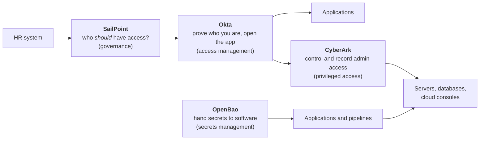

# Tool comparison: OpenBao, CyberArk, SailPoint, Okta

These four are not competitors. Each answers a different question, and a large company commonly runs one product from each category.

## Where each one sits

## Side by side

| | **OpenBao** | **CyberArk** | **SailPoint** | **Okta** |
|---|---|---|---|---|
| **Category** | Secrets management | Privileged access management (PAM) | Identity governance and administration (IGA) | Access management / identity provider |
| **Question it answers** | How does software get credentials safely? | How is admin access controlled and recorded? | Who should have what access, and can we prove it? | Who is this user, and may they open this app? |
| **Main identities served** | Applications, pipelines, workloads | Human administrators and privileged accounts; also machines through Conjur | All workforce identities, viewed for governance | Employees, contractors, partners (customers through Auth0) |
| **Core functions** | Secret storage, dynamic short-lived credentials, PKI, encryption as a service | Credential vaulting, automatic rotation, session isolation and recording, just-in-time elevation | Lifecycle automation, access requests, roles, SoD policies, access certifications | SSO, MFA, sign-in policies, directory, provisioning, workflow automation |
| **Key concepts** | Secrets engines, auth methods, policies, leases, tokens | Vault, Safes, platforms, CPM, PSM, PVWA | Sources, identities, entitlements, access profiles, roles, certification campaigns | Universal Directory, groups and rules, app integrations, authentication policies, Workflows |
| **Main protocols and interfaces** | HTTP API; Kubernetes, JWT/OIDC and AppRole authentication | RDP and SSH proxying; REST API; LDAP and SAML for user sign-in | Connectors to applications; SCIM; REST API | SAML, OIDC, OAuth 2.0, SCIM, LDAP interface |
| **Deployment** | Self-hosted | Self-hosted or SaaS | SaaS (Identity Security Cloud) or self-hosted (IdentityIQ) | SaaS |
| **Licence** | Open source (Linux Foundation; a fork of HashiCorp Vault) | Commercial; Conjur has an open-source edition | Commercial | Commercial; free developer tenants |
| **Typically owned by** | Platform or DevOps engineering | Security / PAM team | IAM governance and compliance | IAM engineering / IT |
| **Main compliance value** | No static secrets in code; audit of secret access | Evidence of who used privileged accounts and what they did | Evidence of approvals, reviews and SoD | Evidence of MFA and who signed in to what |
| **What it does not do** | Human SSO, session recording, access reviews | Everyday SSO, access certification across all apps | Authenticate users, store secrets | Vault admin credentials, deep governance (its governance add-on is lighter than SailPoint) |
| **Job titles** | Platform security engineer, DevSecOps engineer | PAM engineer, CyberArk administrator | IGA engineer, SailPoint developer | IAM engineer, Okta administrator |
| **Chapters in this repo** | [08](08-non-human-identity.md), [09](09-secrets-certificates.md) | [06](06-privileged-access.md) | [05](05-identity-governance.md), [13](13-workforce-identity-lifecycle.md) | [02](02-authentication.md), [03](03-federation-sso.md), [15](15-okta-and-auth0.md) |
| **Lab in this repo** | Lab 03 teaches the same ideas with Conjur | [Lab 03](../labs/03-cyberark-conjur/README.md) | [Lab 04](../labs/04-sailpoint-iga/README.md) | [Lab 05](../labs/05-scim-provisioning/README.md) (the provisioning side) |

## Where they overlap

| Overlap | Detail |
|---|---|
| OpenBao and CyberArk | Both store and rotate secrets. OpenBao is strongest for machines and dynamic credentials; CyberArk for human admin sessions. CyberArk Conjur is the closest match to OpenBao. |
| SailPoint and Okta | Both provision accounts. Okta does it as part of access; SailPoint adds approvals, SoD and certification. Many companies have SailPoint decide and Okta deliver. |
| Okta and CyberArk | Both offer workforce sign-in products. In practice Okta is usually the identity provider and CyberArk sits behind it for privileged access. |

## How they work together: one new database administrator

| Step | Tool | What happens |
|---|---|---|
| 1 | SailPoint | HR record arrives; identity created; DBA role requested, checked for SoD and approved |
| 2 | Okta | Account activated; MFA enrolled; SSO to everyday apps |
| 3 | CyberArk | Admin signs in through Okta, checks out the database admin account; session recorded; password rotated afterwards |
| 4 | OpenBao | The application that uses the database fetches a short-lived database credential; no human involved |
| 5 | SailPoint | Quarterly certification: manager confirms the DBA role is still needed |
| 6 | All | Person leaves: SailPoint triggers removal, Okta disables sign-in, CyberArk access goes with the role |

## If you already know OpenBao

| You know | Carries over to |
|---|---|
| Policies and least privilege | Every tool here |
| Auth methods and short-lived tokens | Okta (OIDC tokens), workload identity |
| Dynamic secrets and leases | CyberArk just-in-time access; the idea of zero standing privilege |
| Audit devices | Compliance evidence in all four |
| Running a Tier 0 service | Operating any identity platform |

Product capabilities and names change; confirm details against each vendor's current documentation.
