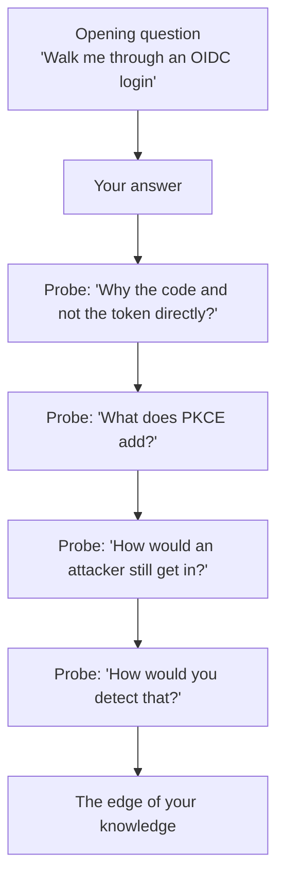

# 02. Technical deep dive

In this round the interviewer picks a topic and keeps asking "why?" and "what if?" until they find the edge of what you know. Reaching that edge is expected. How you behave there is part of the score.

## How this round works

At the edge, say: "I'm not certain. My reasoning would be..." and reason from principles. Do not bluff.

For each topic below: answer the opening aloud, then answer every probe before opening the notes.

## Topic 1. OIDC authorization code flow

**Opening:** "Walk me through what happens when a user clicks 'Sign in' on a web app using OIDC."

Model answer

"The app redirects the browser to the identity provider's authorize endpoint with its client ID, the scopes it wants, a redirect URI, a state value and a PKCE challenge. The user authenticates there. The identity provider redirects back to the app with a one-time authorization code. The app's back end sends that code, plus the PKCE verifier and its own credentials, to the token endpoint. It gets back an ID token, an access token and usually a refresh token. The app validates the ID token and creates a session. It uses the access token to call APIs."

| Probe | What a strong answer includes |
|---|---|
| Why return a code instead of tokens directly? | Tokens in a browser redirect are exposed in history and logs. The code is useless alone and is exchanged over a back channel. |
| What is `state` for? | Ties the response to the request the app started; prevents cross-site request forgery on the callback. |
| What does `nonce` do? | Binds the ID token to this login; prevents a replayed ID token. |
| What if the redirect URI is loosely matched? | An attacker gets the code sent to a URL they control. Redirect URIs must be exact. |
| How long should tokens live? | Access tokens minutes to an hour; refresh tokens longer, rotated on use and revocable. Trade-off between exposure and user friction. |
| The user is terminated mid-session. What happens? | The access token works until expiry unless the API checks revocation. Short lifetimes, refresh revocation, and for high-risk apps a signal to end sessions. |
| How does the API trust the token? | Fetches the issuer's public keys, checks signature, issuer, audience, expiry, then scopes. |

## Topic 2. SAML

**Opening:** "A vendor asks you to set up SAML SSO. What do you exchange, and what happens at login?"

Model answer

"We exchange metadata. From us: the identity provider's entity ID, sign-on URL and signing certificate. From them: their entity ID, the assertion consumer service URL where responses are posted, and which attribute they want as the user identifier. At login the app redirects to us, the user authenticates, and we post back a signed assertion containing the subject, attributes, an audience restricted to their entity ID and a short validity window. They verify the signature and conditions and create a session."

| Probe | What a strong answer includes |
|---|---|
| What goes in NameID, and why does it matter? | The user identifier the app matches on. An immutable ID is safer than email, which changes and causes duplicates. |
| What should the app validate? | Signature, issuer, audience, the time window, the recipient, and that the assertion has not been seen before. |
| The signing certificate is expiring. How do you rotate it? | Publish the new certificate ahead of time, have the app trust both if it can, switch signing, then remove the old. For apps that hold only one, schedule a coordinated cutover. Track expiry so it is never a surprise. |
| Sign the response, the assertion, or both? | At least the assertion. Signing only the outer response while the app reads an unsigned inner assertion has caused real vulnerabilities. |
| How do you send group membership? | As an attribute statement; map IdP groups to app roles. Filter so you do not send every group. |
| How do you debug a failed login? | A browser SAML tracer to read the actual assertion; compare audience, recipient, NameID format and timestamps against what the app expects; then the logs on both sides. |

## Topic 3. SCIM and provisioning

**Opening:** "How does automated provisioning to a SaaS app work?"

Model answer

"When a user is assigned the app, the identity provider calls the app's SCIM API. It first looks the user up with a filter, creates them with a POST if they don't exist, and stores the ID the app returns. Profile changes go as PUT or PATCH. When the user is unassigned or leaves, it sends a PATCH setting active to false. Groups work the same way through the Groups endpoint."

| Probe | What a strong answer includes |
|---|---|
| Why look up before creating? | Idempotency: a retry or an existing account must not create a duplicate. |
| Deactivate or delete? | Deactivate. Keeps audit history and owned data; allows rehire. Delete later per retention. |
| The vendor returns 200 on deactivate but the user stays active. | Verify the result, not the status code. Reconcile on a schedule. Raise it with the vendor with evidence. Until fixed, a compensating process and a recorded exception. |
| How is the SCIM connection authenticated? | Usually a long-lived bearer token, sometimes OAuth. It is a powerful secret: store it properly, rotate it, scope it. |
| What happens at 10,000 users with rate limits? | Batching, backoff on 429, a queue, and a reconciliation job to catch what was dropped. |
| The app has no SCIM. | Use its admin API with a custom connector or workflow; failing that, SSO with manual removal plus a reconciliation report; record the exception; ask the vendor for SCIM. |
| How do you prove to an auditor that leavers are removed? | Timestamps from HR event to app deactivation, a measured target, and the reconciliation report showing no active accounts for terminated workers. |

## Topic 4. Workforce lifecycle

**Opening:** "Walk me through what happens between HR entering a new hire and that person being productive."

Model answer

"HR creates the worker record with a start date. The identity provider imports it and creates the account in a staged state a few days ahead. It generates the username and email and writes the email back to HR. On the start date, in the worker's time zone, the account activates. Group rules place them in groups from their department, location and worker type. Those groups assign applications, which provisions accounts by SCIM and gives SSO. The person enrols MFA on first sign-in. Anything beyond birthright goes through a request."

| Probe | What a strong answer includes |
|---|---|
| How do they sign in the first time, before they have MFA? | A verified bootstrap: a temporary access pass or activation link delivered through a trusted channel, with identity checked. This moment is a target for attackers. |
| What is different for a contractor? | No standard HR record: a named sponsor, an end date, re-approval to extend, and narrower birthright access. |
| A contractor becomes an employee. | Same identity continues, matched on a stable key; worker type changes and access is recalculated. The failure is a second identity and an orphaned first one. |
| An involuntary termination at 3 pm. | A real-time trigger, not the nightly batch: disable, revoke sessions and tokens, deactivate in apps, within minutes. |
| The HR feed arrives empty. | Halt on a threshold; alert; never read it as everyone leaving. |
| How do you handle a mover? | Recalculate birthright from the new attributes; remove the old; flag anything requested under the old role for review. |
| What do you measure? | Time from termination to access removed; day-one readiness; share of access granted automatically; drift found by reconciliation. |

## Topic 5. Okta and automation

**Opening:** "Tell me how you would use Okta Workflows, and where you would not."

Model answer

"I'd use Workflows for identity processes the built-in features don't cover: custom deprovisioning for an app without SCIM, revoking tokens on termination, contractor expiry reminders to sponsors, time-limited group membership. A flow starts from an event, a schedule or an API call, and chains connector actions and logic.

I wouldn't use it for complex logic that needs proper testing and code review. At that point I'd move the logic into a service and have the flow call it. And I'd treat every flow as production code: named, documented, with error handling, and exported to version control."

| Probe | What a strong answer includes |
|---|---|
| A flow fails half-way through a leaver process. | Design for it: idempotent steps, retries, a failure path that alerts, and a reconciliation that catches leftovers. |
| How do you promote a flow from test to production? | Separate tenants, export and import, review; avoid editing production directly. |
| How would you require stronger sign-in for one sensitive app? | A dedicated authentication policy for that app requiring a phishing-resistant factor and a managed device. |
| Event hook or inline hook? | Event hooks notify after the fact, asynchronously. Inline hooks are called during a process and Okta waits, for example to add a claim. Inline hooks add a dependency to sign-in, so they must be fast and reliable. |
| How do you keep the Okta configuration under control? | Terraform, pull requests, a plan reviewed before apply, drift detection, and very few people with direct admin rights. |

If you have not used Okta, say so, name the equivalent you have used, and map the concepts: directory, sourcing, group rules, assignments, policies, automation.

## Topic 6. AWS identity

**Opening:** "How would you give 2,000 engineers access to 300 AWS accounts?"

Model answer

"Federate from the identity provider into IAM Identity Center, with users and groups synced by SCIM. Define a small set of permission sets, for example read-only, developer and admin. Assign groups to permission sets per account or per organizational unit, as code. People get temporary credentials through SSO; there are no IAM users. Service control policies set guardrails across the organization. Admin access is requested and time-limited. CloudTrail gives the audit trail."

| Probe | What a strong answer includes |
|---|---|
| How do you avoid thousands of groups? | Model on team and environment, not per account; use attributes for finer control; automate assignment. |
| How do pipelines and services authenticate? | Roles with workload identity federation, such as OIDC from the CI system. No stored access keys. |
| "AccessDenied" but the policy allows it. | Explicit deny, service control policy, permission boundary, resource policy, session policy, or the trust policy. Use the error context and the policy simulator. |
| How do you find over-permissioned roles? | Compare granted with used, with Access Analyzer and last-accessed data; tighten iteratively. |
| What is the worst privilege-escalation risk? | Permissions that let a principal grant itself more: creating or attaching policies, passing roles. Guard them with boundaries and service control policies. |

## Topic 7. Code and CI/CD

**Opening:** "Tell me about an integration you wrote. How was it structured and how did it get to production?"

Answer from real work. A structure to follow:

> "It [did what] between [system A] and [system B]. It read [desired state], compared it with [actual state] and applied the difference. I made it idempotent by [how]. Failures were [retried / queued / alerted]. It ran as [what, where], with credentials from [where]. Changes went through [review and pipeline]. What I'd improve is [honest point]."

If your example is lab work, say so: [lab 05](../labs/05-scim-provisioning/README.md) in this repo is a legitimate, small example you can walk through line by line.

| Probe | What a strong answer includes |
|---|---|
| How did you test it? | Unit tests on mapping and diff logic; a dry run against real data; a test tenant. |
| How were secrets handled? | A secrets manager, fetched at run time, least privilege, rotated; nothing in code or CI variables long-term. |
| How do you read an unfamiliar codebase? | Start from an entry point for one request, trace it through, read the tests, run it locally, ask the owning team. |
| How would you review an authentication change? | Issuer pinned, audience checked, default deny on routes, object-level authorization, nothing sensitive logged. |
| What happens when it fails at 2 am? | Alarm on failure, a dead-letter queue, a runbook, and it is safe to re-run. |

## Topic 8. Acquisitions

**Opening:** "We close an acquisition of 800 people in six weeks. What do you do about identity?"

Model answer

"Before close I'd find out what they have: HR system, identity provider, MFA coverage, application count and admin access. For day one I would federate, not migrate: our identity provider trusts theirs, so their people sign in as usual and get a small set of our applications. In the first weeks I'd raise their baseline where it's weak, mainly MFA, admin accounts and leaver removal. Consolidation comes later in waves, once their HR data is in our system, with a mapping for IDs and usernames. The last step is decommissioning their identity systems and removing the trusts."

| Probe | What a strong answer includes |
|---|---|
| Why not create accounts for everyone on day one? | New credentials for 800 people in a disruptive week; support load; phishing risk; nothing gained that federation does not give. |
| Their security is weaker than ours. What is the risk of federating? | We inherit their authentication strength. Limit what federated users can reach, require our MFA for sensitive apps, monitor, and fix their baseline fast. |
| Two people have the same username. | A deterministic naming rule decided before migration; match on a strong key; keep a permanent old-to-new mapping. |
| When does lifecycle automation switch to ours? | When their workers are in our HR system, which becomes the source of truth. |
| How do you make this repeatable? | A playbook: a federation template, a fixed day-one app set, a due-diligence questionnaire, mapping rules as code, dry-run migrations. |

Next: [03. Troubleshooting](03-troubleshooting.md)
