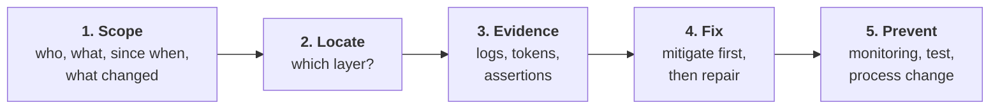
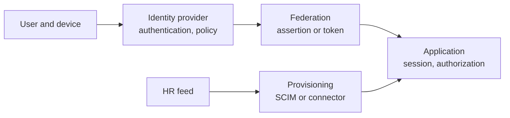

# 03. Troubleshooting round

The interviewer describes a failure and plays the system: you ask, they answer. You are scored on **method**, not on guessing the cause first.

## The method

### 1. Scope: ask before you theorise

| Question | What it rules in or out |
|---|---|
| One user, a group, or everyone? | One user: their account or device. Everyone: the integration or the provider. |
| One application or all? | One: that app's configuration. All: the identity provider or the network. |
| When did it start? | Lines it up with a change. |
| What changed recently? | Certificates, policies, deployments, HR feed, vendor release. |
| What exactly does the user see? | The precise error text often names the layer. |

### 2. Locate: the layers

Cut the problem in half: did the user authenticate at the identity provider? If yes, the fault is to the right. If no, to the left.

### 3. Evidence: where to look

| Layer | Evidence |
|---|---|
| Identity provider | System log: was authentication successful, which policy applied, what was sent |
| Federation | The actual SAML assertion (browser tracer) or decoded JWT |
| Application | Its own logs and error message |
| Provisioning | Provisioning task log, HTTP status from the SCIM calls |
| Cloud | CloudTrail event with the error code and context |

### 4 and 5. Fix, then prevent

Always finish with prevention. "I'd fix the certificate" is a mid-level answer. "I'd fix it, then add expiry monitoring and a rotation runbook so it can't surprise us again" is a senior one.

## Say this out loud

A script for the first thirty seconds of any scenario:

> "Before I guess, let me scope it. Is this one user or many? One app or all? When did it start, and did anything change around then?"

Then narrate: "That tells me authentication is succeeding, so I'll look at what's being sent to the app."

## Scenarios

For each: read the prompt, say your scoping questions aloud, then work through. The notes show how the interviewer might answer and where it leads.

### Scenario 1. SAML login suddenly fails for everyone on one app

**Prompt:** "Since this morning nobody can sign in to our expense tool. Other apps are fine."

Walk-through

**Scope:** one app, everyone, started at a point in time. That points to the integration, not users.

**Ask:** what is the error? What changed? Suppose: "invalid signature" and "nothing changed on our side".

**Locate:** users reach the identity provider and authenticate; the app rejects the response. The fault is in the assertion or in the app's trust configuration.

**Likely causes, in order:**

| Cause | How to confirm |
|---|---|
| Signing certificate rotated or expired | Compare the certificate in the assertion with what the app holds; check expiry dates |
| The vendor changed something | Ask; check their status page and release notes |
| Clock skew | Compare assertion timestamps with the current time |
| Audience or ACS URL changed | Read the assertion with a tracer; compare with the app's settings |

**Fix:** upload the current certificate to the app, or roll back the rotation.

**Prevent:** certificate expiry monitoring; a rotation runbook; rotate with overlap where the app supports two certificates; an inventory of which apps need manual updates.

### Scenario 2. One user cannot sign in to one app

**Prompt:** "A user can sign in to everything except the CRM. They get 'user not found'."

Walk-through

**Scope:** one user, one app. Authentication works. The app does not recognise the identity being sent.

**Ask:** did it ever work? Did anything change about the user, such as a name change?

**Likely causes:**

| Cause | How to confirm |
|---|---|
| The identifier sent does not match the account in the app, often after an email change | Compare NameID in the assertion with the username in the app |
| No account in the app: provisioning failed or the user is not assigned | Check the assignment and the provisioning log |
| The account exists but is deactivated | Look in the app's admin console |

**Fix:** correct the identifier or re-run provisioning.

**Prevent:** use an immutable identifier, not email, as the match key; alert on provisioning failures.

### Scenario 3. API returns 401 for a token that looks valid

**Prompt:** "A service calls our API with a token from the identity provider and gets 401. The token decodes fine."

Walk-through

**Scope:** one client or all? Since when? New client, or did it work before?

**Decode the token and check, in order:**

| Check | Typical finding |
|---|---|
| `aud` | Token was issued for a different API |
| `iss` | Wrong tenant or environment, for example a test issuer against production |
| `exp` and clock | Expired, or server clock is wrong |
| Signature and key ID | The provider rotated keys and the API cached the old set |
| Token type | An ID token sent where an access token is expected |
| Scopes | Authenticated but lacking the scope: this is usually 403, which is a clue in itself |

**Fix:** request the token for the correct audience; refresh the key cache.

**Prevent:** the API should refresh keys when it sees an unknown key ID; clear error messages that say which check failed; an integration test in the pipeline.

### Scenario 4. New hires have no account in an app on day one

**Prompt:** "Three people who started Monday can't get into the ticketing tool. Last month's starters were fine."

Walk-through

**Scope:** some users, one app, recent. Walk the chain from the left.

| Link | Question |
|---|---|
| HR | Are the three in the feed with the right attributes? |
| Identity provider | Were they imported and activated? |
| Group rule | Did the rule place them in the group? Did their department value change, for example a renamed department? |
| Assignment | Is the group assigned to the app? |
| Provisioning | Did the SCIM call fail? What status? |

**Common findings:** a renamed department no longer matches the group rule; a required attribute is empty so the app rejects the create; the SCIM token expired; the app ran out of licences; a rate limit.

**Fix:** correct the rule or mapping and re-push.

**Prevent:** alert on provisioning errors; do not key rules on free-text values; a day-one readiness check before the start date.

### Scenario 5. A terminated employee accessed an app two days later

**Prompt:** "Security found activity in our source control from someone who left on Friday."

This is an incident as well as a fault. Say so, and separate containment from root cause.

Walk-through

**Contain first:** disable the account in that app now, revoke its sessions and tokens, and preserve logs.

**Then find how:**

| Question | Finding it points to |
|---|---|
| Was the identity provider account disabled, and when? | HR event late or missed |
| Did they sign in through SSO, or use something else? | A personal access token or SSH key, which SSO never controlled |
| Was the app account deactivated? | Provisioning did not run or does not deprovision |
| Was there a live session? | Sessions were not revoked |
| Does the app allow local passwords? | SSO is not enforced |

**Fix the class of problem:** include token and key revocation in the leaver process; enforce SSO; reconcile app accounts against terminated workers.

**Prevent:** measure time from termination to removal per app; a recurring reconciliation report; check every other leaver in the period for the same gap.

### Scenario 6. Hundreds of accounts are being deactivated

**Prompt:** "It's 2 am. Alerts show the lifecycle job deactivating hundreds of active users."

Walk-through

**Stop it first.** Pause the job or the integration. Do not investigate while it runs.

**Scope:** which users? All from one source, one department, one country?

**Likely causes:** a truncated or empty HR feed; a changed column or attribute name so every record fails to match; a filter change in the HR integration; an expired credential making the source look empty.

**Recover:** restore from the last good feed; reactivate in a controlled way; check that downstream apps reactivated too and that access came back correctly, not more than before.

**Prevent:** a threshold that halts the job when deactivations exceed a share of users; validation of the feed's size and shape before processing; a staged rollout for integration changes.

[Lab 05](../labs/05-scim-provisioning/README.md) lets you trigger and see this guard.

### Scenario 7. Duplicate accounts after a name change

**Prompt:** "A user got married, changed their name, and now has two accounts in a SaaS app, one with all their data and one empty."

Walk-through

**Cause:** the app matches on email. The email changed, the lookup found nothing, and a new account was created by provisioning or by just-in-time creation at login.

**Fix:** merge or re-link in the app; update the original account's username; remove the duplicate.

**Prevent:** match on an immutable identifier in `externalId` and NameID; treat an email change as an update to an existing account; test the rename path for each integration.

### Scenario 8. AWS AccessDenied although the policy allows the action

**Prompt:** "An engineer's role has `s3:GetObject` on the bucket but they get AccessDenied."

Walk-through

**Ask:** same account or cross-account? What does the full error say? Which principal is actually making the call?

**Check in order:**

| Check | Why |
|---|---|
| Who is the caller really? | `sts get-caller-identity`: often a different role than assumed |
| Explicit deny in any policy | Deny always wins |
| Service control policy | An organization guardrail |
| Permission boundary or session policy | Caps the role |
| Bucket policy | Cross-account needs both sides; it may also deny by condition, such as requiring a VPC endpoint |
| Encryption key policy | The object is encrypted and the role cannot use the key |
| Resource ARN | Permission on the bucket but not on `bucket/*` |

**Prevent:** use the policy simulator and Access Analyzer in review; keep policies as code with tests.

### Scenario 9. Users locked out after an MFA policy change

**Prompt:** "We enforced phishing-resistant MFA this morning and the help desk is flooded."

Walk-through

**Mitigate:** decide quickly between rollback and a targeted exception. If a large share is blocked, roll back to the previous policy for the affected group.

**Scope:** who is blocked? Often people who never enrolled the new factor, shared or unmanaged devices, a legacy app that cannot do the new flow, or service accounts caught by a policy meant for people.

**Fix:** an enrolment path for the unenrolled; exceptions with expiry for the genuine edge cases.

**Prevent:** report-only mode first to see who would fail; rings; an enrolment campaign with a measured threshold before enforcement; help desk briefed; a secure recovery process, because lockout recovery is exactly where attackers try to get in.

### Scenario 10. LDAP authentication stopped working for a legacy app

**Prompt:** "An internal tool that authenticates against the directory is rejecting all logins."

Walk-through

**Scope:** all users, one app: the connection or the bind account, not the users.

| Cause | How to confirm |
|---|---|
| The bind account's password expired or the account is locked | Try a bind with it; check the directory |
| The directory's TLS certificate changed and the app does not trust the new one | Test the TLS connection; look for a certificate error in the app log |
| A network or firewall change | Test the port from the app host |
| A hardening change now requires signing or TLS | Check recent directory policy changes |

**Prevent:** monitor the bind account and certificate expiry; document the dependency; plan to move the app to SAML or OIDC.

## Practise with a partner

Have someone read only the prompt, then answer your questions from the walk-through. If you are alone, cover the walk-through and write your first five questions before looking.

Score yourself:

| Did you | |
|---|---|
| Ask scoping questions before proposing a cause? | |
| Identify the layer before diving in? | |
| Name the evidence you would look at? | |
| Mitigate before finding the root cause, where users were affected? | |
| End with prevention? | |

Next: [04. Solution design](04-solution-design.md)
