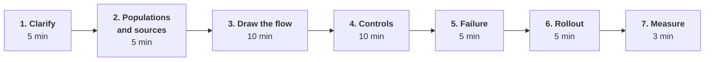
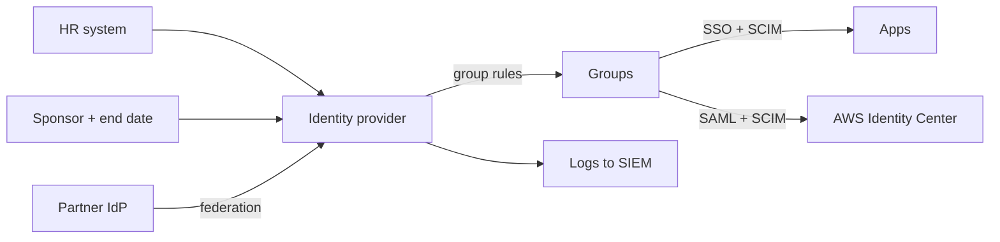

# 04. Solution design round

You are given an open problem and 45 to 60 minutes. There is no single right answer. You are scored on how you scope, structure, weigh trade-offs and plan for failure and rollout.

## The method

Use the same seven steps every time, and say them aloud at the start so the interviewer knows where you are going.

| Step | What you do | Say |
|---|---|---|
| **1. Clarify** | Ask about scale, populations, existing systems, constraints, what success means | "Before I design, a few questions." |
| **2. Populations and sources** | List who needs access and what the source of truth is for each | "There are three populations here, each with a different source." |
| **3. Draw the flow** | Boxes and arrows: source, identity provider, apps, with protocols on the arrows | "Let me draw the path from HR to an application." |
| **4. Controls** | Authentication, authorization, lifecycle, privileged access, logging | "Now the controls on each arrow." |
| **5. Failure** | What breaks, and what happens when it does | "Three things can fail here." |
| **6. Rollout** | Phases, pilot, rollback | "I wouldn't ship this at once." |
| **7. Measure** | Two or three metrics | "I'd know it worked if..." |

Three rules for the whole round:

1. **State assumptions** when the interviewer does not answer: "I'll assume about 10,000 people and an existing cloud identity provider. Tell me if that's wrong."
2. **Name trade-offs** every time you choose: "I'm choosing X over Y because... The cost is..."
3. **Return to the dual mission:** for each control, say what risk it reduces and what it costs in speed.

## Clarifying questions to keep ready

| Area | Question |
|---|---|
| Scale | How many people, apps, countries? |
| Populations | Employees only, or contractors and partners too? |
| Existing | What HR system, identity provider and directory are in place? |
| Constraints | Regulatory requirements? Deadlines? Things that cannot change? |
| Risk | What is most sensitive? What incident are we trying to prevent? |
| Success | What does good look like in six months? |

## Design 1. Workforce lifecycle for employees, contractors and partners

**Prompt:** "Design the identity lifecycle for employees, contractors and external partners at a fast-moving, cloud-heavy company."

Worked outline

**Clarify:** population sizes, the HR system, whether contractors are in it, how partners authenticate today, how fast terminations must take effect.

**Populations and sources:**

| Population | Source of truth | Trigger for removal |
|---|---|---|
| Employees | HR system | HR termination |
| Contractors | HR as contingent workers, or a sponsor record | End date; sponsor must renew |
| Partners | The partner's identity provider, by federation | Partner removes them; periodic re-attestation |

**Flow:**

**Controls:**

- Authentication: phishing-resistant MFA for all; stricter policy for sensitive apps; partners must meet a minimum at their own identity provider or step up at ours.
- Authorization: birthright from HR attributes through group rules; extra access by request, time-limited where possible.
- Lifecycle: matched on worker ID; pre-hire staging; movers recalculated; leavers disabled, sessions revoked, apps deactivated, tokens revoked.
- Partners: least privilege, a small set of apps, no local passwords.
- Governance: periodic review of non-birthright access; reconciliation per app.

**Failure:**

| Failure | Handling |
|---|---|
| Bad or empty HR feed | Threshold halts the run |
| An app's provisioning fails | Retry, alert, reconciliation catches leftovers |
| Identity provider outage | Tested break-glass path; multi-region provider |
| Sponsor leaves | Sponsorship reassigned or access suspended |

**Rollout:** start with leaver automation for the highest-risk apps, then joiners, then movers; one population at a time.

**Measure:** time from termination to access removed; share of access granted automatically; day-one readiness; accounts found by reconciliation with no owner.

**Trade-offs to name:** real-time versus batch sync; how much access is birthright versus requested; federation versus guest accounts for partners.

## Design 2. Integrate an acquisition

**Prompt:** "We have acquired a 600-person company with its own identity provider. Integrate them, quickly and safely."

Worked outline

**Clarify:** close date; their HR system and identity provider; MFA coverage; number of apps; what must work on day one; whether they will be fully absorbed or stay semi-separate.

**Phases:**

| Phase | Design | Trade-off |
|---|---|---|
| Day one | Our identity provider trusts theirs; small fixed app set | Fast and low disruption; we inherit their authentication strength, so limit reach and require our MFA for sensitive apps |
| Baseline | Enforce MFA, lock down admins, send their logs to our monitoring, make sure leavers are removed in both systems | Effort before migration, but risk does not wait a year |
| Migrate | After HR data moves: match on a strong key, resolve username collisions by rule, keep an ID mapping, re-enrol MFA, move apps in waves | Re-enrolment needs support capacity and a phishing-aware communication plan |
| Decommission | Remove trusts, revoke service accounts, archive logs | Often skipped; leftovers are a standing risk |

**Failure:** collisions and duplicates; a wave that goes badly (keep a rollback); attackers imitating migration emails.

**Measure:** share of users and apps migrated; sign-in success per wave; tickets per hundred users; date the old provider is switched off.

**To show seniority:** describe how you would turn this into a repeatable playbook.

## Design 3. A vendor with weak identity support

**Prompt:** "The business has bought a SaaS tool that holds sensitive data. It has SAML but no SCIM. Integrate it."

Worked outline

**Clarify:** what data; how many users; does it have an admin API; can SSO be enforced; can users create API tokens; is SCIM on a higher plan or the roadmap.

**Design:**

- Enforce SAML SSO; turn off local passwords; use an immutable identifier.
- Authorization: map identity provider groups to app roles if supported.
- Provisioning: if there is an admin API, a connector or workflow for create and deactivate. If not, just-in-time creation plus a manual removal step.
- Reconciliation in either case: a scheduled comparison of app accounts against active workers.
- Admin accounts in the tool: behind SSO, few, reviewed, with a protected break-glass account.
- Logs: export sign-in and admin events.

**With the vendor:** a specific request for SCIM with deactivate support, the reason, and an offer to test. Put identity requirements into the contract renewal.

**Record the exception** with an owner and a review date.

**Trade-off to name:** blocking the purchase versus accepting with compensating controls. For sensitive data with no SSO at all, the answer may be no.

**Measure:** accounts for terminated workers found by reconciliation (target zero); time to remove.

## Design 4. Day-one productivity without over-provisioning

**Prompt:** "Automate onboarding so a new engineer is productive on their first day, without giving them more than they need."

Worked outline

**Clarify:** what "productive" means; what tools an engineer needs on day one; what is sensitive.

**Design:**

- Pre-hire: account staged before the start date; laptop and accounts prepared.
- Birthright access from attributes: everyone gets collaboration tools; engineers get source control and non-production cloud access; team-specific access from the team attribute.
- Sensitive access is not birthright: production and customer data are requested, approved and time-limited.
- First sign-in: verified bootstrap, then enrol a phishing-resistant factor.
- A readiness check the day before: are all expected accounts present?

**Trade-off:** more birthright means faster onboarding and more standing access. Draw the line at sensitivity, and make the request path for the rest fast enough that people do not ask for it all in advance.

**Measure:** time to first commit or first productive action; number of access tickets in the first week; share of birthright access actually used.

## Design 5. Access to AWS at scale

**Prompt:** "Design how humans and workloads get access to several hundred AWS accounts."

Worked outline

**Humans:** identity provider to IAM Identity Center by SAML and SCIM; groups mapped to a small set of permission sets; assignments as code; temporary credentials only; privileged permission sets requested and time-limited.

**Workloads:** roles assumed through workload identity; CI systems use OIDC federation; no stored access keys.

**Guardrails:** service control policies at the organization level; permission boundaries for roles that teams create themselves.

**Detection:** CloudTrail centralised; alerts on root use, policy changes and new access keys; unused-permission analysis to tighten roles.

**Failure:** identity provider outage, so a break-glass role per account with credentials stored offline and alarms on use.

**Trade-off:** few broad permission sets are simple and over-permissive; many narrow ones are precise and hard to manage. Start coarse, tighten with usage data.

**Measure:** number of long-lived keys (target zero); share of permissions unused; time to grant a new team access.

## Design 6. Roll out phishing-resistant MFA

**Prompt:** "Move the whole company to phishing-resistant authentication."

Worked outline

**Clarify:** current factors; device management; populations that cannot use the new factor; legacy apps.

**Design:** device-bound authenticators and security keys; per-app policy so the most sensitive apps require it first; a secure enrolment and recovery process.

**Rollout:** report-only to see who would fail; the IAM team, then a pilot, then by department; enforce highest-risk groups first; exceptions with expiry; remove weak factors at the end.

**Failure:** lockouts, so help desk readiness and a rollback per ring; recovery abuse, so recovery must be as strong as enrolment.

**Measure:** enrolment rate; share of sign-ins using a phishing-resistant factor; weak factors remaining.

The full plan is in [chapter 18](../docs/18-delivery-rollout-and-communication.md).

## Probes to expect in any design

| Probe | What they are testing |
|---|---|
| "What threat does that control stop?" | Controls tied to risk, not habit |
| "How does it fail: open or closed?" | You have thought about the bad day |
| "How would an attacker get around it?" | You assume controls can be bypassed |
| "How do teams adopt this?" | A design nobody uses reduces no risk |
| "What would the auditor see?" | Evidence as a by-product |
| "What would you cut if you had half the time?" | Prioritisation |
| "What would you say no to?" | Judgement |

## Mistakes that lose this round

- Designing before asking a single question.
- Naming products instead of explaining the design.
- No failure handling.
- No rollout.
- Talking for twenty minutes without checking in.
- Never mentioning the user's experience.

Next: [05. Behavioural](05-behavioural.md)
