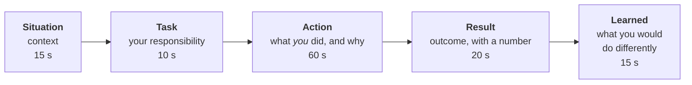

# 05. Behavioural round

This round asks for real examples from your past. It tests the non-technical requirements of the role: communication, product mindset, collaboration, ambiguity and independent decisions.

**Every answer here must be your own.** The templates below give the shape; the content in brackets has to come from work you did. Do not borrow or invent a story. Interviewers ask follow-up questions that an invented story will not survive.

## The shape: situation, task, action, result

| Part | Common mistake | Fix |
|---|---|---|
| Situation | Three minutes of background | Two sentences |
| Task | Unclear what was yours | "I was responsible for..." |
| Action | "We did..." | "I decided... I built... I persuaded..." |
| Result | "It went well" | A number, a date, or a before and after |
| Learned | Omitted | One honest sentence; this is what makes it credible |

## Build a story bank

Prepare eight stories. Each can answer several questions. Fill this in from your own experience:

| # | Theme | Your story (one line) | Result |
|---|---|---|---|
| 1 | Something you designed and built end to end | | |
| 2 | A decision made with incomplete information | | |
| 3 | Persuading someone who disagreed | | |
| 4 | Explaining something technical to a non-technical person | | |
| 5 | Security and delivery speed in conflict | | |
| 6 | A failure or outage you owned | | |
| 7 | Working with an outside vendor or another team | | |
| 8 | A migration or risky change | | |

### If you are new to IAM

Use real stories from your current field and connect them to identity. A story about migrating a secrets store, automating a manual process or handling an outage shows the same judgement. Lab work is fine as a technical example if you say it is lab work. Do not present it as production experience.

## Questions and templates

Say your own answer before reading the template. The "what they listen for" line is the scoring.

### Ownership and delivery

**"Tell me about an identity or access solution you built end to end."**

> "At [company], [problem: for example, access to X was granted by ticket and took days]. I was responsible for [scope]. I [designed what], choosing [option] over [alternative] because [reason]. I built [what], rolled it out by [how], and [handled this obstacle]. The result was [number: time reduced, tickets eliminated, accounts cleaned up]. Looking back, I'd [improvement]."

*What they listen for:* your decisions, a real trade-off, a measured result.

**"Tell me about something you operate. What goes wrong with it?"**

*What they listen for:* that you know its failure modes, have monitoring, and improved it after an incident.

### Ambiguity and independent decisions

**"Describe a time you had to decide without enough information."**

> "We needed to [decide what] by [deadline], and we didn't know [the unknown]. I worked out which parts were reversible. For those I [decided and moved]. For the part that wasn't, I [got the minimum information needed: a test, a conversation]. I chose [option] and told people [the assumption and how we'd know if it was wrong]. It turned out [result]. [If it was wrong:] We corrected by [how]."

*What they listen for:* you separate reversible from irreversible, decide, communicate the assumption and adjust.

**"Requirements were unclear and stakeholders disagreed. What did you do?"**

*What they listen for:* you found the underlying need, proposed a concrete default for people to react to, and wrote the decision down.

### Collaboration over process

**"Tell me about a time you got something done without relying on a formal process."**

> "The official route for [thing] was [slow process]. The real need was [underlying need]. I talked directly to [people], agreed [a lightweight approach], and [shipped it]. I kept [the control that mattered] in place by [how]."

*What they listen for:* pragmatism that does not drop the control that mattered.

**"Tell me about a disagreement with a colleague or another team."**

> "[Person or team] wanted [X]; I thought [Y] because [reason]. I first made sure I understood their concern, which was [it]. I [brought data / built a small test / proposed a compromise]. We ended up [outcome]. What I took from it was [learning]."

*What they listen for:* you understood the other side, used evidence, and can say what you got wrong.

### Risk versus speed

**"When did security and the business's speed conflict, and how did you resolve it?"**

> "[Team] needed [thing] by [date]. The secure approach would have [cost]. I looked for a way to give them the speed with the risk bounded: [the option: a time-limited exception, a narrower scope, a compensating control]. I was explicit about the remaining risk and [who accepted it]. We followed up by [closing the gap] on [date]."

*What they listen for:* a safe yes rather than a flat no; a risk owner; the exception actually closed.

**"Tell me about a time you said no."**

*What they listen for:* a clear reason tied to risk, an alternative offered, and the relationship intact afterwards.

### Communication and product mindset

**"Tell me about explaining a complex technical topic to a non-technical audience."**

> "I needed [audience] to [decide or do something] about [topic]. I started from what they cared about, which was [it], used [analogy], and left out [the detail they did not need]. I checked they'd understood by [how]. They [decided / approved / changed behaviour]."

*What they listen for:* audience first, an analogy, and an outcome.

You may then be asked to do it live: "Explain SCIM to me as if I were in finance." Practise the plain-language versions in [01](01-screen-and-fundamentals.md).

**"How did you find out what your users needed?"**

*What they listen for:* you talked to them or measured something, and it changed what you built.

**"Tell me about a time you improved a process people disliked."**

*What they listen for:* you measured the friction and removed it without removing the control.

### Vendors and partners

**"A vendor's product didn't support what you needed. What did you do?"**

> "[Product] lacked [capability]. I [worked around it by...] so we weren't blocked, with [compensating control]. In parallel I went to the vendor with a specific request: [exactly what], [why], and [what we'd do to help, such as testing]. The result was [they shipped it / we escalated at renewal / we kept the workaround and reviewed it on a date]."

*What they listen for:* unblocked now, influenced the vendor, and the gap tracked.

### Failure and learning

**"Tell me about a mistake or an outage you caused."**

> "I [what I did] and it caused [impact]. I [noticed how], [mitigated], and told [people] straight away. The root cause was [it]. I changed [process, test or guard] so it couldn't recur. What I do differently now is [habit]."

*What they listen for:* you own it plainly, you fixed the cause and not just the symptom, no blaming.

**"What is something you changed your mind about?"**

*What they listen for:* evidence changed your view.

### Migration and change

**"Tell me about a risky migration or rollout."**

> "We moved [what] from [old] to [new], affecting [how many]. The risk was [it]. I planned it in [phases], with [pilot], [rollback], and [success measure]. [Something unexpected] happened; I [response]. We finished [when], with [result]."

*What they listen for:* phases, rollback, measurement, and how you handled the surprise.

### Mentoring and influence

**"Tell me about helping someone else grow."** and **"How have you influenced a team you had no authority over?"**

*What they listen for:* specific actions and what changed for the other person or team.

## Follow-ups to expect

Whatever story you tell, be ready for:

- "What was your part specifically?"
- "What would you do differently?"
- "What did the other person think?"
- "How did you know it worked?"
- "What was the hardest part?"

If you cannot answer these about a story, choose a different story.

## Questions to ask them

Always have three. Good ones show you understand the job:

| Question | What it shows |
|---|---|
| "What does the lifecycle look like today, from the HR record to an application, and where does it hurt most?" | You think in terms of the whole chain |
| "How do you balance reducing risk with keeping engineers fast? Can you give a recent example?" | You understood the dual mission |
| "How much of the identity platform is managed as code?" | Engineering mindset |
| "What would you want the person in this role to have delivered in the first six months?" | Outcome focus |
| "How does the team work with vendors whose identity support is limited?" | You read the job description |
| "What does on-call look like for the identity platform?" | You expect to operate what you build |

## Final checks

- Each story is under two minutes spoken.
- Each has a number or a concrete outcome.
- Each uses "I" for your actions.
- At least one story is about a failure.
- You have practised them aloud, not just written them.

Next: [06. Mock interviews](06-mock-interviews.md)
