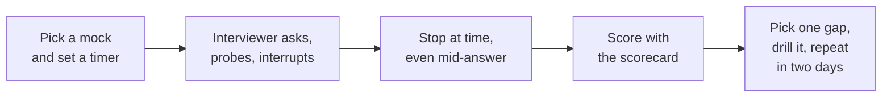

# 06. Mock interviews

Timed practice loops. Each is a script an interviewer can read from: a partner, a mentor, or an AI assistant. Run them under real conditions: on a call, with a timer, speaking aloud, without notes.

## How to run a mock

Rules for the interviewer:

1. Ask the question and wait. Do not help.
2. Ask at least two follow-ups per question from the "probes" column.
3. If the candidate rambles past two minutes, interrupt: "Let me stop you there."
4. Keep to the time box. Move on even if the answer is unfinished.
5. Score straight afterwards, while it is fresh.

### Using an AI assistant as the interviewer

Paste this, followed by the mock you want:

> Act as a senior IAM interviewer. Ask me the questions below one at a time. Wait for my answer before continuing. After each answer, ask one or two follow-up probes that test whether I really understand it. Do not give me answers or hints during the interview. Keep to the time boxes. At the end, score me from 1 to 4 on scoping, protocol depth, design, threat thinking, operability, communication and ownership, name my two biggest gaps, and give one drill for each.

## Mock A. Technical screen (45 minutes)

| Time | Question | Probes |
|---|---|---|
| 0 to 5 | "Tell me about yourself and why this role." | "What part of identity have you gone deepest on?" |
| 5 to 12 | "What is the difference between SAML, OAuth and OIDC?" | "Which would you use for a mobile app calling an API?" "What is in an ID token?" |
| 12 to 20 | "How does automated provisioning to a SaaS app work?" | "What if the app doesn't support deactivate?" "How do you prove leavers are removed?" |
| 20 to 28 | "A user is terminated. Walk me through everything that should happen." | "What still works after the account is disabled?" "How fast should it be?" |
| 28 to 35 | "How should engineers get access to AWS accounts?" | "What about pipelines?" "What is a trust policy?" |
| 35 to 40 | "Explain SSO to someone in finance." | "Now explain why SSO alone isn't enough." |
| 40 to 45 | "What questions do you have for me?" | |

Reference answers: [01](01-screen-and-fundamentals.md), [02](02-technical-deep-dive.md).

## Mock B. Deep dive (45 minutes)

One topic, pursued to the edge. The interviewer should keep asking "why?" and "what if?".

| Time | Question | Probes |
|---|---|---|
| 0 to 15 | "Walk me through an OIDC login for a web application, step by step." | "Why a code and not tokens directly?" "What does PKCE protect against?" "What does the API validate?" "The user is fired mid-session; what happens?" |
| 15 to 30 | "Now walk me from an HR record to a working account in a third-party app." | "What is the matching key and why?" "Contractor converts to employee: what happens?" "The feed is empty tonight." "How do you handle a mover?" |
| 30 to 42 | "Tell me about an integration you wrote or would write to deprovision an app without SCIM." | "How is it tested?" "Where do credentials live?" "What happens when it fails at night?" "How does it get to production?" |
| 42 to 45 | Candidate questions | |

Reference answers: [02](02-technical-deep-dive.md).

## Mock C. Troubleshooting (30 minutes)

The interviewer plays the system and answers only what is asked. Choose two scenarios from [03](03-troubleshooting.md). Suggested pair:

| Time | Scenario | Interviewer notes |
|---|---|---|
| 0 to 15 | "Since this morning nobody can sign in to the expense tool. Other apps work." | If asked: error is "invalid signature"; the identity provider's signing certificate was rotated last night; the app holds only one certificate. |
| 15 to 30 | "Security found activity in source control from someone who left on Friday." | If asked: the identity provider account was disabled Friday at 6 pm; the activity used a personal access token; the app account is still active; SCIM is not configured for that app. |

Score method, not speed: did they scope, locate the layer, name the evidence, mitigate, and prevent?

## Mock D. Design (60 minutes)

| Time | Stage | Interviewer does |
|---|---|---|
| 0 to 2 | Give the prompt: "Design the identity lifecycle for employees, contractors and external partners at a fast-moving, cloud-heavy company." | Then stop talking |
| 2 to 8 | Clarifying questions | Answer briefly: 12,000 employees, 3,000 contractors, about 200 partner companies; a cloud HR system and a cloud identity provider exist; contractors are handled by tickets today; partners have shared accounts |
| 8 to 30 | Candidate designs | Interrupt with: "What threat does that stop?" "How does that fail?" |
| 30 to 40 | Go deeper on one area | "Zoom in on partners. How exactly do they authenticate, and how is their access removed?" |
| 40 to 50 | Change a constraint | "We've just acquired a company of 800. What changes?" |
| 50 to 57 | Rollout and measurement | "What do you ship first? How do you know it's working?" |
| 57 to 60 | Candidate questions | |

Reference: [04](04-solution-design.md).

## Mock E. Behavioural (45 minutes)

| Time | Question | Probes |
|---|---|---|
| 0 to 8 | "Tell me about an access or identity solution you built end to end." | "What was your part specifically?" "What would you do differently?" |
| 8 to 16 | "Describe a decision you made with incomplete information." | "How did you know it was the right call?" "What if you'd been wrong?" |
| 16 to 24 | "When did security and delivery speed conflict?" | "Who accepted the risk?" "Was the exception ever closed?" |
| 24 to 31 | "A vendor's product didn't do what you needed. What happened?" | "Did the vendor change anything?" |
| 31 to 38 | "Tell me about a mistake you made." | "What changed afterwards?" |
| 38 to 41 | "Explain SCIM to me as if I work in finance." | Interrupt if jargon appears |
| 41 to 45 | Candidate questions | |

Reference: [05](05-behavioural.md).

## Mock F. Full loop (half a day)

Run A, B, C, D and E with ten-minute breaks, in one sitting. Do this once, about a week before the real interview. It shows what tiredness does to your structure in the fourth hour, which no single mock will.

## Scorecard

Score each dimension from 1 to 4 after every mock.

| Dimension | 1 | 2 | 3 | 4 | Score |
|---|---|---|---|---|---|
| **Scoping** | Jumped to an answer | Asked a question or two | Clarified populations, systems and constraints first | Reframed the problem; named what was out of scope | |
| **Protocol depth** | Named tools | Rough mechanics | Explained the mechanism and real failure modes | Knew the trade-offs well enough to set a standard | |
| **Design** | One control | A component | Authentication, authorization, lifecycle, failure and detection together | Target state plus migration across populations | |
| **Threat thinking** | None | Generic | Threats drove the design | Assumed a control is bypassed; limited the damage | |
| **Operability** | Ignored | Mentioned monitoring | Retries, alerts, runbooks, a measured target | Designed for operation and cost across teams | |
| **Governance** | Ignored | Mentioned audit | Evidence as a by-product | Mapped controls to obligations; handled exceptions | |
| **Adoption** | Paper design | Mentioned rollout | Phased plan with rollback | A way to bring teams along at scale | |
| **Communication** | Hard to follow | Clear in places | Structured, checked in, plain language | Led the conversation | |
| **Ownership** | Vague, "we" | Some specifics | Specific actions, numbers, owned mistakes | Changed how a team works | |

For a senior engineer role, aim for mostly 3s, with protocol depth and operability strongest. That is a guide, not any company's actual bar.

### After each mock

| Question | Your note |
|---|---|
| Lowest two scores | |
| What a stronger answer would have added | |
| One drill for each | |
| Date of the next mock | |

## Drills for common gaps

| Gap | Drill |
|---|---|
| Rambling | Answer ten questions from [01](01-screen-and-fundamentals.md) with a 60-second timer |
| No structure | Before every answer, say "There are three parts" and then name them |
| Jumping to solutions | Write five clarifying questions for each design prompt before designing anything |
| Shallow protocol knowledge | Draw the OIDC, SAML and SCIM sequences from memory daily for a week |
| Weak on failure modes | For every concept, write one sentence beginning "Where this goes wrong is..." |
| Troubleshooting by guessing | Force yourself to ask three scoping questions before naming any cause |
| Jargon | Record yourself explaining SSO, SCIM and MFA to an imaginary non-engineer |
| "We" in stories | Rewrite each story using only "I" for actions |
| No results | Add one number to every story, even an approximate one you can defend |
| Bluffing | Practise saying "I haven't used that; here is how I'd reason about it" |

## Readiness check

You are ready when, in a mock:

1. You ask clarifying questions before every design and troubleshooting answer without being reminded.
2. You can be interrupted mid-answer and resume without losing your place.
3. Every technical answer includes how the thing fails.
4. Every story has your actions, a result and something learned.
5. You can say "I don't know" and then reason usefully.

Back to the [interview overview](README.md).
