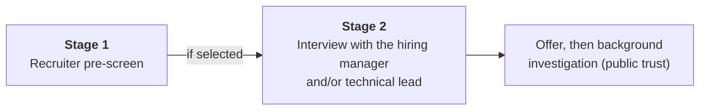

# 07. Interview guide: IAM / ICAM governance and strategy role

This file documents the interview process for a governance and strategy role (see the [role guide](../docs/role-guide-governance-icam.md)) and gives question sets for each of the job description's four areas.

The posting states the process:

Two conversations decide it. That is shorter than an engineering loop, so each one carries more weight and covers more ground. Confirm the format, length and who attends with the recruiter.

## How this differs from an engineering interview

| | Engineering role | Governance and strategy role |
|---|---|---|
| Most common question type | "How does X work?" | "How would you approach X?" and "Tell me about a time..." |
| What is rewarded | Mechanism and failure modes | A structured approach, frameworks, stakeholder handling |
| Technical depth | Deep in a few areas | Accurate across all areas |
| Live exercise | Troubleshooting, design | Explaining to an executive; walking through a recommendation |
| Evidence | Things you built | Documents you wrote, groups you led, outcomes you moved |

The answer shape for approach questions:

| Part | Sentence starter |
|---|---|
| **Understand** | "First I'd establish the current state by..." |
| **Assess** | "I'd measure it against..." |
| **Recommend** | "That gives prioritised recommendations, with options..." |
| **Agree** | "I'd take those to... to get a decision" |
| **Track** | "And I'd report progress using..." |

## Stage 1. Recruiter pre-screen

Typically 20 to 30 minutes. The recruiter checks requirements, not depth.

### What will be checked

| Topic | Prepare |
|---|---|
| Years of experience | An accurate count for security or identity overall, and for IAM programme support specifically |
| Degree | State it plainly |
| The seven required areas | One sentence of real experience or study for each: IGA, RBAC, ABAC, authentication and authorization, lifecycle, access certification, PAM |
| Tools | Which of the listed products you have used, and how |
| Certifications | What you hold; what you are working towards |
| Federal experience | Any, including as a contractor or on regulated work |
| Background investigation | Whether you are willing to undergo it |
| Logistics | Location, availability, compensation expectations, work authorization |

### "Walk me through your background"

Fill from your own history. Do not claim programme experience you do not have.

> "I have [N] years in [security / engineering / IT], most recently as [role] at [organisation]. My identity-related work has been [what you actually did: for example secrets management with OpenBao, access automation, SSO integration, access reviews].
>
> On the governance side I've [real examples: written standards, run reviews, supported an audit, presented to leadership], and I've been building depth in [IGA, lifecycle, zero trust] through [study, labs, certification].
>
> I'm interested in this role because [reason tied to the posting: modernisation, working across stakeholders, federal mission]."

### Handling a requirement you do not fully meet

> "I have [what is true]. I haven't [the gap] in a formal programme. The closest work I've done is [real example], and I've prepared by [specific study or sample artefacts]. I'd rather be exact about that than overstate it."

Accuracy matters more here than in most interviews: a background investigation follows, and so does the hiring manager's deeper questioning.

### Questions to ask the recruiter

- "What is the format of the hiring manager interview, and who will be in it?"
- "Is this role embedded with one agency or client, or across several?"
- "Which of the listed technologies is the environment actually using?"
- "What does the background investigation involve and how long does it usually take?"

## Stage 2. Hiring manager and/or technical lead

Typically 45 to 60 minutes. Expect a mix: your background, questions across the four areas of the job description, one or two scenarios, and possibly a short live exercise such as explaining a concept to a non-technical listener.

If both attend, the hiring manager usually weighs communication, judgement and fit; the technical lead checks that your knowledge is real.

A typical flow:

| Time | Segment |
|---|---|
| 0 to 5 | Introductions; "tell me about yourself" |
| 5 to 20 | Technical lead: concepts across the required areas |
| 20 to 40 | Scenarios: how you would approach programme problems |
| 40 to 50 | Behavioural: stakeholder and communication examples |
| 50 to 60 | Your questions |

Say your own answer aloud before opening each model answer.

### Area 1. Identity governance and strategy

**1. How would you develop an IAM modernisation roadmap for an agency you have just joined?**

Model answer

"I'd start with the current state: interviews with system owners, security, HR and the help desk, a review of policies and past audit findings, and real data such as account lists and review results. I'd score that against a maturity model; in a federal setting, the identity pillar of the CISA Zero Trust Maturity Model, alongside the mandates the agency has to meet.

Then I'd define the target state with stakeholders and identify the gaps. I'd prioritise by risk reduced, by dependency and by what the organisation can absorb, and lay it out as now, next and later, with an owner, a rough cost and a measure for each item.

I'd take that to the governance committee for agreement, because a roadmap nobody has signed up to doesn't get delivered. And I'd include a few quick wins in the first months to build confidence."

**2. What is ICAM, and how is federal identity different from commercial IAM?**

Model answer

"ICAM is identity, credential and access management, and FICAM is the federal architecture for it. The differences are that requirements come from policy and standards rather than company preference; credentials are stronger, typically PIV or CAC smart cards; assurance is formal, using the levels in NIST 800-63; controls come from NIST 800-53; and systems need an authorization to operate. So recommendations have to be tied to controls and mandates, and delivery is more documented and change-controlled."

**3. How would you support a governance committee?**

Model answer

"By making it easy for the committee to decide. That means a clear charter covering scope and decision rights. Before each meeting, papers that state the decision needed up front, with options and a recommendation. In the meeting, keeping to the agenda. Afterwards, decisions, owners and dates circulated within a day, and actions tracked to closure and reported back. I'd also bring the same small set of metrics each time so the committee can see movement."

**4. How do you evaluate a new identity technology?**

Model answer

"With a consistent template, so evaluations can be compared. What problem it solves and whether that's a priority. Fit with the existing identity provider, directory and governance tool. Whether it uses open standards. Security and compliance, including FedRAMP status in a federal environment. Maturity and who else runs it at scale. Total cost, including integration and operation. Risks such as lock-in. And a clear recommendation: adopt, pilot, watch or reject. I'd usually propose a small pilot with success criteria before any commitment."

**5. What identity trends should an agency be watching?**

Model answer

"Phishing-resistant and passwordless authentication, because it's mandated and it removes the most common attack. Identity threat detection, since attackers now log in more than they break in. Non-human identities, including AI agents, which outnumber people and are poorly governed. Consolidating identity data across many directories. And continuous access evaluation, which is where zero trust is heading. For each I'd ask what risk it addresses for this agency before recommending anything."

### Area 2. Identity lifecycle management

**6. Describe joiner, mover and leaver, and where each typically fails.**

Model answer

"Joiner: the HR record creates the identity and baseline access. It fails when access isn't ready on day one, or when too much is granted by copying a colleague. Mover: access changes with the job. This fails most often, because new access is added and the old isn't removed, so people accumulate privilege. Leaver: access is removed at departure. It fails when removal depends on a ticket, when applications outside single sign-on are missed, or when contractors have no end date. I'd measure each: day-one readiness, access carried over after a move, and time from termination to removal."

**7. An organisation grants access person by person. How would you help it move to role-based access?**

Model answer

"I'd combine two views. Top-down: what job functions exist and what each needs. Bottom-up: analysing who has what today to find common patterns. I'd draft a small number of business roles, validate them with the managers and system owners who'll own them, and pilot in one department. Each role gets a named owner and a regular review. I'd keep the number of roles low and handle exceptions through time-limited requests, because if roles multiply to match every individual the model has failed."

**8. When would you use attribute-based access control instead of, or with, roles?**

Model answer

"Roles describe what a job function may do. Attributes add conditions that roles handle badly: location, clearance, project, training status, time, device. So I'd use roles for the coarse shape and attributes for the conditions. For example, a claims processor role can open case files, but only for the user's own region and only if their training is current. That avoids creating a separate role for every region. The cost is that it's harder to answer 'who can access this?', so it needs good attribute data and tooling."

**9. How would you improve an access certification process that has become a rubber stamp?**

Model answer

"First I'd confirm it with data: approval rates near one hundred percent and seconds spent per item. Then make it smaller and more meaningful. Stop asking managers to re-approve baseline access everyone has. Focus on privileged access, unusual access and access not used recently. Give reviewers context: what the access does and when it was last used. Spread it through the year or trigger it on job changes. Make sure revocations actually happen and are verified. And report revocation rate, not just completion rate, because completion alone rewards rubber-stamping."

**10. How do you coordinate identity compliance and reporting?**

Model answer

"By keeping a calendar of obligations, such as certification campaigns and audit cycles, and a standing set of evidence. I'd brief reviewers before campaigns, track completion, and confirm that revocations were carried out. For audits I'd gather evidence, explain how each control operates, and keep the remediation plan current with owners and dates. The aim over time is evidence produced automatically by the systems, so reporting is a by-product and not a scramble."

### Area 3. Access management and security

**11. What authentication would you recommend for an agency, and why?**

Model answer

"Phishing-resistant multi-factor authentication for everyone: PIV where it works, and FIDO2-based authenticators where cards don't, such as on mobile devices. It's what federal zero trust strategy requires, and it removes the attacks that defeat codes and push prompts. I'd set the assurance level per system from a risk assessment, using NIST 800-63. And I'd plan the rollout in stages, with a secure recovery process, because the weakest point is usually how people get back in after losing an authenticator."

**12. Explain privileged access management and how you would support a PAM initiative.**

Model answer

"PAM protects the accounts that can do the most damage: administrators, root, service accounts. The core controls are vaulting credentials so people don't know them, rotating them automatically, brokering and recording sessions, and granting privilege just in time instead of permanently.

To support an initiative I'd start with discovery, because organisations rarely know how many privileged accounts they have. Then prioritise by risk, starting with the systems that control identity itself. Onboard in waves, with the administrators involved, since they're the users. And measure: share of privileged accounts under management, standing privileges remaining."

**13. How do you evaluate whether an access control is effective?**

Model answer

"I separate design from operation. Design: would the control stop the risk if it were followed? I check that against the policy. Operation: is it actually followed? I test by sampling, for example taking twenty-five recent leavers and checking when each account was disabled. Then coverage: does it apply to every system or only some? And evidence: can it be shown? A control that exists on paper but fails in the sample isn't effective, and that's a finding."

**14. Walk me through an identity risk assessment.**

Model answer

"I'd define scope, then gather information through interviews, documents and data. For each finding I'd state the fact with evidence, the risk it creates, and rate likelihood and impact. I'd map it to the relevant control, recommend a fix with options, and name an owner. Then prioritise across the findings and agree a remediation plan with dates; in a federal environment that's the plan of action and milestones. I'd present the top risks to leadership in plain terms and track remediation to closure."

**15. What does zero trust mean for identity?**

Model answer

"That no request is trusted because of where it comes from. Each one is verified using identity, device and context, with least privilege, and assuming a breach can happen. Identity is the first pillar in the CISA maturity model. In practice it means one consolidated identity source, phishing-resistant authentication, access decisions that consider device health, automated lifecycle, and moving towards continuous evaluation. I'd describe it as a multi-year strategy with measurable stages, not a product."

**16. In an architecture review, what would you look for from an identity perspective?**

Model answer

"How users and services authenticate, and whether that goes through the enterprise identity provider or something local. How authorization is decided and where it's enforced. How accounts are created and removed. How privileged access is handled. Whether there are service accounts with static secrets. What's logged. And where the trust boundaries are. The usual findings are local accounts, shared administrator credentials, and no deprovisioning path."

### Area 4. Stakeholder engagement and programme support

**17. Give me a two-minute executive briefing on the state of an MFA rollout.**

This may be asked live. Use the structure: bottom line, why it matters, where we are, what you need, what is next.

Model answer

"We're on track to meet the phishing-resistant authentication target by March. This matters because it's a federal requirement and it closes the route used in most account compromises.

Sixty-one percent of staff are enrolled, up from twelve at the start of the year. Help desk calls are within what we planned for.

There's one issue. Two older systems can't support the new method. I need a decision: fund their replacement this year, or formally accept the risk for another twelve months with extra monitoring.

Next, we enrol the remaining regional offices in January and switch off the older methods in March."

(The figures are invented for the example. Use your own in a real briefing.)

**18. A system owner refuses to adopt the new access review process. What do you do?**

Model answer

"I'd start by finding out why, in a one-to-one conversation. It's usually workload, a bad past experience, or a real problem with how the process fits their system. If it's a genuine issue I'd adapt: a smaller scope, better data for their reviewers, different timing. I'd show what they get from it, such as fewer audit findings. I'd offer help for the first cycle. If we still can't agree, I'd take it to the governance forum as a risk decision with the facts laid out, because accepting that risk isn't mine or theirs alone to decide."

**19. How do you run an effective workshop?**

Model answer

"One clear objective, and the right people in the room: those who do the work and those who can decide. An agenda with times, and pre-reading. I open by saying what we'll have produced by the end. Then get everyone contributing before narrowing down, so the loudest voice doesn't set the answer. Close by reading back decisions, owners and next steps, and send a summary within a day. A walk-through of the joiner, mover and leaver process with the people who do each step is one I'd use early."

**20. How do you track and report progress on a modernisation programme?**

Model answer

"I agree a small set of outcome measures at the start, with a baseline and target for each: share of users on phishing-resistant authentication, time to remove leavers, applications behind single sign-on, privileged accounts under management. I report the same measures every period so the trend is visible. The status report covers overall status, what was delivered, what's next, risks with owners, and decisions needed. I report outcomes, not activity; 'held six workshops' isn't progress."

**21. How do you get an organisation to adopt a new identity process?**

Model answer

"People need to know about it, be able to do it, and have a reason to. So: clear communication of what's changing and why, in their terms. Guides, training and a pilot group. Leaders using it first. Then measure adoption, follow up with teams that lag, and set a date when the old route closes. I'd also listen during the pilot and change the process where it doesn't fit, because adoption fails when a process is imposed without that."

**22. How do you explain a technical identity risk to a business leader?**

Model answer

"I start from what they're responsible for, not the technology. For example: 'Forty people who've left still have working accounts in the finance system. Any one of those could be used to move money or read salary data, and we'd have no way of knowing it wasn't them. Fixing it takes six weeks and I need your team's time for two workshops.' One risk, a consequence they care about, and a specific ask."

### Tools and concepts check

Short questions a technical lead may use to confirm your knowledge is real.

| Question | Short answer |
|---|---|
| What does an IGA tool such as SailPoint do? | Automates lifecycle, access requests, roles, separation of duties and access certification |
| What is Microsoft Entra ID? | Microsoft's cloud identity provider: SSO, conditional access, privileged identity management, governance features |
| How do Entra ID and Active Directory differ? | AD is on-premises, hierarchical, Kerberos and LDAP. Entra ID is cloud, flat, SAML and OIDC |
| What is CyberArk used for? | Privileged access: vaulting, rotation, session recording |
| What does Radiant Logic do? | Unifies identity data from many directories into one view without migrating them |
| What is ForgeRock? | An access management and customer identity platform, now part of Ping Identity |
| SSO versus MFA? | SSO is one login for many apps. MFA is more than one kind of proof at login. They are used together |
| SAML versus OIDC? | Both do single sign-on. SAML is XML and common in older enterprise apps. OIDC is JSON-based and common in modern and mobile apps |
| What is separation of duties? | No one person can complete a risky process alone |
| IAL, AAL, FAL? | Assurance levels for identity proofing, authentication and federation, from NIST 800-63 |
| What is a POA&M? | The tracked list of weaknesses with owners and dates |
| Name the zero trust maturity pillars | Identity, devices, networks, applications and workloads, data |

Fuller answers for the concepts are in [01](01-screen-and-fundamentals.md).

### Scenarios

For each, give your approach aloud in two minutes using understand, assess, recommend, agree, track.

**Scenario A.** "An audit found that 15 percent of sampled leaver accounts were still active after 30 days. You are asked to lead the response."

Approach

- **Contain:** disable the accounts found; check for use after the departure date.
- **Understand:** how are leavers handled today? Which systems rely on tickets? Where does the HR event go?
- **Scope:** run a full reconciliation of active accounts against terminated workers across systems.
- **Recommend:** short term, a weekly reconciliation with an owner; longer term, HR-driven automated deprovisioning, starting with the highest-risk systems.
- **Agree:** present findings and plan to the governance committee; record remediation items with owners and dates.
- **Track:** time from termination to removal, and the count of active accounts for terminated workers, reported monthly until it reaches zero.

**Scenario B.** "The agency has four separate directories after years of reorganisation. Leadership wants 'one identity'. Where do you start?"

Approach

- **Understand:** what each directory is for, who is in it, which applications depend on it, and who owns it.
- **Assess:** overlaps, duplicates, data quality, and which is closest to authoritative.
- **Options:** (a) consolidate into one directory, (b) put a cloud identity provider in front and keep directories for legacy, (c) a virtual directory or identity data layer that presents one view without migrating. Each with cost, risk and time.
- **Recommend:** usually a phased mix: establish one authoritative source and one identity provider for sign-in first, then retire directories as applications move.
- **Agree and track:** a decision at steering level; applications migrated and directories retired as the measures.

**Scenario C.** "You have 90 days to show progress on zero trust. What do you do?"

Approach

- **Days 1 to 30:** assess the identity pillar against the maturity model; gather data on MFA coverage, lifecycle and privileged access.
- **Days 31 to 60:** agree target stages and a roadmap with stakeholders; pick two quick wins, such as enforcing MFA for administrators and removing dormant accounts.
- **Days 61 to 90:** deliver the quick wins; present the roadmap, the baseline metrics and the first movement to leadership.
- Be explicit that zero trust is a multi-year effort and that the 90 days deliver a baseline, a plan and early results.

**Scenario D.** "Two system owners disagree about who should approve access to shared data."

Approach

- Meet each separately to understand their concern.
- Establish facts: who is accountable for the data under policy; what risk each is worried about.
- Propose options, such as a primary approver with the other consulted, or dual approval for sensitive subsets.
- Bring it to the working group or committee for a decision if they cannot agree, and record the outcome in the access policy.

### Behavioural questions

Use situation, task, action, result, with your own experience. Templates and guidance are in [05](05-behavioural.md). Those most likely for this role:

| Question | What they listen for |
|---|---|
| "Tell me about a time you influenced a decision without having authority." | Evidence, relationships, a result |
| "Describe presenting a complex topic to senior leaders." | Conclusion first, plain language, a decision obtained |
| "Tell me about a process you improved." | Baseline, change, measured result |
| "Describe working with a resistant stakeholder." | You understood their concern and adapted |
| "Tell me about managing competing priorities across teams." | Explicit trade-offs and communication |
| "Describe a recommendation that was not accepted." | You stayed constructive and learned something |
| "Tell me about a document you wrote that changed something." | Audience, clarity, outcome |

If your identity programme experience is limited, use real examples from other security, engineering or operations work and name the parallel.

### Questions to ask the hiring manager

| Question | What it shows |
|---|---|
| "Where is the organisation on the zero trust maturity model for identity today, and where does it need to be?" | You think in terms of measured progress |
| "What is the biggest obstacle to modernisation: technology, process or agreement between stakeholders?" | You understand the real work |
| "Which governance bodies exist today, and how well do they function?" | You have read the job description |
| "What would you want delivered in the first 90 days?" | Outcome focus |
| "Which of the listed technologies are in place, and which are being evaluated?" | Practical preparation |
| "How is success in this role measured?" | Accountability |

## Mock interviews for this role

Run these aloud with a partner or an AI assistant as interviewer, using the rules in [06](06-mock-interviews.md).

### Mock G. Recruiter pre-screen (25 minutes)

| Time | Question |
|---|---|
| 0 to 4 | "Walk me through your background." |
| 4 to 8 | "How many years have you worked in security or identity? In IAM programmes specifically?" |
| 8 to 14 | "Tell me briefly about your experience with identity governance, role-based access and access certification." |
| 14 to 17 | "Which of these have you used: SailPoint, Entra ID, Okta, CyberArk?" |
| 17 to 19 | "Do you have any federal or public sector experience? Certifications?" |
| 19 to 21 | "Are you able to undergo a background investigation?" |
| 21 to 25 | "What questions do you have?" |

Score: accurate, concise, no overstatement, clear interest in this role.

### Mock H. Hiring manager and technical lead (60 minutes)

| Time | Question | Probes |
|---|---|---|
| 0 to 5 | "Tell me about yourself and why this role." | "What draws you to governance over engineering?" |
| 5 to 12 | "What is ICAM and how does it differ from commercial IAM?" | "What are IAL and AAL?" "Which control families matter most?" |
| 12 to 20 | "How would you help an organisation move to role-based access?" | "How many roles is too many?" "Where would you add attributes?" |
| 20 to 28 | "Our access reviews are a rubber stamp. Fix them." | "How would you measure improvement?" |
| 28 to 36 | Scenario A: the leaver audit finding | "What do you tell leadership tomorrow?" |
| 36 to 42 | "Give me a two-minute executive briefing on that." | Interrupt on any jargon |
| 42 to 50 | "Tell me about influencing a decision without authority." | "What was your part?" "What would you change?" |
| 50 to 55 | "How would you support a PAM initiative?" | "Where do you start?" |
| 55 to 60 | Candidate questions | |

### Scorecard for this role

Score each from 1 to 4.

| Dimension | 1 | 2 | 3 | 4 | Score |
|---|---|---|---|---|---|
| **Structured approach** | Unordered thoughts | Some order | Clear steps from assessment to tracking | Adapts the approach to the situation | |
| **Concept accuracy** | Errors | Roughly right | Accurate across all required areas | Accurate with nuance and limits | |
| **Framework fluency** | None named | Names them | Uses them correctly to structure an answer | Knows when a framework does not fit | |
| **Risk and compliance** | Ignored | Mentioned | Ties recommendations to risks and controls | Prioritises and handles exceptions | |
| **Stakeholder handling** | Ignored | Acknowledged | Identifies who decides and how to bring them along | Anticipates resistance and plans for it | |
| **Executive communication** | Jargon, no conclusion | Clear in places | Conclusion first, plain language, a specific ask | Could be delivered as given | |
| **Measurement** | None | Activity counts | Outcome measures with baseline and target | Uses measures to drive decisions | |
| **Honesty about experience** | Overstates | Vague | Exact about done versus studied | Turns gaps into a credible plan | |

## Final preparation checklist

- [ ] An accurate count of years, for each requirement.
- [ ] One true sentence for each of the seven required experience areas.
- [ ] The federal map in your head: ICAM practice areas, the three assurance scales, the control families, the five maturity pillars.
- [ ] The approach shape (understand, assess, recommend, agree, track) practised on four scenarios.
- [ ] A two-minute executive briefing delivered aloud without jargon.
- [ ] Five stories from your own work in situation, task, action, result form.
- [ ] Sample artefacts ready to describe: assessment, risk table, roadmap, charter, briefing, status report.
- [ ] Five questions to ask.

Back to the [interview overview](README.md).
