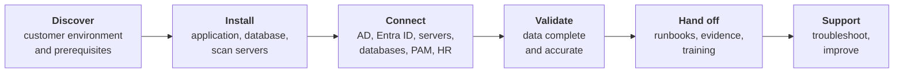
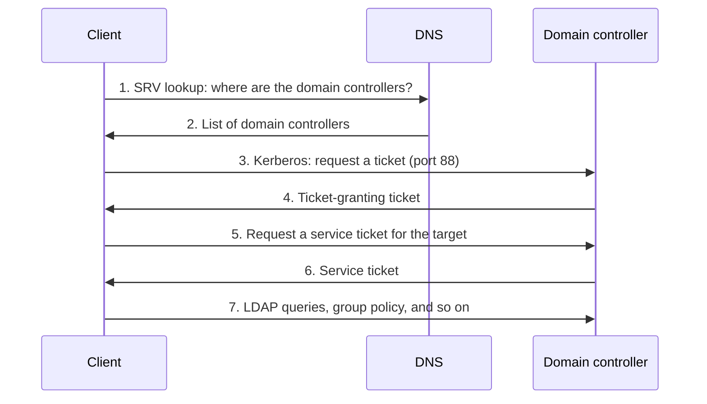
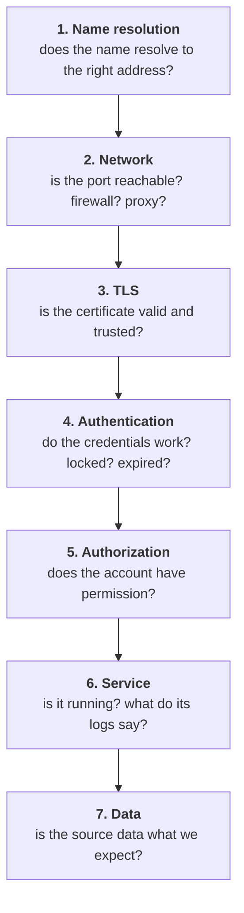

# 08. Interview guide: IAM systems engineer (customer-facing)

For a hands-on, customer-facing systems engineer role centred on Active Directory, Microsoft Entra ID, PowerShell, SQL and deploying an identity product into customer environments.

The posting behind this guide does not state its interview process. What follows is a **typical** shape for this kind of role; confirm it with the recruiter.

## The role in plain words

You install and integrate an identity product in customers' environments, connect it to their directories, servers, databases and HR systems, fix whatever goes wrong across those layers, automate the repeatable parts, and hand over something the customer can run. It is a systems administrator's skill set pointed at identity, with a customer in the room.



### About the product named in the posting

The posting describes SPHEREboard as having application, database and scan-server components with connectors to enterprise sources. Publicly it is described as an identity hygiene platform: it discovers accounts, groups and access across systems, establishes who owns them, and drives clean-up. Read the vendor's website and any public documentation before the interview and be able to say in two sentences what problem it solves. Do not claim experience with it that you do not have; the role is written for people who will learn it.

## What the posting asks for, and where to prepare

| The posting says | Prepare with |
|---|---|
| Active Directory, Entra ID, LDAP, authentication services | [Chapter 01](../docs/01-directories.md), [02](../docs/02-authentication.md), [11](../docs/11-cross-cutting.md) (hybrid identity); cheat sheet below |
| Service accounts, certificates, DNS | [Chapter 08](../docs/08-non-human-identity.md), [09](../docs/09-secrets-certificates.md); cheat sheet below |
| Deploy and support an enterprise product | "Deployment" section below |
| Integrate sources with connectors, SQL, PowerShell, REST APIs | [Chapter 14](../docs/14-provisioning-and-integration-patterns.md); [lab 05](../labs/05-scim-provisioning/README.md) |
| PowerShell automation | PowerShell section below |
| SQL: queries, views, procedures, reconciliation | SQL section below; [lab 04](../labs/04-sailpoint-iga/README.md) reconciliation idea |
| Troubleshoot end to end | [03](03-troubleshooting.md) and the layered method below |
| Customer relationships and clear communication | Customer section below; [chapter 18](../docs/18-delivery-rollout-and-communication.md) |
| Runbooks, evidence, training materials | "Handoff" section below |
| Least privilege, change control, credential handling | [Chapter 06](../docs/06-privileged-access.md) |
| SSO, MFA, SAML, OAuth/OIDC, Kerberos | [01](01-screen-and-fundamentals.md) |

## Typical interview shape

| Stage | Length | What is tested |
|---|---|---|
| Recruiter screen | 30 min | Background, customer-facing experience, logistics |
| Technical interview | 60 min | AD, networking, certificates, PowerShell, SQL; troubleshooting scenarios |
| Practical exercise (sometimes) | 30 to 60 min | Write or read a script or query; diagnose a described failure |
| Hiring manager / customer skills | 45 min | Communication, handling pressure, ownership |

Weighting to prepare for: troubleshooting and fundamentals most, then scripting and SQL, then customer handling. Deep protocol theory matters less here than in an engineering-platform role.

## Cheat sheet: what you must know cold

### Ports

| Service | Port |
|---|---|
| DNS | 53 |
| Kerberos | 88 (password change 464) |
| LDAP / LDAPS | 389 / 636 |
| Global catalogue / over TLS | 3268 / 3269 |
| SMB | 445 |
| RPC endpoint mapper | 135, then a dynamic high port |
| WinRM (PowerShell remoting) | 5985 HTTP / 5986 HTTPS |
| RDP | 3389 |
| SSH | 22 |
| SQL Server | 1433 |
| HTTPS | 443 |

### How a Windows logon finds and uses a domain controller



Most "Active Directory problems" are a failure of step 1 (DNS), step 3 (time or reachability) or step 5 (service principal names).

### Active Directory troubleshooting commands

| Command | Use |
|---|---|
| `nslookup -type=SRV _ldap._tcp.dc._msdcs.example.com` | Can the client find domain controllers? |
| `Test-NetConnection dc01 -Port 636` | Is a port reachable? |
| `dcdiag /v` | Domain controller health |
| `repadmin /replsummary`, `repadmin /showrepl` | Replication status |
| `klist`, `klist purge` | View or clear Kerberos tickets |
| `setspn -L account`, `setspn -X` | List service principal names; find duplicates |
| `w32tm /query /status` | Time synchronisation |
| `nltest /dsgetdc:example.com` | Which domain controller am I using? |
| `gpresult /r` | Which group policies applied |
| `whoami /groups` | Effective group membership in this session |

### Security event IDs

| ID | Meaning |
|---|---|
| 4624 | Successful logon |
| 4625 | Failed logon |
| 4740 | Account locked out |
| 4768 | Kerberos ticket-granting ticket requested |
| 4769 | Kerberos service ticket requested |
| 4771 | Kerberos pre-authentication failed |
| 4720 / 4726 | User account created / deleted |
| 4728 / 4732 / 4756 | Member added to a security group |

### Kerberos failure causes

| Symptom | Likely cause |
|---|---|
| Works by IP address, fails by name (or the reverse) | Missing or wrong service principal name; falling back to NTLM |
| Fails for everyone after a time change | Clock skew over five minutes |
| "Duplicate SPN" errors | The same service principal name on two accounts |
| Works for some users only | Token too large from very many group memberships, or delegation settings |
| Works on-site, fails over VPN | Port 88 blocked, or DNS not resolving the domain |

### Service accounts

| Point | Detail |
|---|---|
| Use a dedicated account per service | Never a person's account or a shared admin |
| Least privilege | Read-only where the product only reads; no Domain Admin for convenience |
| Group managed service accounts (gMSA) | The directory manages and rotates the password |
| Rights needed | Often "log on as a service" and specific read permissions |
| Record it | Owner, purpose, where used, how rotated |

### Certificates

| Check | How |
|---|---|
| Expired? | Validity dates |
| Name matches? | The subject alternative name must include the hostname the client uses |
| Chain trusted? | Root and intermediate present on the client |
| Right purpose? | Server authentication for LDAPS and HTTPS |
| Private key usable? | The service account has permission to the key |
| Inspect from a client | `openssl s_client -connect dc01.example.com:636 -showcerts` or `certutil -verify` |

### Entra ID and hybrid

| Topic | Know |
|---|---|
| Sync | Entra Connect or Cloud Sync copies users and groups from AD; `Start-ADSyncSyncCycle -PolicyType Delta` triggers a sync |
| Source of authority | Synced objects are edited on-premises, not in the cloud |
| Sign-in logs | The first place to look for cloud authentication failures; they show which conditional access policy applied |
| App registration vs enterprise application | The definition of an app vs its instance in a tenant |
| Graph API | The REST API for Entra ID; apps authenticate with client credentials or a managed identity |

## PowerShell you should be able to write

Read each and say aloud what it does before opening the explanation.

**Enabled accounts not used in 90 days:**

```powershell
$cutoff = (Get-Date).AddDays(-90)
Get-ADUser -Filter 'Enabled -eq $true' -Properties LastLogonTimestamp |
    Where-Object { [DateTime]::FromFileTime($_.LastLogonTimestamp) -lt $cutoff } |
    Select-Object SamAccountName, @{ n = 'LastLogon'; e = { [DateTime]::FromFileTime($_.LastLogonTimestamp) } } |
    Export-Csv stale-accounts.csv -NoTypeInformation
```

<details><summary>Explanation and follow-ups</summary>

It lists enabled users whose last logon is older than 90 days and writes them to a file. `LastLogonTimestamp` is replicated between domain controllers but only updated roughly every two weeks, so it is right for "stale" and wrong for "exact". The true last logon (`LastLogon`) is not replicated and must be queried on every domain controller.

Follow-ups: how would you exclude service accounts? (By organisational unit or naming convention, or better, an attribute.) What about accounts that have never logged on? (The value is empty; handle it explicitly.)
</details>

**Everyone with privileged access, including through nested groups:**

```powershell
Get-ADGroupMember -Identity 'Domain Admins' -Recursive |
    Get-ADUser -Properties Enabled, PasswordLastSet, PasswordNeverExpires |
    Select-Object SamAccountName, Enabled, PasswordLastSet, PasswordNeverExpires
```

<details><summary>Explanation</summary>

`-Recursive` expands nested groups to the actual users. The selected properties show the hygiene questions an identity product asks: is the account enabled, how old is the password, is it set never to expire.
</details>

**Call a REST API safely:**

```powershell
$headers = @{ Authorization = "Bearer $token" }
try {
    $result = Invoke-RestMethod -Uri "$baseUrl/api/accounts" -Headers $headers -Method Get -ErrorAction Stop
    $result.items | ConvertTo-Json -Depth 5 | Out-File accounts.json
}
catch {
    Write-Error "API call failed: $($_.Exception.Message)"
    exit 1
}
```

<details><summary>What an interviewer looks for</summary>

Error handling with `try`/`catch` and `-ErrorAction Stop`; a non-zero exit code so a scheduler knows it failed; the token coming from a variable and not written in the script. Follow-ups: where does `$token` come from (a vault or a protected credential store, never plain text); how do you handle pagination and rate limits; where do logs go.
</details>

What makes a script production-ready, in the posting's words "reliable, maintainable, documented":

| Property | How |
|---|---|
| Parameters, not hard-coded values | `param()` block |
| Errors stop the script | `$ErrorActionPreference = 'Stop'`, `try`/`catch` |
| Safe to re-run | Check before changing |
| Preview mode | Support `-WhatIf` for anything that changes state |
| Logging | Timestamped, to a file |
| No secrets | Fetch from a vault at run time |
| Comment-based help | So the customer can run it without you |

## SQL you should be able to write

Assume these tables: `accounts(account_id, username, source, owner_id, enabled, last_logon)` and `owners(owner_id, name, email, active)`.

**Accounts with no owner, or an owner who has left:**

```sql
SELECT a.username, a.source
FROM accounts a
LEFT JOIN owners o ON o.owner_id = a.owner_id
WHERE a.enabled = 1
  AND (o.owner_id IS NULL OR o.active = 0);
```

**Duplicate usernames within a source:**

```sql
SELECT source, username, COUNT(*) AS copies
FROM accounts
GROUP BY source, username
HAVING COUNT(*) > 1;
```

**Completeness check: did every source load, and how much?**

```sql
SELECT source,
       COUNT(*) AS total,
       SUM(CASE WHEN enabled = 1 THEN 1 ELSE 0 END) AS enabled,
       SUM(CASE WHEN owner_id IS NULL THEN 1 ELSE 0 END) AS unowned
FROM accounts
GROUP BY source
ORDER BY source;
```

Compare `total` with the count taken directly from each source system. A mismatch is the first sign of a connector or filter problem.

| Concept | One-line answer |
|---|---|
| `INNER` vs `LEFT JOIN` | Inner keeps only matches; left keeps every row from the left table, with nulls where there is no match |
| `WHERE` vs `HAVING` | `WHERE` filters rows before grouping; `HAVING` filters groups after |
| View | A saved query you can select from like a table |
| Stored procedure | Saved logic that can take parameters and change data |
| Index | A lookup structure that speeds up searches on a column, at some cost to writes |
| A slow query | Read the execution plan; look for table scans; check indexes on the join and filter columns |
| Why `NULL = NULL` is not true | Null means unknown; use `IS NULL` |

## Deployment: what a good installation looks like

### Prerequisites to confirm before the day

| Area | Confirm |
|---|---|
| Servers | Sizing, operating system version, patches, who has admin access |
| Database | Instance, version, collation, a database account with the right roles |
| Service accounts | Created, least privilege, passwords stored in the customer's vault |
| Network | Firewall rules between application, database, scan servers and each source; proxy settings |
| DNS | Names resolve from every server |
| Certificates | Issued, trusted, correct names |
| Change control | An approved change window; a rollback plan |
| People | Named contacts for directory, database, network and security |

Most deployments that fail on the day fail on this list, so a thorough prerequisites check is the strongest signal you can give in an interview.

### Validation and acceptance evidence

| Check | Evidence |
|---|---|
| Services running | Screenshot or command output |
| Each connector authenticates | Connector test result |
| Data complete | Counts per source matched to the source system |
| Data accurate | A sample of records checked by hand with the customer |
| Schedules run | First scheduled run completed, with duration |
| Access works | A customer user signs in with the intended role |

### Handoff package

| Document | Contents |
|---|---|
| Configuration record | What was installed where, versions, accounts used, ports opened |
| Runbook | Start, stop, health checks, common failures and fixes, how to rotate credentials and certificates |
| Test evidence | The table above, completed |
| Support procedure | Who to contact, what information to collect first, escalation path |
| Training material | A short guide for the customer's administrators |

## Troubleshooting: the layered method

Work from the bottom up. Do not look at the application until the layers beneath it are proven.



### Scenarios

Say your first three questions aloud before opening each walk-through.

**Scenario 1.** "The Active Directory connector worked yesterday. Today it fails with 'cannot connect to server'."

<details><summary>Walk-through</summary>

Scope: one connector or all? Anything changed overnight?

Bottom up from the scan server: does the domain controller's name resolve (`nslookup`)? Is the port reachable (`Test-NetConnection dc01 -Port 636`)? If LDAPS, is the certificate valid (expired overnight is common)? Can the service account bind (locked out or password changed)? Is the product's service running?

Common findings: a certificate expired; the service account password was rotated or expired; a firewall change; the specific domain controller is down and the connector points at one host and not the domain.

Prevent: point at the domain name, not one server; monitor certificate expiry and the service account; record the dependency in the runbook.
</details>

**Scenario 2.** "A service account keeps getting locked out."

<details><summary>Walk-through</summary>

Find the source: event 4740 on the domain controller holding the PDC emulator role names the calling computer. On that computer, look at 4625 failures and at what runs as that account: services, scheduled tasks, mapped drives, application pools, a script with an old password.

Usual cause: the password was changed and one place still has the old one.

Prevent: an inventory of where each service account is used; group managed service accounts where possible; a rotation procedure.
</details>

**Scenario 3.** "Users sign in to the application through SSO but land on 'not authorized'."

<details><summary>Walk-through</summary>

Authentication worked; authorization did not. Check which group or role the application expects, whether the user is in it (`whoami /groups` or the directory), whether the group claim is being sent in the assertion or token, and whether nested groups are being resolved. If hybrid, check that the group has synced to the cloud.
</details>

**Scenario 4.** "The product shows 4,200 accounts for a server estate the customer says has about 6,000."

<details><summary>Walk-through</summary>

A data completeness problem. Compare counts by source and by server. Likely causes: some servers unreachable (firewall, offline, wrong credentials); a filter or scope excluding an organisational unit; a scan that timed out part-way; permissions letting the account see only part of the data; duplicates being merged, in which case 4,200 may be correct.

Method: get the authoritative list from the customer, find which servers are missing, pick one and work the layers on it.

Communicate: tell the customer what you know, what you are checking and when you will update them. Do not sign off acceptance until the count is explained.
</details>

**Scenario 5.** "A query the product runs every night has gone from two minutes to forty."

<details><summary>Walk-through</summary>

What changed: data volume, a new connector, an index dropped, statistics out of date, blocking from another job? Look at the execution plan for scans on large tables, check indexes on the join and filter columns, check whether statistics are current, and check for blocking at the time it runs. Fix with the database administrator, under change control, and measure before and after.
</details>

**Scenario 6.** "Kerberos authentication to the application's website fails; it prompts for credentials repeatedly."

<details><summary>Walk-through</summary>

Check that a service principal name for the site's hostname exists on the account the application runs as (`setspn -L`), that there is no duplicate (`setspn -X`), that the client resolves the name to the right host, that clocks agree, and that the browser treats the site as intranet so it sends a ticket. `klist` on the client shows whether a service ticket was obtained.
</details>

## Customer-facing questions

**"A customer is frustrated: the deployment is a week late and they are escalating. What do you do?"**

<details><summary>Model answer</summary>

"Listen first, without defending. Then acknowledge the impact on them. I'd state plainly where we are: what's done, what's blocking, and who owns each blocker, including the ones on our side. I'd give a realistic revised date with what it depends on, and commit to updates at a fixed interval, even when there's no news. Then I'd follow through exactly. Trust comes back from doing what I said I'd do."
</details>

**"How do you explain a technical root cause to a non-technical customer contact?"**

<details><summary>Model answer</summary>

"In three parts: what happened in their terms, why, and what we've done so it won't recur. For example: 'The nightly scan stopped because a security certificate on your directory server expired. We've renewed it with your team and set up a reminder ninety days before the next expiry.' I leave out the protocol detail unless they ask."
</details>

**"The customer asks for something outside the agreed scope during the engagement."**

<details><summary>Model answer</summary>

"I'd understand what they need and why, because sometimes it's small or it reveals a real gap. I wouldn't promise it on the spot. I'd say what it would involve, check with my manager or the account owner, and come back with a clear answer: yes within scope, yes as a change, or an alternative. Saying yes informally and then missing the original deadline is the worst outcome for them."
</details>

**"You find the customer's environment has a serious security weakness unrelated to your work."**

<details><summary>Model answer</summary>

"I'd raise it, privately and factually, with my customer contact and through my own company's process: what I saw, why it matters, and that it's outside our scope. I wouldn't fix it myself or go looking further without being asked. Their environment, their change control."
</details>

**"The customer wants to give your service account Domain Admin to save time."**

<details><summary>Model answer</summary>

"I'd decline and explain why in terms of their risk: that account's credentials would then unlock their whole domain. I'd give them the specific permissions the product needs and help their team set them up. It takes longer once and it's the right answer for them."
</details>

**"Tell me about a time you owned a problem from first report to resolution."**

Use your own example with situation, task, action and result ([05](05-behavioural.md)). They listen for follow-through, communication during the problem and what you changed afterwards.

## Product feedback questions

**"You hit the same installation problem at three customers. What do you do?"**

<details><summary>Model answer</summary>

"Fix it for each customer, then make sure nobody hits it a fourth time. I'd document the symptom, cause and workaround in the knowledge base. I'd raise it with engineering as a defect or a documentation gap, with evidence from all three. And I'd propose a change to the prerequisites checklist or the installer so it's caught earlier."
</details>

## Mock interviews

Use the rules in [06](06-mock-interviews.md).

### Mock I. Technical interview (60 minutes)

| Time | Question | Probes |
|---|---|---|
| 0 to 5 | "Tell me about the environments you have administered." | "What was the largest? What did you own?" |
| 5 to 13 | "A user cannot log on to the domain. Walk me through it." | "How does the client find a domain controller?" "What would time skew do?" |
| 13 to 20 | "What is a service principal name and when does it matter?" | "How do you find a duplicate?" |
| 20 to 28 | "How would you find all enabled accounts not used in 90 days, with PowerShell?" | "Why is the timestamp approximate?" "How would you make the script safe to hand to a customer?" |
| 28 to 36 | "Write a query for accounts with no owner." | "Inner or left join, and why?" "How do you check the load was complete?" |
| 36 to 46 | Scenario 1 (connector cannot connect) | Answer only what is asked |
| 46 to 53 | "LDAPS will not connect. What do you check about the certificate?" | "How do you look at it from the client?" |
| 53 to 60 | "What are SSO and MFA? How does SAML differ from Kerberos?" | Keep answers under a minute |

### Mock J. Customer and delivery interview (45 minutes)

| Time | Question |
|---|---|
| 0 to 8 | "Describe a deployment or project you delivered end to end." |
| 8 to 16 | "A customer is escalating over a delay. What do you do?" |
| 16 to 23 | "Explain a certificate expiry outage to a business manager." (Live) |
| 23 to 30 | "What goes in a runbook you hand to a customer?" |
| 30 to 37 | "The customer offers Domain Admin for your service account." |
| 37 to 42 | "Tell me about a mistake in production and what you changed." |
| 42 to 45 | Candidate questions |

### Scorecard

| Dimension | 1 | 2 | 3 | 4 | Score |
|---|---|---|---|---|---|
| **Method** | Guesses | Some order | Scopes, then works the layers | Finds root cause and prevents recurrence | |
| **Fundamentals** | Gaps in DNS, ports, certificates | Rough | Accurate | Explains how the pieces interact | |
| **Directory skill** | Names features | Basic administration | Diagnoses real failures | Designs for supportability | |
| **Scripting and SQL** | Cannot write it | With help | Correct and readable | Production-ready: errors, logging, safe to re-run | |
| **Security habits** | Ignored | Mentioned | Least privilege and credential care unprompted | Pushes back on unsafe requests well | |
| **Customer communication** | Jargon, defensive | Clear | Plain, calm, sets expectations | Builds trust under pressure | |
| **Ownership** | Hands off early | Follows through | Discovery to handoff, with documentation | Turns field experience into improvements | |

## Questions to ask them

- "What does a typical deployment look like, from kickoff to handoff, and how long does it take?"
- "Which source systems cause the most integration trouble?"
- "How does field feedback reach the product team?"
- "How much of the work is new deployments versus supporting existing customers?"
- "What does the first 90 days look like for someone learning the product?"

## Preparation checklist

- [ ] Ports and the logon sequence from memory.
- [ ] The seven troubleshooting layers, applied aloud to three scenarios.
- [ ] Three PowerShell scripts you can write without reference.
- [ ] Left join, group by and having, written without reference.
- [ ] A two-sentence description of the product and the problem it solves.
- [ ] Three customer stories from your own experience.
- [ ] A sample runbook outline you can describe.

Back to the [interview overview](README.md).
