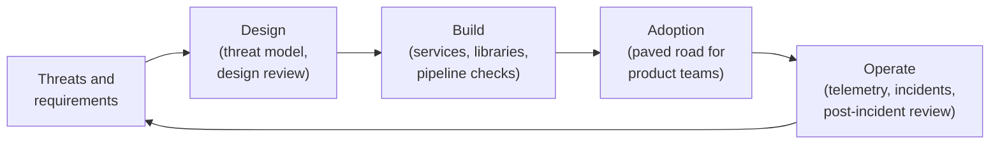
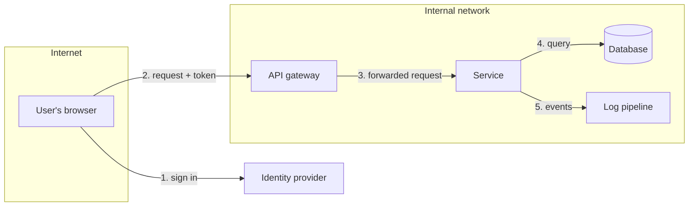
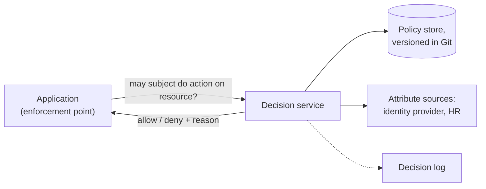
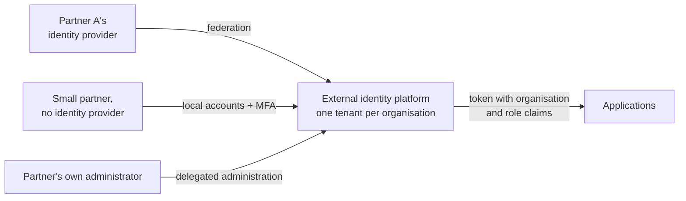
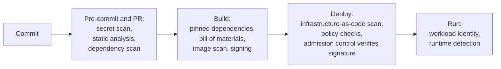

# 09. Interview guide: security software engineer (identity and security platforms)

For a software engineering role on a security products team: building the services, libraries and pipeline controls that make other teams' software secure by default.

The posting behind this guide does not state its interview process. What follows is a **typical** shape for a senior software engineering role with a security focus; confirm it with the recruiter.

## The role in plain words

You are a software engineer first. The software you build happens to be security infrastructure: authentication and authorization services, secrets tooling, pipeline checks, security logging. Your customers are other engineers, and your measure of success is that they adopt what you build because it is easier than doing it themselves.



This differs from the earlier roles in this repo: here the interview will include **coding** and **software system design**, and identity knowledge is one part of a wider security engineering picture.

## What the posting asks for, and where to prepare

| The posting says | Prepare with |
|---|---|
| Design and build security services and tools | Design section below; [04](04-solution-design.md) |
| Platforms that make secure patterns easy (identity, authorization, secrets, logging) | "Paved road" below; [chapter 04](../docs/04-authorization.md), [09](../docs/09-secrets-certificates.md), [17](../docs/17-iam-engineering-code-cicd-aws.md) |
| Security controls in CI/CD and deployment workflows | Pipeline section below |
| Authentication, authorization, policy evaluation, event ingestion services | Design prompts below |
| Secure code review, threat modelling, design review | Sections below, with exercises |
| Security telemetry: logging, metrics, alerting | Telemetry section below; [chapter 11](../docs/11-cross-cutting.md) |
| Incident response and post-incident review | Section below |
| Mentorship on secure coding | Behavioural section; [05](05-behavioural.md) |
| OAuth 2.0/OIDC, SSO, RBAC/ABAC | [01](01-screen-and-fundamentals.md), [02](02-technical-deep-dive.md) |
| Encryption in transit and at rest; key and secrets management | Cryptography table below; [chapter 09](../docs/09-secrets-certificates.md) |
| Injection, XSS, CSRF, insecure direct object references | Vulnerability table below |
| Cloud, infrastructure as code, Docker, Kubernetes | Kubernetes table below; [lab 02](../labs/02-aks-identity/README.md) |
| AI-assisted development tools | Section below |
| External, partner and contractor identity; federation; multi-tenant; just-in-time provisioning | Design 4 below; [chapter 07](../docs/07-customer-identity.md), [14](../docs/14-provisioning-and-integration-patterns.md), [16](../docs/16-acquisitions-and-migrations.md) |
| Explain identity and security to any audience | [Chapter 18](../docs/18-delivery-rollout-and-communication.md) |

**Gap to be aware of:** this repo does not teach general programming, data structures or algorithms. The posting requires seven or more years as a software engineer. Prepare coding separately with a dedicated resource; this guide covers the security-specific parts.

## Typical interview shape

| Stage | Length | What is tested |
|---|---|---|
| Recruiter screen | 30 min | Background, level, motivation |
| Coding | 45 to 60 min, sometimes twice | Working, readable code; testing; communication while coding |
| System design | 60 min | A service designed end to end, usually with a security angle |
| Security depth | 45 to 60 min | Threat modelling, secure code review, vulnerability classes, identity patterns |
| Behavioural / leadership | 45 min | Ownership, influence, mentoring, incidents |

## Coding round

General coding skill is assumed. Security teams often choose problems from their own domain. Practise these; each is a real component.

| Problem | What it exercises |
|---|---|
| A policy evaluator: given policies and a request, return allow or deny | Default deny, explicit deny, matching, tests |
| A rate limiter (token bucket or sliding window) | State, time, concurrency |
| Parse authentication logs and flag accounts with many failures from many addresses | Parsing, grouping, thresholds |
| Validate a token's claims given a decoded payload and expected values | Careful conditionals, edge cases |
| Find all users with effective access to a resource through nested groups | Graph traversal, cycle handling |
| A cache with expiry for signing keys | Data structures, refresh on unknown key |
| Detect separation-of-duties conflicts in a set of user entitlements | Sets, pairwise rules |
| Redact secrets from log lines | Pattern matching, false positives |

A worked example of the first, small enough to write in an interview:

```python
def is_allowed(policies, principal, action, resource):
    """Default deny. Any matching deny wins over any allow."""
    allowed = False
    for policy in policies:
        if not matches(policy, principal, action, resource):
            continue
        if policy["effect"] == "deny":
            return False
        allowed = True
    return allowed


def matches(policy, principal, action, resource):
    return (
        principal["role"] in policy["roles"]
        and action in policy["actions"]
        and resource["type"] == policy["resource_type"]
        and all(resource.get(k) == principal.get(k) for k in policy.get("must_match", []))
    )
```

`must_match` adds an attribute condition, for example `["tenant_id"]` so a user can only reach resources in their own tenant.

What to say while writing it:

- "I'll start with deny as the default, so a missing policy fails closed."
- "A deny returns immediately; an allow only records that we saw one."
- "Tests I'd write: no policies, one allow, allow plus deny, wrong tenant, unknown action."

Habits that score in a coding round:

| Habit | Why |
|---|---|
| Restate the problem and ask about inputs and edge cases | Shows scoping |
| Say your approach before typing | The interviewer can redirect early |
| Write tests or at least list the cases | Senior signal |
| Name the complexity | Expected at this level |
| Mention the security edge: empty input, malformed data, fail closed | It is a security team |

## Secure code review

You may be shown code and asked what is wrong. Find the issues in this handler before opening the answer.

```python
@app.route("/api/invoices/<invoice_id>")
def get_invoice(invoice_id):
    token = request.headers.get("Authorization", "").replace("Bearer ", "")
    claims = jwt.decode(token, options={"verify_signature": False})
    app.logger.info("token=%s user=%s", token, claims["sub"])
    row = db.execute(f"SELECT * FROM invoices WHERE id = '{invoice_id}'").fetchone()
    return jsonify(dict(row))
```

<details><summary>Findings</summary>

| # | Issue | Class | Fix |
|---|---|---|---|
| 1 | Signature not verified, so anyone can forge a token; issuer, audience and expiry unchecked | Broken authentication | Verify with the issuer's key, a fixed algorithm, expected audience and issuer |
| 2 | The token is written to the log | Sensitive data exposure | Never log credentials; log the subject and a request ID |
| 3 | The ID is concatenated into the SQL string | SQL injection | Parameterised query |
| 4 | No check that the invoice belongs to the caller | Insecure direct object reference | Filter by the caller's tenant or ownership |
| 5 | No scope or role check | Missing authorization | Require the scope the endpoint needs |
| 6 | `SELECT *` returns every column | Excessive data exposure | Select only the fields the client needs |
| 7 | A missing row raises an error | Error handling | Return 404; do not leak whether it exists to other tenants |

A corrected core:

```python
claims = jwt.decode(
    token, key=signing_key, algorithms=["RS256"],
    audience="invoice-api", issuer="https://idp.example.com",
)
if "invoices.read" not in claims.get("scope", "").split():
    abort(403)
row = db.execute(
    "SELECT id, amount, status FROM invoices WHERE id = ? AND tenant_id = ?",
    (invoice_id, claims["tenant_id"]),
).fetchone()
if row is None:
    abort(404)
```

Then say the senior part: "The real fix is that no team should write this by hand. I'd provide middleware that validates tokens and a data access layer that always scopes by tenant, so the insecure version is harder to write than the secure one."
</details>

How to give review feedback, which is itself assessed: lead with the highest risk, explain the attack and the fix, separate must-fix from suggestions, and be courteous.

## Vulnerability classes

| Class | What happens | Primary defence |
|---|---|---|
| **Injection** (SQL, command, LDAP) | Input is interpreted as code | Parameterised queries; never build commands from input |
| **Cross-site scripting (XSS)** | Attacker's script runs in a victim's browser | Output encoding by context; a framework that escapes by default; content security policy |
| **Cross-site request forgery (CSRF)** | A victim's browser sends an authenticated request the user did not intend | Anti-forgery tokens; SameSite cookies |
| **Insecure direct object reference** / broken object-level authorization | Changing an ID in a request reaches someone else's data | Authorization check on every object, on the server |
| **Broken authentication** | Weak sessions, token validation or credential handling | Standard libraries; validate signature, issuer, audience, expiry |
| **Server-side request forgery (SSRF)** | The server is tricked into calling internal addresses, such as a cloud metadata service | Allow-list destinations; block internal ranges |
| **Insecure deserialisation** | Untrusted data becomes objects that execute code | Do not deserialise untrusted data into rich types; use plain data formats |
| **Security misconfiguration** | Defaults left on, verbose errors, open storage | Secure defaults; configuration as code with checks |
| **Vulnerable dependencies** | A library with a known flaw | Dependency scanning; pinned versions; fast patching |
| **Secrets in code** | Credentials committed or logged | Secret scanning; a secrets manager; short-lived credentials |

For each, be ready to answer "how would you prevent this across five hundred services?" The answer is a library, a framework default or a pipeline check, not a training course.

## Threat modelling

### The four questions

1. What are we working on?
2. What can go wrong?
3. What are we going to do about it?
4. Did we do a good job?

### STRIDE

| Letter | Threat | Property it attacks | Typical control |
|---|---|---|---|
| **S** | Spoofing | Authentication | Strong authentication, mutual TLS |
| **T** | Tampering | Integrity | Signatures, hashing, access control |
| **R** | Repudiation | Accountability | Audit logs that cannot be altered |
| **I** | Information disclosure | Confidentiality | Encryption, least privilege |
| **D** | Denial of service | Availability | Rate limits, quotas, redundancy |
| **E** | Elevation of privilege | Authorization | Least privilege, input validation, isolation |

### Do it live

A common exercise: "Threat model this." Draw the data flow, mark the trust boundaries, then walk STRIDE across each boundary.



<details><summary>Sample findings for this diagram</summary>

| Flow | Threat | Mitigation |
|---|---|---|
| 2 | Spoofing: a forged or stolen token | Validate signature, issuer, audience, expiry; short lifetimes |
| 2 | Denial of service | Rate limiting at the gateway |
| 3 | Elevation: the service trusts whatever the gateway forwards | The service validates the token itself, or the gateway and service authenticate each other |
| 4 | Tampering and disclosure: injection; over-broad database account | Parameterised queries; least-privilege database role; tenant scoping |
| 4 | Disclosure at rest | Encryption at rest; key management |
| 5 | Disclosure: secrets or personal data in logs | Structured logging with redaction |
| 5 | Repudiation: logs can be altered | Append-only, centralised, access-controlled logs |

Finish by ranking: which two would you fix first, and why.
</details>

## Cryptography and secrets: what to know

| Topic | Answer |
|---|---|
| In transit | TLS everywhere, including inside the network; mutual TLS between services where identity matters |
| At rest | Encryption by the storage service, keys in a key management service |
| Envelope encryption | Data is encrypted with a data key; the data key is encrypted with a master key held in the key management service |
| Key rotation | Regular and automated; old keys kept to decrypt old data |
| Password storage | A slow, salted hashing function made for passwords, such as Argon2 or bcrypt; never plain hashing or reversible encryption |
| Hashing vs encryption vs signing | One-way fingerprint; reversible with a key; proof of origin and integrity |
| Secrets | In a secrets manager, fetched at run time, short-lived where possible, never in code or images |
| The golden rule | Use well-reviewed libraries. Do not design or implement your own cryptography |

## Design round

Use the seven steps in [04](04-solution-design.md), and add the software concerns: API shape, data model, scale, availability, latency, failure modes, rollout, and how other teams adopt it.

### Design 1. A central authorization service

**Prompt:** "Design an authorization service that hundreds of internal applications can use."

<details><summary>Worked outline</summary>

**Clarify:** request volume, latency budget, kinds of rules (roles, attributes, relationships), who writes policy, how apps integrate.

**Shape:**



**Key decisions:**

| Decision | Options and trade-off |
|---|---|
| Where decisions run | A central service is simple to manage and adds a network call. A local sidecar or library with policy distributed to it is fast and resilient, and harder to update consistently |
| Policy language | A general policy language is flexible; a restricted one is easier to analyse and test |
| Failure mode | Fail closed for sensitive actions; consider cached decisions for read-only, low-risk ones |
| Freshness | How quickly must a revocation take effect? Drives cache lifetime |
| Adoption | A client library and middleware for common frameworks; shadow mode to compare with existing logic before enforcing |

**Operate:** decision logs for audit; latency and error metrics; policy changes through review and automated tests; a tool that answers "who can access this, and why".

**Rollout:** shadow mode, one application, then a paved-road library.
</details>

### Design 2. A secrets platform for developers

<details><summary>Worked outline</summary>

Workloads authenticate with their platform identity (Kubernetes service account, cloud role), not a bootstrap secret. Policy maps identities to paths. Prefer dynamic, short-lived credentials over stored ones. Deliver secrets by a sidecar, a driver or an SDK. Audit every read. Detect leaked secrets with scanning in pre-commit, in the pipeline and across repositories, with automatic revocation.

Trade-offs: availability, since every service depends on it, so multi-region and client-side caching with short lifetimes; migration of existing static secrets; developer experience, which decides whether it is used at all.

Measure: static secrets remaining; share of services using workload identity; time to rotate after a leak.
</details>

### Design 3. A security event ingestion pipeline

<details><summary>Worked outline</summary>

Sources (applications, identity provider, cloud audit logs) send to an ingestion API or agents; a durable queue absorbs bursts; a stream processor validates, normalises to a common schema, enriches with identity and asset data, and redacts; storage is split into a hot search store and cheap long-term storage; detection rules run on the stream; alerts go to on-call with context.

Decisions: schema enforcement at the edge or after; at-least-once delivery with idempotent processing; back-pressure and what is dropped first; tenant isolation; retention by data class; protecting the pipeline itself from tampering, with append-only storage and tight access.

Measure: ingestion lag, drop rate, time from event to alert, false positive rate.
</details>

### Design 4. External and partner identity

**Prompt:** "Design identity for suppliers, dealers and contractors who need access to our applications."

<details><summary>Worked outline</summary>

**Clarify:** how many organisations; do they have their own identity providers; sensitivity; who administers users in each organisation.

**Shape:** a dedicated external identity tenant, separate from workforce. Each partner organisation is a tenant within it.



| Decision | Detail |
|---|---|
| Federation where possible | The partner's identity provider authenticates; we hold no password |
| Just-in-time provisioning | Create the account at first federated login from the assertion; pair it with expiry and periodic re-attestation, because nothing else removes it |
| Smaller partners | Local accounts with enforced MFA and an invitation flow |
| Tenant isolation | Organisation ID in every token; every query scoped by it; tests that try to cross tenants |
| Delegated administration | The partner manages its own users within limits we set |
| Authorization | Roles per organisation; least privilege; no access by default |
| Lifecycle | A sponsor inside our company for each partner; contracts drive expiry |
| Assurance | We inherit the partner's authentication strength; require step-up for sensitive actions |

**Threats:** a compromised partner identity provider; cross-tenant data access; orphaned accounts after a contract ends; a partner administrator abusing delegation.

**Measure:** share of partners federated; accounts with no login in 90 days; cross-tenant test results.
</details>

### Design 5. Security controls in the delivery pipeline

<details><summary>Worked outline</summary>



Principles: fast feedback, as early as possible; block only on high-confidence, high-severity findings and report the rest; one place for exceptions, with expiry; results where developers already work.

Protect the pipeline: short-lived credentials through federation; isolated runners; protected branches; signed artefacts.

The risk to name: noisy checks that teams learn to bypass. Measure false positive rate and time added to the build, not only findings.
</details>

## Kubernetes security

| Area | Know |
|---|---|
| Authentication to the cluster | Through the identity provider; no shared kubeconfig |
| RBAC | Roles and bindings, scoped to namespaces; avoid cluster-admin |
| Service accounts | One per workload; no default token mounted where not needed |
| Workload identity | Pods obtain cloud credentials by federation ([lab 02](../labs/02-aks-identity/README.md)) |
| Network policy | Default deny between namespaces; allow what is needed |
| Pod security | No privileged containers, no root, read-only file system where possible |
| Secrets | Kubernetes secrets are only encoded by default; enable encryption at rest or use an external manager |
| Admission control | Policies that reject non-compliant workloads and unsigned images |
| Supply chain | Scan and sign images; pull only from trusted registries |

## Security telemetry

| Question | Answer |
|---|---|
| What must a service log? | Authentication and authorization decisions, administrative actions, data access to sensitive records, with who, what, when, where and outcome |
| What must it never log? | Passwords, tokens, keys, full personal data |
| Format | Structured, with a consistent schema and a correlation ID |
| Metrics | Rates of failures and denials, latency, error rates |
| Alerts | On behaviour that needs a human, with enough context to act; every alert has a runbook |
| Integrity | Centralised, append-only, restricted access |

## Incident response and post-incident review

**"A vulnerability is found in the token-validation library your team owns, used by 300 services. What do you do?"**

<details><summary>Model answer</summary>

"Treat it as an incident. First assess: is it exploitable, is it being exploited, which versions and services are affected. Contain: if there's a configuration mitigation or a gateway rule, apply it now. Fix: patch the library, test, release. Roll out: find every consumer from the dependency inventory, push the upgrade through automated pull requests where possible, and track adoption to zero. Communicate throughout: what teams need to do, by when. Check logs for exploitation.

Afterwards, a blameless review: how it got in, why tests didn't catch it, how long each phase took, and what we change. For example a fuzz test for that parser, and a faster way to roll a library across all consumers."
</details>

A post-incident review covers: timeline, impact, root cause and contributing factors, what went well, what did not, and actions with owners and dates. It names systems and decisions, not people.

## AI-assisted development

The posting lists experience with AI coding tools as a requirement. Be ready to describe real use and its limits.

**"How do you use AI coding assistants, and how do you keep that safe?"**

<details><summary>Model answer</summary>

"I use them for scaffolding, tests, unfamiliar APIs, explaining code I'm reading, and first-pass review. I treat the output as a draft from a capable colleague who doesn't know our system: I read every line, and I'm accountable for it.

On safety: I don't paste secrets, credentials or sensitive data into prompts, and I follow the organisation's approved tools and settings. I'm particularly careful with security-sensitive code, where a plausible-looking answer can be subtly wrong, such as token validation or cryptography; there I check against the standard and write tests for the failure cases. Generated code goes through the same review, scanning and tests as anything else. I also check suggested dependencies actually exist and are maintained."
</details>

Related questions to prepare: where AI helped you most; a case where its output was wrong and how you caught it; how you would set guidance for a team; how you would secure an AI agent that calls tools ([chapter 08](../docs/08-non-human-identity.md)).

## The paved road

The idea that ties this role together.

| Instead of | Provide |
|---|---|
| A wiki page on validating tokens | Middleware that does it correctly by default |
| A review of every team's authorization code | A library or service with a simple call |
| A policy that secrets must not be in code | A secrets SDK that is easier than an environment variable, plus scanning |
| A manual security review per release | Automated checks in the pipeline |
| Mandates | Defaults, templates and good documentation |

**"How do you get teams to adopt a security library?"**

<details><summary>Model answer</summary>

"Make it the easiest option. Build it with two or three teams as design partners so it fits real code. Give it good documentation, a migration guide and automated pull requests for the common cases. Put it in the service template so new services start with it. Measure adoption and reach out to the teams that haven't moved, to find out what's blocking them. Mandates come last, for the few that remain."
</details>

## Behavioural questions for this role

Use your own examples in situation, task, action, result form ([05](05-behavioural.md)).

| Question | What they listen for |
|---|---|
| "Tell me about a system you designed, built and ran in production." | Ownership through operation; trade-offs; what broke |
| "Describe an initiative that improved security posture through design or automation." | A measured before and after |
| "Tell me about a design review where you disagreed." | Evidence, respect, outcome |
| "How have you mentored engineers on secure coding?" | Specific actions and their effect |
| "Tell me about an incident you led as engineering owner." | Calm, method, follow-up |
| "How did you turn a compliance requirement into engineering work?" | Understood the intent; built something reusable |
| "Describe explaining a security risk to a non-technical audience." | Plain language; a decision obtained |

## Mock interviews

Use the rules in [06](06-mock-interviews.md).

### Mock K. Security depth (60 minutes)

| Time | Question | Probes |
|---|---|---|
| 0 to 5 | "Tell me about a security-relevant system you built." | "What was the hardest trade-off?" |
| 5 to 20 | Show the invoice handler above: "Review this." | "Which is most severe?" "How do you prevent this class across all services?" |
| 20 to 35 | "Threat model a service behind an API gateway with a database." | "What do you fix first?" "What does the service trust that it should not?" |
| 35 to 43 | "Explain CSRF and XSS, and how they differ." | "Does SameSite solve CSRF completely?" |
| 43 to 50 | "How should a service store and obtain its database credentials?" | "What if the secrets platform is down?" |
| 50 to 57 | "How do you use AI coding tools safely?" | "Give an example where it was wrong." |
| 57 to 60 | Candidate questions | |

### Mock L. System design (60 minutes)

Use Design 1 (authorization service) or Design 4 (external identity). After 30 minutes the interviewer changes a constraint: "Decisions must now take under five milliseconds" or "A partner's identity provider has been compromised; what happens?"

### Scorecard

| Dimension | 1 | 2 | 3 | 4 | Score |
|---|---|---|---|---|---|
| **Coding** | Does not work | Works with help | Correct, readable, tested | Clean design, edge cases, clear trade-offs | |
| **System design** | Components listed | A plausible design | Scale, failure, data and rollout covered | Defends trade-offs; adapts to changed constraints | |
| **Security depth** | Names terms | Explains them | Finds real issues and fixes them correctly | Fixes the class, not the instance | |
| **Threat thinking** | None | Generic | Structured, prioritised | Anticipates bypass; limits damage | |
| **Identity knowledge** | Vague | Basics | Applies OAuth/OIDC and RBAC/ABAC correctly | Designs federation and multi-tenant models | |
| **Developer empathy** | Ignores users | Mentions them | Designs for adoption | Measures and improves developer experience | |
| **Operability** | Ignored | Monitoring | Telemetry, runbooks, incident handling | Learns from incidents systematically | |
| **Communication** | Hard to follow | Clear | Structured, adapts to audience | Leads the discussion | |

## Questions to ask them

- "Which security services does the team own today, and which are most adopted?"
- "How do product teams discover and adopt your libraries and services?"
- "What is the balance between building new platforms and operating existing ones?"
- "How is success measured: adoption, incidents avoided, developer satisfaction?"
- "What does the external and partner identity landscape look like?"

## Preparation checklist

- [ ] Coding practice done separately, including three problems from the list above.
- [ ] The vulnerability table from memory, with the defence for each.
- [ ] STRIDE applied aloud to a diagram in ten minutes.
- [ ] The code review exercise completed without looking.
- [ ] Two designs from this file practised with a timer.
- [ ] A real, specific account of how you use AI tools.
- [ ] Five stories from your own work.

Back to the [interview overview](README.md).
