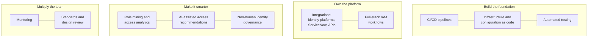
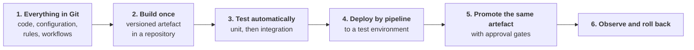
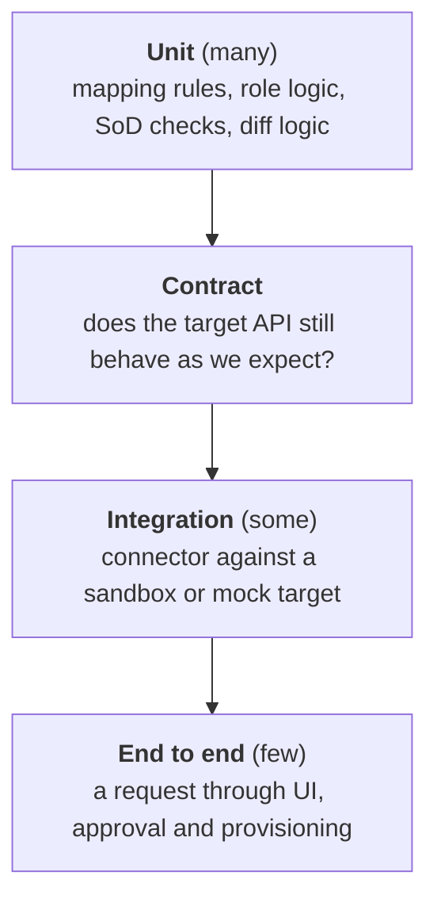
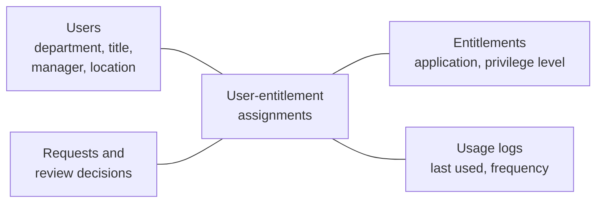
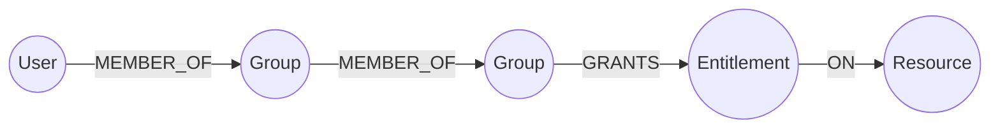
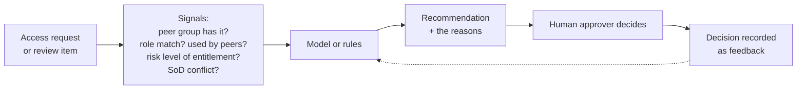
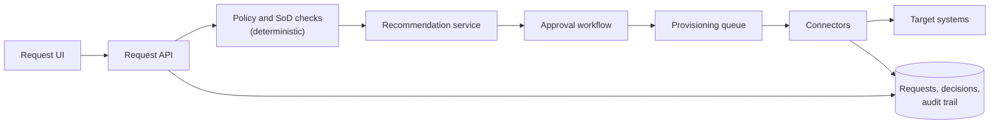

# 10. Interview guide: senior staff IAM software engineer (identity platform)

For a senior staff software engineer on an identity platform team: full-stack and systems depth, building the team's CI/CD and automation foundation, owning integrations, applying data analytics and AI to identity governance, and raising the level of the engineers around them.

The posting behind this guide does not state its interview process. What follows is a **typical** shape for a staff-level engineering role; confirm it with the recruiter.

## The role in plain words

The team runs the enterprise identity governance platform. This role makes that platform an engineered product: tested, deployed by pipeline, defined as code, integrated through well-built connectors, and smarter through analytics. It is also a leadership role without direct reports: you set technical direction and mentor four or five engineers.



**Level check.** The posting asks for ten or more years of software engineering and three or more at senior staff level. That is a high bar reached through years of delivery. This guide helps you understand what is assessed and prepare the identity-specific material; it cannot stand in for that experience.

## What the posting asks for, and where to prepare

| The posting says | Prepare with |
|---|---|
| CI/CD pipelines with GitLab, Jenkins, Nexus; manual to automated | Pipeline section below; [chapter 17](../docs/17-iam-engineering-code-cicd-aws.md) |
| Terraform, Ansible, Puppet | Comparison table below |
| Integrations across identity platforms and ServiceNow | Integration section below; [chapter 14](../docs/14-provisioning-and-integration-patterns.md); [lab 05](../labs/05-scim-provisioning/README.md) |
| Full-stack development; backend and UI input | Design 1 below |
| Identity analytics: role mining, access patterns, entitlement optimisation | Analytics section below; [lab 04](../labs/04-sailpoint-iga/README.md) |
| AI-assisted access request recommendations | AI section below |
| Identity lifecycle, RBAC/ABAC, access certification, PAM | [Chapters 04](../docs/04-authorization.md), [05](../docs/05-identity-governance.md), [06](../docs/06-privileged-access.md), [13](../docs/13-workforce-identity-lifecycle.md) |
| Non-human identity governance | [Chapter 08](../docs/08-non-human-identity.md); Design 3 below |
| Automated testing in pipelines | Testing section below |
| Distributed systems, REST APIs, reliability, observability | Design section below |
| Mentor four to five engineers; lead cross-functional initiatives | Staff-level section below |
| Secure, scalable, audit-ready; regulated environments | [Chapter 19](../docs/19-federal-icam-and-zero-trust.md); "audit-ready" notes below |
| SAML, OAuth 2.0, OIDC, SCIM | [02](02-technical-deep-dive.md) |
| Graph databases; machine-learning-assisted role mining | Analytics section below |

**Gap to be aware of:** this repo does not teach general programming, algorithms or front-end development. Prepare coding separately.

## Typical interview shape

| Stage | Length | What is tested |
|---|---|---|
| Recruiter screen | 30 min | Level, scope of past work |
| Hiring manager | 45 to 60 min | Scope, leadership, why this role |
| Coding | 60 min | Clean, tested code; often a practical problem |
| System design | 60 min | A distributed platform designed in depth |
| IAM domain | 45 to 60 min | Governance concepts, protocols, integrations, analytics |
| Staff-level / leadership | 45 to 60 min | Influence, mentoring, strategy, handling ambiguity |

## What "senior staff" means in an interview

The same question is scored differently at this level.

| Dimension | Senior answer | Staff answer |
|---|---|---|
| Scope | "I built the service" | "I changed how several teams build services" |
| Problem selection | Solves the problem given | Identifies which problem is worth solving |
| Design | A sound design | A design plus the migration, the standards and the adoption plan |
| Trade-offs | For this system | For the organisation, including what not to build |
| People | Helps teammates | Deliberately grows engineers; creates leverage |
| Ambiguity | Asks for clarity | Creates clarity for others |
| Communication | Explains to the team | Aligns principal engineers, managers and other organisations |

Prepare stories that show the right-hand column. For each, be able to say what would not have happened without you.

## CI/CD for an identity platform

### "Move the team from manual to automated"

This is named directly in the posting. A credible answer is a sequence, not a tool list.



<details><summary>Model answer</summary>

"I'd start by finding out what's manual and where it hurts: map one change from a developer's laptop to production and time each step.

Then in order. First, get everything into version control, including identity platform configuration, rules and workflow definitions that people currently edit in a console. Second, a pipeline that builds a versioned artefact and publishes it to an artefact repository, so what we test is what we ship. Third, tests in the pipeline, starting with unit tests on the logic that's most dangerous to get wrong, such as mapping and provisioning rules. Fourth, automated deployment to a lower environment. Fifth, promotion of the same artefact through environments with approval gates that satisfy change control. Sixth, monitoring and a rollback path.

I'd do it for one component end to end before widening, so the team sees the benefit early. And I'd bring the team with me: pair on the first pipelines, write the templates together, and make the pipeline the only route to production once it's trusted."
</details>

### A pipeline, concretely

Illustrative GitLab CI configuration for a connector service. Check syntax against current documentation before using it.

```yaml
stages: [validate, test, build, publish, deploy]

lint:
  stage: validate
  script:
    - ruff check .
    - terraform fmt -check -recursive

unit-tests:
  stage: test
  script:
    - pytest --junitxml=report.xml
  artifacts:
    reports:
      junit: report.xml

build:
  stage: build
  script:
    - python -m build
  artifacts:
    paths: [dist/]

publish:
  stage: publish
  script:
    - twine upload --repository-url "$NEXUS_URL" dist/*
  rules:
    - if: $CI_COMMIT_BRANCH == $CI_DEFAULT_BRANCH

deploy-production:
  stage: deploy
  script:
    - ./deploy.sh production
  environment: production
  rules:
    - if: $CI_COMMIT_BRANCH == $CI_DEFAULT_BRANCH
      when: manual
```

| Term | Meaning |
|---|---|
| Runner | The machine or container that executes pipeline jobs |
| Stage / job | A phase of the pipeline / one task within it |
| Artefact | A build output passed between jobs or stored |
| Artefact repository (Nexus, JFrog) | Stores versioned build outputs and proxies dependencies |
| Environment | A deployment target with its own history and protection |
| Manual gate | A job that waits for a person: the change-control approval |

Points to raise unprompted:

- The pipeline has powerful credentials. Use short-lived ones, protect the branches and isolate the runners ([chapter 17](../docs/17-iam-engineering-code-cicd-aws.md)).
- In a regulated environment, the pipeline record (who approved, what was tested, what was deployed) is the change-control evidence.
- Separation of duties applies: the author of a change should not be its only approver.

### Terraform, Ansible and Puppet

| | Terraform | Ansible | Puppet |
|---|---|---|---|
| Main job | Create and change infrastructure and service configuration through APIs | Configure machines and run procedures | Keep machines in a defined state continuously |
| Style | Declarative, with a state file | Tasks run in order; mostly idempotent modules | Declarative |
| How it runs | From a workstation or pipeline, calling APIs | Push, over SSH or WinRM; no agent | An agent on each node pulls its configuration regularly |
| Good for | Cloud resources, identity platform objects, DNS | Installing and configuring software; orchestration; one-off operations | Enforcing baseline configuration and correcting drift |
| Watch for | State file security and locking; drift from manual changes | Ordering and partial failure | Agent management; slower feedback |

They are complementary: Terraform creates the servers and the identity provider configuration, Ansible or Puppet configures what runs on them.

### Automated testing for identity systems



| Layer | Examples for IAM |
|---|---|
| Unit | Attribute mapping; username generation; SoD rule evaluation; desired-versus-actual diff |
| Contract | The target's SCIM or REST API returns the fields we rely on |
| Integration | Create, update and deactivate against a sandbox tenant |
| End to end | A browser test (Playwright, Selenium) of the request and approval flow |
| Policy tests | "A user with role X must not be able to approve their own request" |
| Negative tests | Empty feed; duplicate user; target returns success but does not act |

Hard parts to mention: realistic test data without real personal data; sandbox environments that drift from production; tests that are flaky because targets are slow or rate-limited.

## Integrations

### Identity platforms and ServiceNow

| Integration | Purpose |
|---|---|
| Access requests raised in the service catalogue, fulfilled by the governance platform | One front door for employees |
| Tickets created for targets that cannot be provisioned automatically | Tracked manual fulfilment, with closure fed back |
| Application and owner data from the configuration management database | Who owns each system and approves access |
| Incidents raised on provisioning failures | Operational visibility |
| HR and lifecycle events | Joiner, mover and leaver triggers |

Mechanisms to recognise: ServiceNow's REST APIs, its integration tooling for outbound calls, and a proxy server used to reach systems inside a private network. Verify product specifics against current documentation.

### Designing a connector

| Property | How |
|---|---|
| Idempotent | Look up before create; apply the difference |
| Resilient | Retries with backoff; a queue; a dead-letter path |
| Rate-limit aware | Honour limits; batch |
| Verifying | Confirm the result, not just the status code |
| Observable | Structured logs, metrics, correlation IDs |
| Secure | Credentials from a vault; least privilege on the target |
| Reconciling | A scheduled full comparison to catch drift |
| Testable | The target behind an interface that can be mocked |

[Lab 05](../labs/05-scim-provisioning/README.md) is a small working example of the first, fourth and seventh rows.

## Identity data analytics

### What the data looks like



Almost every analysis below is a question asked of this data.

### Role mining

Finding roles from existing access.

| Step | Detail |
|---|---|
| 1. Build the matrix | Rows are users, columns are entitlements, cells are held or not |
| 2. Group similar users | By HR attributes (top-down) and by similar access (bottom-up clustering) |
| 3. Propose candidate roles | Entitlements most of a group shares |
| 4. Clean before trusting | Existing access contains mistakes; exclude outliers and unused access |
| 5. Validate with owners | A role is only real when a manager agrees it matches a job |
| 6. Measure | Coverage: how much access roles explain. Count: fewer is better |

A query for candidate birthright access: entitlements held by at least 90 percent of a department.

```sql
SELECT u.department,
       a.entitlement,
       COUNT(*)                                   AS holders,
       ROUND(100.0 * COUNT(*) / d.headcount, 1)   AS pct_of_department
FROM user_access a
JOIN users u ON u.id = a.user_id
JOIN (
    SELECT department, COUNT(*) AS headcount
    FROM users
    WHERE active
    GROUP BY department
) d ON d.department = u.department
WHERE u.active
GROUP BY u.department, a.entitlement, d.headcount
HAVING COUNT(*) >= 0.9 * d.headcount
ORDER BY u.department, pct_of_department DESC;
```

Flip the `HAVING` to a low threshold (for example under 5 percent) and you get **outliers**: access almost nobody else in the department has, which is where reviews should focus.

### Other analyses

| Analysis | Question | Use |
|---|---|---|
| Peer-group outliers | What does this person have that similar people do not? | Target certifications |
| Unused entitlements | What has not been used in 90 days? | Remove; right-size roles |
| Privilege creep | Whose access grew across job changes without shrinking? | Mover clean-up |
| Toxic combinations | Who holds conflicting entitlements? | SoD remediation |
| Orphaned accounts | Which accounts have no active owner? | Remove |
| Review quality | Who approves everything in seconds? | Fix rubber-stamping |
| Request patterns | What is requested most, and approved almost always? | Candidates for birthright or automatic approval |

### Access as a graph

Access is naturally a graph: users belong to groups, groups nest, groups grant entitlements on resources.



A graph database answers path questions that are awkward in SQL. Illustrative Cypher:

```cypher
MATCH path = (u:User {id: $userId})-[:MEMBER_OF*1..5]->(:Group)-[:GRANTS]->(e:Entitlement)-[:ON]->(r:Resource {name: $resource})
RETURN e.name, path
```

That asks: how does this user reach this resource, through which chain of groups? Other graph questions: who can reach this sensitive resource by any path; which group, if removed, would cut the most unintended access.

Trade-off to name: a graph store is another system to keep in sync with the source of truth. Start with relational queries and recursive joins; move to a graph when path queries become central.

## AI-assisted access intelligence

The posting names AI-assisted access request recommendations, and asks twice for considered thinking about AI.

### What a recommendation system does



### The guardrails, which is what the interviewer is listening for

| Risk | Guardrail |
|---|---|
| Learning from bad history: existing over-provisioning becomes "normal" | Clean the training data; weight by usage and recent certified decisions; do not treat "many people have it" as "appropriate" |
| Automation bias: approvers click accept | Show reasons, not just a verdict; measure whether approvers ever disagree; sample decisions for audit |
| Hard rules bypassed | Separation of duties and policy checks are deterministic and run regardless of the model |
| High-risk access auto-approved | Recommendations only for privileged or sensitive access; a human always decides |
| Unexplainable decisions | Every recommendation carries the factors behind it, stored for audit |
| Unfair patterns | Check that recommendations do not differ by attributes unrelated to the job |
| Sensitive data sent to an external model | Keep identity data inside approved boundaries; minimise what is sent |
| Drift | Monitor acceptance rate and later revocations; retrain or roll back |
| A language model given tools | Its own identity, least privilege, logging and human confirmation for changes ([chapter 08](../docs/08-non-human-identity.md)) |

**"How would you build AI-assisted access recommendations?"**

<details><summary>Model answer</summary>

"I'd start simple and measurable. The first version is peer-group analysis: for a request, what share of people with the same role, department and manager hold this entitlement and actually use it. That's explainable and often enough. It runs after the deterministic checks, so separation of duties and policy still block what they should.

I'd show approvers the recommendation with its reasons, and only for low and medium-risk access. Privileged access always gets a human decision with no nudge.

The main risk is learning from history that's already wrong, so I'd weight recent, certified, used access above simply held access. I'd log every recommendation with its inputs for audit, and I'd measure it: acceptance rate, how often approvers override, and whether recommended access is later revoked in reviews.

Only once that baseline is trusted would I try a learned model, and I'd compare it with the baseline before switching. I'd rather ship something modest and trustworthy than something clever that auditors can't follow."
</details>

**"How do you use AI tools in your own engineering work?"** See the section in [09](09-security-software-engineer-interview.md); the same answer applies, with the addition at staff level of how you would set guidance for the team.

## Non-human identity governance

The posting says the team is expanding here. Core points, from [chapter 08](../docs/08-non-human-identity.md):

| Capability | Detail |
|---|---|
| Inventory | Discover service accounts, keys, tokens, application registrations, workload roles across platforms |
| Ownership | Every identity has a named human or team owner; ownership moves when people leave |
| Classification | By privilege and by what it can reach |
| Lifecycle | Creation with a purpose and an expiry; rotation; decommissioning |
| Least privilege | Compare granted with used; reduce |
| Certification | Owners periodically confirm the identity is still needed, as with human access |
| Detection | Unused, over-privileged, long-lived or leaked credentials; use from unexpected places |
| Preference | Short-lived, federated credentials over stored secrets |

## Audit-ready by design

| Requirement | Engineering answer |
|---|---|
| Change control | Every change through a pipeline with review and recorded approval |
| Separation of duties | Author cannot be sole approver; production access is limited and logged |
| Evidence | Generated by the system: pipeline records, provisioning logs, review decisions |
| Traceability | Any access can be traced to a request, an approver and a reason |
| Regulated environments | Separate environments and boundaries; restricted personnel; documented configuration |

## Design round

Use the seven steps in [04](04-solution-design.md), with software depth: APIs, data model, consistency, scale, failure, observability, rollout and the team's ability to operate it.

### Design 1. An access request system with recommendations

<details><summary>Worked outline</summary>

**Clarify:** users and requests per day; sources of entitlements; approval rules; latency expectations; audit requirements.



**Decisions:** deterministic checks before any recommendation; an immutable audit trail; idempotent provisioning through a queue; request status visible to the user; time-limited access by default with expiry enforced by a scheduler; a catalogue users can search in plain language.

**Front end input:** show what the access does, who approves and how long it takes; make the right access easy to find, since most over-requesting comes from poor search.

**Failure:** a target is down, so the request stays queued and visible; partial provisioning is detected by verification; the recommendation service is down, so the workflow proceeds without it.

**Measure:** time from request to access; share fulfilled automatically; override rate; later revocations.
</details>

### Design 2. A role mining and analytics pipeline

<details><summary>Worked outline</summary>

Extract users, entitlements, assignments and usage from the governance platform and target systems on a schedule; land raw data; transform to a consistent model with a stable identity key; compute peer groups, candidate roles, outliers and unused access; store results for a review UI and for the certification process; track every role proposal through owner approval.

Decisions: batch is sufficient, since roles change slowly; relational storage first, a graph for path questions; data quality checks at each stage, because a wrong join silently grants wrong access; access controls on the analytics data itself, which is sensitive; reproducible runs.

Measure: share of access explained by roles; number of roles; outliers remediated; reduction in items per certification.
</details>

### Design 3. Non-human identity governance

<details><summary>Worked outline</summary>

Collectors per platform (cloud providers, directory, source control, CI, secrets managers) feed an inventory with a common schema. An ownership service resolves each identity to a team using tags, repository ownership and creation records, with a workflow for unknowns. Usage data shows last use and exercised permissions. A policy engine flags long-lived keys, unused identities, excess privilege and missing owners. Findings route to owners with a remediation path; periodic certification confirms continued need.

Decisions: discovery is never complete, so measure coverage; ownership is the hardest part and needs process as well as code; remediation must be safe, so disable before delete, with a rollback window; prefer moving teams to short-lived credentials over rotating static ones.

Measure: identities with an owner; long-lived credentials remaining; unused identities removed.
</details>

### Design 4. A provisioning engine at scale

<details><summary>Worked outline</summary>

Events from HR and requests become desired-state changes. A planner compares desired with actual per target and emits operations. Operations go through per-target queues with rate limiting, retries and dead-letter handling. Connectors apply and verify. A reconciler runs full comparisons on a schedule. Everything is recorded for audit.

Decisions: desired-state reconciliation over one-shot events, so missed events self-heal; ordering per identity; a guard that halts when a run would remove an unusual amount of access; priority lanes so urgent terminations are not stuck behind bulk changes; back-pressure when a target is slow.

Measure: time from event to applied; failure and retry rates; drift found by reconciliation.
</details>

## Staff-level and leadership questions

Answer from your own experience in situation, task, action, result form ([05](05-behavioural.md)). The "what they listen for" column is the staff bar.

| Question | What they listen for |
|---|---|
| "Tell me about the largest technical initiative you led." | You defined the problem, aligned people beyond your team, and delivered a measured result |
| "How have you raised the level of engineers around you?" | Specific people, specific actions, what they can do now that they could not |
| "Describe changing how a team builds and ships software." | A manual-to-automated story with adoption, not just tooling |
| "Tell me about a technical direction you set that others disagreed with." | Listening, evidence, a decision, and what you conceded |
| "When did you decide not to build something?" | Judgement about leverage |
| "Describe working with principal engineers or other organisations to set a standard." | Influence without authority |
| "Tell me about a production incident on a platform you owned." | Calm ownership, systemic follow-up |
| "How do you balance delivery with mentoring?" | Deliberate allocation; delegation that develops people |
| "How do you evaluate a new technology or pattern for the team?" | A small experiment with success criteria; the cost of adoption considered |

**"How do you mentor a team of four or five engineers at different levels?"**

<details><summary>Model answer template</summary>

"I start by learning where each person is and what they want. Then I match the approach to the person: for someone junior, pairing and well-scoped tasks with fast feedback; for someone mid-level, ownership of a component with me reviewing the design and not the code line by line.

Across the team I use design reviews and code reviews as teaching, explaining the reasoning and not only the verdict. I write things down: standards, examples, decision records, so the knowledge outlasts the conversation. And I give away work I could do faster myself, because the goal is a team that doesn't depend on me.

[Give a specific example: who, what you did, what changed.]"
</details>

## IAM domain questions

These confirm the "strong IAM domain experience" requirement. Answers are in [01](01-screen-and-fundamentals.md), [02](02-technical-deep-dive.md) and [07](07-governance-icam-interview.md).

| Question | Pointer |
|---|---|
| Walk through joiner, mover and leaver, and where each fails | [07](07-governance-icam-interview.md) question 6 |
| How would you design roles for an organisation? RBAC versus ABAC? | [07](07-governance-icam-interview.md) questions 7 and 8 |
| How would you fix access certification that is a rubber stamp? | [07](07-governance-icam-interview.md) question 9 |
| What are the core controls of privileged access management? | [07](07-governance-icam-interview.md) question 12 |
| Explain SCIM, and where integrations break | [02](02-technical-deep-dive.md) topic 3 |
| SAML versus OIDC; what does an API validate in a token? | [01](01-screen-and-fundamentals.md) questions 5 to 7 |
| What does an identity governance platform do, and how do access-graph tools differ? | [Tool comparison](../docs/tool-comparison.md); access-graph products model who can reach what across systems as a graph for analysis |

## Mock interviews

Use the rules in [06](06-mock-interviews.md).

### Mock M. IAM domain and platform (60 minutes)

| Time | Question | Probes |
|---|---|---|
| 0 to 6 | "Describe the identity platform you know best and your part in it." | "What would you redesign?" |
| 6 to 18 | "The team deploys by hand. Take us to automated delivery." | "What do you do first?" "How do you satisfy change control?" "How do you bring the team along?" |
| 18 to 28 | "How would you test a provisioning connector?" | "What is hard to test?" "The target returns success but does nothing." |
| 28 to 40 | "How would you find candidate roles from existing access data?" | "The existing access is wrong. Now what?" "How do you measure a good role model?" |
| 40 to 52 | "Design AI-assisted recommendations for access requests." | "What stops it reinforcing over-provisioning?" "What would an auditor ask?" |
| 52 to 57 | "Terraform, Ansible, Puppet: when each?" | |
| 57 to 60 | Candidate questions | |

### Mock N. Staff-level leadership (45 minutes)

| Time | Question |
|---|---|
| 0 to 10 | "Tell me about the largest technical initiative you led." |
| 10 to 18 | "How have you raised the level of the engineers around you?" |
| 18 to 26 | "Describe a technical direction others disagreed with." |
| 26 to 33 | "When did you decide not to build something?" |
| 33 to 40 | "Tell me about a serious incident on a platform you owned." |
| 40 to 45 | Candidate questions |

### Scorecard

| Dimension | 1 | 2 | 3 | 4 | Score |
|---|---|---|---|---|---|
| **Coding** | Does not work | Works | Clean and tested | Exemplary structure; teaches while coding | |
| **System design** | Components | A plausible design | Scale, failure, data, operations | Plus migration, standards and adoption | |
| **IAM domain** | Terms | Concepts | Applies them to real designs | Sees the governance and audit consequences | |
| **DevOps foundation** | Tool names | A pipeline | A sequenced path from manual to automated | Including change control and team adoption | |
| **Data and analytics** | None | Basic queries | Sound analysis with data-quality awareness | Turns analysis into decisions and measures | |
| **AI judgement** | Hype or dismissal | Uses tools | Concrete uses with guardrails | Sets direction and limits for a team | |
| **Scope and leverage** | Own tasks | Own team | Across teams | Changes how the organisation works | |
| **Mentoring** | None | Helps when asked | Deliberate development of others | Others grew visibly because of it | |
| **Communication** | Hard to follow | Clear | Structured, adapts to audience | Aligns senior stakeholders | |

## Questions to ask them

- "What is manual today that most needs automating, and what has stopped it so far?"
- "How is identity platform configuration managed now: in a console, or as code?"
- "What data do you have for role mining and access analytics, and how clean is it?"
- "Where is the team on non-human identity: inventory, ownership or remediation?"
- "How do senior staff and principal engineers work together here on standards?"
- "What would you want this person to have changed in the first year?"

## Preparation checklist

- [ ] Coding practice done separately.
- [ ] The manual-to-automated sequence explained aloud in three minutes.
- [ ] Terraform, Ansible and Puppet distinguished in one minute.
- [ ] The testing layers for identity systems from memory.
- [ ] The role mining steps and one query written without reference.
- [ ] The AI recommendation guardrails from memory.
- [ ] Two designs from this file practised with a timer.
- [ ] Six staff-level stories, each with what would not have happened without you.

Back to the [interview overview](README.md).
