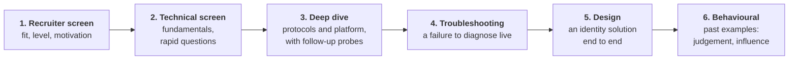

# IAM interview preparation

How to perform in a live IAM interview: what the rounds look like, how to structure an answer while someone is waiting for it, and question sets with model answers you can practise aloud.

It is aimed at a senior workforce IAM engineer role (see the [role guide](../docs/role-guide.md)) and works for IAM engineer interviews generally.

> Interview loops differ by company and change often. What follows is a **typical** shape. Ask your recruiter what the rounds are, who runs them and how long each lasts.

## The rounds

| Round | Typical length | What is being tested | Practise with |
|---|---|---|---|
| Recruiter screen | 30 min | Can you describe your work clearly; is the level right | [01](01-screen-and-fundamentals.md) |
| Technical screen | 45 min | Fundamentals: do you know *why*, not just the names | [01](01-screen-and-fundamentals.md) |
| Deep dive | 45 to 60 min | Depth: how it really works and how it fails | [02](02-technical-deep-dive.md) |
| Troubleshooting | 30 to 45 min | Method under pressure | [03](03-troubleshooting.md) |
| Design | 45 to 60 min | Scoping, trade-offs, failure handling, rollout | [04](04-solution-design.md) |
| Behavioural | 45 min | Ownership, ambiguity, communication, influence | [05](05-behavioural.md) |
| Full practice loops | | All of the above, timed | [06](06-mock-interviews.md) |

For a governance, strategy or federal ICAM role the process is usually shorter (a recruiter pre-screen, then one interview with the hiring manager and technical lead) and weighted towards approach and communication. That process is documented in [07](07-governance-icam-interview.md).

## How to answer in real time

The hardest part of a live interview is not knowing the material. It is organising it in ten seconds while someone watches. Use a fixed shape for each kind of question so you never start from nothing.

### For a "what is" or "explain" question: answer, mechanism, failure, example

| Part | Sentence starter | Time |
|---|---|---|
| **Answer** | "In one sentence, it is..." | 10 s |
| **Mechanism** | "It works by..." | 30 s |
| **Failure** | "Where it goes wrong is..." | 20 s |
| **Example** | "For example, when I..." | 20 s |

The third part is what separates a senior answer from a textbook one. Anyone can define SCIM. Saying "the common failure is a vendor that supports create but not deactivate, so leavers keep their accounts" shows you have operated it.

### For a "how would you" or design question: clarify first

Never start designing immediately. Ask two or three questions, state your assumptions aloud, then proceed. The full method is in [04](04-solution-design.md).

### For a troubleshooting question: narrow before you guess

Scope, layer, evidence, fix, prevent. The full method is in [03](03-troubleshooting.md).

### For a behavioural question: situation, task, action, result

Spend most of the time on **your** actions and the result. The method is in [05](05-behavioural.md).

## Habits that help live

| Habit | Why |
|---|---|
| **Pause for three seconds before answering** | It reads as thoughtful, and it gives you the first sentence |
| **Say the structure first**: "There are three parts to this" | The interviewer can follow, and you can find your place again |
| **Think aloud** | They are assessing how you reason, not just the answer |
| **Check in**: "Should I go deeper on this, or move on?" | Lets them steer you to what they want to score |
| **Say when you do not know**: "I have not used that. Here is how I would reason about it." | Guessing confidently is what fails senior interviews |
| **Tie everything to risk and to speed** | Shows you understand both halves of the role |
| **Use plain words** | Explaining simply is itself a listed requirement |

## What interviewers score

A typical rubric, simplified. Read it before each practice session and mark yourself afterwards.

| Dimension | Weak | Strong |
|---|---|---|
| **Scoping** | Jumps to a product or an answer | Clarifies populations, systems and constraints first |
| **Protocol depth** | Names tools | Explains the mechanism and its real failure modes |
| **Design** | One control | Authentication, authorization, lifecycle, failure and detection together |
| **Threat thinking** | Generic | Says what each control stops, and what happens when it is bypassed |
| **Operability** | Ignored | Monitoring, retries, runbooks, a measured target such as time to remove a leaver |
| **Governance** | Ignored | Evidence produced as a by-product of the design |
| **Adoption** | A design on paper | A rollout plan and a way to bring teams along |
| **Communication** | Hard to follow | Structured, checks in, can explain it to a non-expert |
| **Ownership** | Vague, "we did" | Specific actions, numbers, owns mistakes |

## How to practise

1. **Cover the answer.** Every model answer in these files is folded. Say your own answer aloud first, then open it.
2. **Record yourself.** Play it back once. You will hear filler and missing structure immediately.
3. **Time it.** A spoken answer should be 60 to 90 seconds unless asked to go deeper.
4. **Practise the follow-ups.** The first question is easy. The third "why?" is where the score is decided.
5. **Use a partner or an AI assistant as interviewer** for the mock loops in [06](06-mock-interviews.md), and ask to be interrupted.

## A four-week plan

| Week | Focus | Material |
|---|---|---|
| 1 | Fundamentals, spoken fluently | [01](01-screen-and-fundamentals.md); chapters 00 to 04 |
| 2 | Protocol and lifecycle depth | [02](02-technical-deep-dive.md); chapters 03, 13, 14, 15; lab 05 |
| 3 | Troubleshooting and design | [03](03-troubleshooting.md), [04](04-solution-design.md); chapters 16, 17 |
| 4 | Stories and full mock loops | [05](05-behavioural.md), [06](06-mock-interviews.md) |

## The day before

- Re-read your own stories, not new material.
- Redraw three diagrams from memory: OIDC authorization code flow, SAML flow, HR to IdP to app lifecycle.
- Prepare three questions to ask them (examples in [05](05-behavioural.md)).
- Have paper, or a shared whiteboard you have already tried, ready for the design round.
