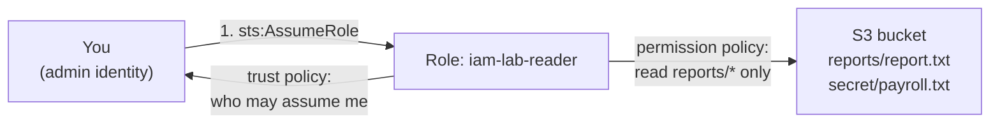

# Lab 01. AWS IAM: policies, roles and AssumeRole

## Goal

Create a least-privilege role, assume it, and watch AWS allow, implicitly deny and explicitly deny requests.

Read [chapter 10](../../docs/10-cloud-iam.md) first.

## What you are building



## Before you start

Run every command from this folder (`labs/01-aws-iam`). Your CLI must be signed in as an admin (lab 00).

## Step 1. Set variables

```bash
export ACCOUNT_ID=$(aws sts get-caller-identity --query Account --output text)
export BUCKET="iam-lab-$ACCOUNT_ID"
echo "$ACCOUNT_ID $BUCKET"
```

## Step 2. Create a bucket with two files

```bash
aws s3 mb "s3://$BUCKET"
echo "Q3 report" | aws s3 cp - "s3://$BUCKET/reports/report.txt"
echo "salaries"  | aws s3 cp - "s3://$BUCKET/secret/payroll.txt"
```

## Step 3. Fill in the policy templates

The files in `policies/` contain the placeholders `ACCOUNT_ID` and `BUCKET_NAME`. This writes filled-in copies to `out/`:

```bash
mkdir -p out
for f in policies/*.json; do
  sed -e "s/ACCOUNT_ID/$ACCOUNT_ID/g" -e "s/BUCKET_NAME/$BUCKET/g" "$f" > "out/$(basename "$f")"
done
```

Open the three files in `out/` and read them before going on:

| File | What it is |
|---|---|
| `trust-policy.json` | **Who** may assume the role: principals in your own account |
| `permission-policy.json` | **What** the role may do: list and read `reports/` only |
| `deny-policy.json` | An explicit deny on reading objects, used in step 8 |

## Step 4. Create the role

```bash
aws iam create-role --role-name iam-lab-reader \
  --assume-role-policy-document file://out/trust-policy.json
```

```bash
aws iam put-role-policy --role-name iam-lab-reader \
  --policy-name read-reports --policy-document file://out/permission-policy.json
```

## Step 5. Assume the role

Ask STS for temporary credentials and load them into this terminal:

```bash
CREDS=$(aws sts assume-role \
  --role-arn "arn:aws:iam::$ACCOUNT_ID:role/iam-lab-reader" \
  --role-session-name lab01 \
  --query 'Credentials.[AccessKeyId,SecretAccessKey,SessionToken]' --output text)
export AWS_ACCESS_KEY_ID=$(echo "$CREDS" | cut -f1)
export AWS_SECRET_ACCESS_KEY=$(echo "$CREDS" | cut -f2)
export AWS_SESSION_TOKEN=$(echo "$CREDS" | cut -f3)
```

If you get `AccessDenied` straight after creating the role, wait ten seconds and retry. IAM changes take a moment to spread.

Check who you are now:

```bash
aws sts get-caller-identity
```

The ARN should contain `assumed-role/iam-lab-reader/lab01`. These credentials expire in one hour.

## Step 6. Test: allowed

```bash
aws s3 cp "s3://$BUCKET/reports/report.txt" -
```

Expected: `Q3 report`.

## Step 7. Test: implicit deny

Nothing allows these, so the default (deny) applies.

```bash
aws s3 cp "s3://$BUCKET/secret/payroll.txt" -
```

```bash
echo "x" | aws s3 cp - "s3://$BUCKET/reports/new.txt"
```

```bash
aws s3 ls
```

Expected: each fails with `AccessDenied` (or `403 Forbidden`). Reading outside `reports/`, writing, and listing all buckets were never allowed.

## Step 8. Test: explicit deny wins

Go back to your admin identity:

```bash
unset AWS_ACCESS_KEY_ID AWS_SECRET_ACCESS_KEY AWS_SESSION_TOKEN
```

Add a second policy that denies reading objects. The allow from step 4 is still attached.

```bash
aws iam put-role-policy --role-name iam-lab-reader \
  --policy-name deny-read --policy-document file://out/deny-policy.json
```

Ask the policy simulator what the role can do now:

```bash
aws iam simulate-principal-policy \
  --policy-source-arn "arn:aws:iam::$ACCOUNT_ID:role/iam-lab-reader" \
  --action-names s3:GetObject s3:PutObject \
  --resource-arns "arn:aws:s3:::$BUCKET/reports/report.txt" \
  --query 'EvaluationResults[].[EvalActionName,EvalDecision]' --output table
```

Expected:

| Action | Decision | Why |
|---|---|---|
| `s3:GetObject` | `explicitDeny` | Allow and deny both match; deny wins |
| `s3:PutObject` | `implicitDeny` | No statement mentions it |

Remove the deny and run the simulator again. `s3:GetObject` becomes `allowed`.

```bash
aws iam delete-role-policy --role-name iam-lab-reader --policy-name deny-read
```

## Break it

1. Edit `out/trust-policy.json` and change the account ID to `111111111111`. Apply it:

```bash
aws iam update-assume-role-policy --role-name iam-lab-reader \
  --policy-document file://out/trust-policy.json
```

2. Repeat step 5. It fails, even though you are an administrator, because the role no longer trusts your account. **The trust policy and the permission policy are separate locks.**
3. Regenerate `out/` (step 3) and apply the correct trust policy to fix it.

## What you proved

- A role has two policies: trust (who may assume) and permission (what it may do).
- STS issues temporary credentials; nothing long-lived was created.
- Default is deny. An explicit deny beats any allow.
- You can test a policy with the simulator without making real calls.

Interview phrasing: "I built a least-privilege role scoped to one S3 prefix, verified it by assuming the role, and used the policy simulator to show the difference between implicit and explicit deny."

## Clean up

```bash
unset AWS_ACCESS_KEY_ID AWS_SECRET_ACCESS_KEY AWS_SESSION_TOKEN
aws iam delete-role-policy --role-name iam-lab-reader --policy-name read-reports
aws iam delete-role --role-name iam-lab-reader
aws s3 rb "s3://$BUCKET" --force
rm -rf out
```

Next: [Lab 02. AKS identity](../02-aks-identity/README.md)
