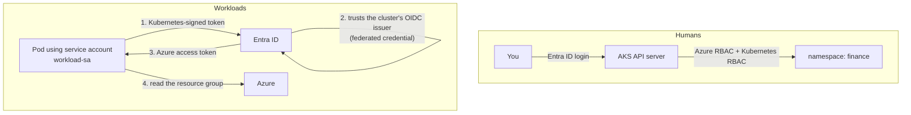
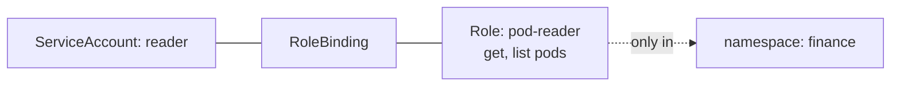

# Lab 02. AKS identity: Entra ID, Kubernetes RBAC and workload identity

## Goal

Build an AKS cluster where humans sign in with Entra ID, permissions are limited with RBAC, and a pod reaches Azure with no stored secret.

Read chapters [04](../../docs/04-authorization.md), [08](../../docs/08-non-human-identity.md) and [10](../../docs/10-cloud-iam.md) first.

> **Cost:** this lab runs one small virtual machine. It is billed for as long as the cluster exists. Do the clean-up step when you finish.

## What you are building



There are three layers of identity here. Keeping them apart is the point of the lab.

| Layer | Question | Technology |
|---|---|---|
| A | Who may talk to the cluster? | Entra ID + Azure RBAC |
| B | What may they do inside it? | Kubernetes RBAC |
| C | What may a pod do in Azure? | Workload identity |

## Before you start

Run every command from this folder (`labs/02-aks-identity`), signed in with `az login`.

```bash
export RG=iam-lab-rg
export AKS=iam-lab-aks
export LOCATION=eastus
```

## Part A. Humans: Entra ID and Azure RBAC

### Step 1. Create the cluster

```bash
az group create --name $RG --location $LOCATION
```

```bash
az aks create --resource-group $RG --name $AKS \
  --node-count 1 --node-vm-size Standard_B2s --tier free \
  --enable-aad --enable-azure-rbac \
  --enable-oidc-issuer --enable-workload-identity \
  --generate-ssh-keys
```

This takes about five minutes. What the flags mean:

| Flag | Meaning |
|---|---|
| `--enable-aad` | Users authenticate with Entra ID |
| `--enable-azure-rbac` | Azure role assignments decide what they can do in the cluster |
| `--enable-oidc-issuer` | The cluster publishes keys so others can verify its tokens (part C) |
| `--enable-workload-identity` | Pods can exchange those tokens for Azure tokens (part C) |

If the VM size is not available in your subscription, pick another small size or region.

### Step 2. Try to use it and get refused

```bash
az aks install-cli
az aks get-credentials --resource-group $RG --name $AKS
kubectl get nodes
```

Expected: a browser or device login, then **Forbidden**. You created the cluster, but creating it and being allowed inside it are different permissions. Authentication worked; authorization said no.

### Step 3. Give yourself a role

```bash
export AKS_ID=$(az aks show -g $RG -n $AKS --query id -o tsv)
export ME=$(az ad signed-in-user show --query id -o tsv)
az role assignment create --assignee $ME \
  --role "Azure Kubernetes Service RBAC Cluster Admin" --scope $AKS_ID
```

Wait a minute, then:

```bash
kubectl get nodes
```

Expected: one node, `Ready`. Note the three parts of the assignment from chapter 10: principal (`$ME`), role definition, scope (`$AKS_ID`).

## Part B. Inside the cluster: Kubernetes RBAC

### Step 4. Create a namespace, a role and a binding

Read `manifests/rbac.yaml`, then apply it:

```bash
kubectl apply -f manifests/rbac.yaml
```

It creates the `finance` namespace, a service account `reader`, a Role `pod-reader` (get and list pods), and a RoleBinding joining the two.



### Step 5. Ask what the service account may do

`kubectl auth can-i` answers authorization questions without doing anything.

```bash
kubectl auth can-i list pods   -n finance --as system:serviceaccount:finance:reader
kubectl auth can-i delete pods -n finance --as system:serviceaccount:finance:reader
kubectl auth can-i list pods   -n default --as system:serviceaccount:finance:reader
```

Expected: `yes`, `no`, `no`. Allowed verb in the right namespace; a verb it was never given; the right verb in the wrong namespace.

## Part C. Workloads: a pod reaching Azure with no secret

### Step 6. Create a managed identity

```bash
az identity create --resource-group $RG --name iam-lab-workload
export CLIENT_ID=$(az identity show -g $RG -n iam-lab-workload --query clientId -o tsv)
export PRINCIPAL_ID=$(az identity show -g $RG -n iam-lab-workload --query principalId -o tsv)
```

### Step 7. Give it one narrow permission

Reader on this resource group only.

```bash
export RG_ID=$(az group show -n $RG --query id -o tsv)
az role assignment create --assignee-object-id $PRINCIPAL_ID \
  --assignee-principal-type ServicePrincipal --role Reader --scope $RG_ID
```

### Step 8. Tell Entra ID to trust the cluster

This is the federation step. It says: "a token issued by *this cluster* for *this service account* may act as this identity."

```bash
export ISSUER=$(az aks show -g $RG -n $AKS --query oidcIssuerProfile.issuerUrl -o tsv)
az identity federated-credential create --name iam-lab-fed \
  --identity-name iam-lab-workload --resource-group $RG \
  --issuer "$ISSUER" \
  --subject system:serviceaccount:finance:workload-sa \
  --audience api://AzureADTokenExchange
```

Compare with lab 01: `issuer` plus `subject` is the Azure equivalent of an AWS trust policy.

### Step 9. Run a pod that uses it

`manifests/workload.yaml` has two placeholders. Fill them in and apply:

```bash
export TENANT_ID=$(az account show --query tenantId -o tsv)
sed -e "s/CLIENT_ID_PLACEHOLDER/$CLIENT_ID/" -e "s/RG_PLACEHOLDER/$RG/" \
  manifests/workload.yaml | kubectl apply -f -
```

```bash
kubectl wait --for=condition=Ready pod/workload-demo -n finance --timeout=180s
kubectl logs workload-demo -n finance
```

Expected: the log shows a successful login followed by the resource group's name and location. The pod read from Azure, and at no point did you create, store or mount a password or key.

### Step 10. Look at the token

```bash
kubectl exec workload-demo -n finance -- sh -c 'cat $AZURE_FEDERATED_TOKEN_FILE' \
  | cut -d. -f2 | tr '_-' '/+' | awk '{l=length($0)%4; if(l==2)$0=$0"=="; if(l==3)$0=$0"="; print}' | base64 -d | jq .
```

Find the claims from chapter 03: `iss` is your cluster's issuer URL, `sub` is `system:serviceaccount:finance:workload-sa`, `aud` is `api://AzureADTokenExchange`. Those are the three values you registered in step 8.

## Break it

1. Delete the federated credential:

```bash
az identity federated-credential delete --name iam-lab-fed \
  --identity-name iam-lab-workload --resource-group $RG --yes
```

2. Restart the pod and read the log:

```bash
kubectl delete pod workload-demo -n finance
sed -e "s/CLIENT_ID_PLACEHOLDER/$CLIENT_ID/" -e "s/RG_PLACEHOLDER/$RG/" \
  manifests/workload.yaml | kubectl apply -f -
sleep 60; kubectl logs workload-demo -n finance
```

The login fails with an error saying no matching federated identity record was found. The pod and its token are unchanged; Entra ID simply no longer trusts them.

## What you proved

- Authenticating to a cluster and being authorized in it are separate.
- Azure RBAC assignments are principal + role + scope.
- Kubernetes RBAC is Role + RoleBinding, limited by namespace.
- Workload identity replaces stored secrets with a trust relationship (issuer + subject) and short-lived tokens.

Interview phrasing: "I set up an AKS cluster with Entra ID authentication and Azure RBAC, scoped in-cluster access with Kubernetes RBAC, and used workload identity federation so pods get Azure tokens without any stored credential."

## Clean up

This deletes the cluster, the identity and everything else in the resource group.

```bash
az group delete --name $RG --yes --no-wait
kubectl config delete-context $AKS
```

Next: [Lab 03. CyberArk Conjur](../03-cyberark-conjur/README.md)
