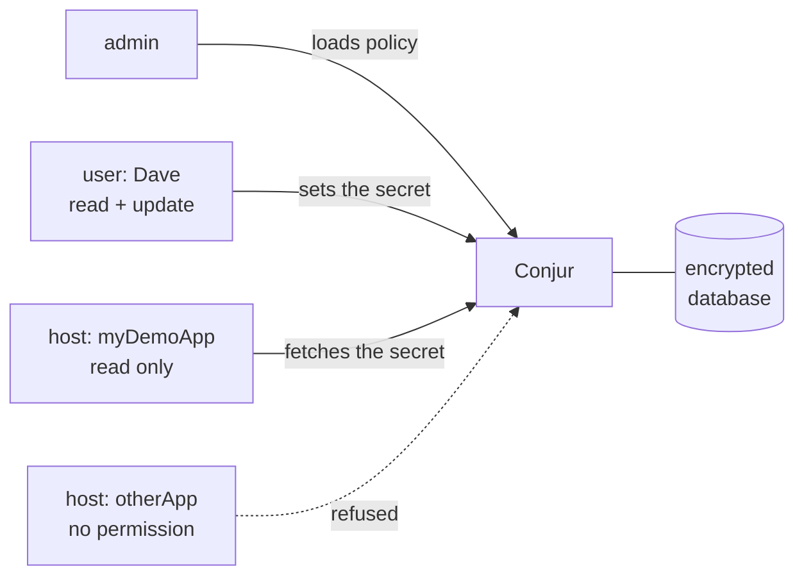

# Lab 03. CyberArk Conjur: secrets under policy

## Goal

Run CyberArk's open-source secrets manager, write a policy, and show that an application identity can read a secret while everyone else is refused.

Read chapters [06](../../docs/06-privileged-access.md), [08](../../docs/08-non-human-identity.md) and [09](../../docs/09-secrets-certificates.md) first.

## Where Conjur sits in CyberArk

CyberArk's commercial PAM suite has no free edition. Conjur Open Source is the part you can run yourself, and the ideas carry over.

| CyberArk PAM component | What it does | Closest thing in this lab |
|---|---|---|
| **Digital Vault** | Encrypted store for privileged credentials | Conjur's encrypted database |
| **Safe** | Container for accounts, with its own access list | A Conjur **policy** branch (`BotApp`) |
| **Safe member permissions** | Who may use, retrieve or manage accounts in a Safe | `!permit` statements |
| **PVWA** (web portal) | Where humans request and check out access | The REST API you call here |
| **CPM** (Central Policy Manager) | Rotates passwords on target systems | Setting a new value on the variable (step 8) |
| **PSM** (Privileged Session Manager) | Proxies and records admin sessions | Not covered: human sessions only |
| **Conjur / Secrets Manager** | Secrets for applications and pipelines | This lab |

## What you are building



In Conjur, a **user** is a human, a **host** is a machine or application, and a **variable** is a secret.

## Before you start

Docker Desktop must be running. Run every command from this folder (`labs/03-cyberark-conjur`).

## Step 1. Generate the master key and start Conjur

The data key encrypts everything in the database.

```bash
docker compose run --no-deps --rm conjur data-key generate > data_key
export CONJUR_DATA_KEY="$(< data_key)"
docker compose up -d
```

Wait about 20 seconds for it to start.

## Step 2. Create an account

```bash
docker compose exec conjur conjurctl account create lab > admin_data
grep "API key" admin_data
```

`admin_data` now holds the admin API key. Treat it like a root password. It is in `.gitignore`.

## Step 3. Load the helper functions

`conjur.sh` wraps the REST API in four small shell functions so you can see exactly what is sent.

```bash
source conjur.sh
```

| Function | What it does |
|---|---|
| `conjur_login <identity> <api-key>` | Exchanges an API key for a short-lived access token |
| `conjur_policy <file>` | Loads a policy file |
| `conjur_set <variable> <value>` | Stores a secret value |
| `conjur_get <variable>` | Reads a secret value |

## Step 4. Log in as admin and load the policy

Read `policy.yml` first. It declares one human, two applications, one secret, and who may do what.

```bash
conjur_login admin "$(grep 'API key' admin_data | awk '{print $NF}')"
conjur_policy policy.yml | tee policy_out.token
```

The response lists the API keys Conjur generated for Dave and the two hosts. They are shown once. Save them:

```bash
export DAVE_KEY=$(jq -r '.created_roles["lab:user:Dave@BotApp"].api_key' policy_out.token)
export APP_KEY=$(jq -r '.created_roles["lab:host:BotApp/myDemoApp"].api_key' policy_out.token)
export OTHER_KEY=$(jq -r '.created_roles["lab:host:BotApp/otherApp"].api_key' policy_out.token)
```

## Step 5. As Dave, store the secret

```bash
conjur_login Dave@BotApp "$DAVE_KEY"
conjur_set BotApp/dbPassword "s3cr3t-$(date +%s)"
```

## Step 6. As the application, read it

```bash
conjur_login host/BotApp/myDemoApp "$APP_KEY"
conjur_get BotApp/dbPassword
```

Expected: the value Dave stored.

## Step 7. Least privilege in action

The application has `read` and `execute` but not `update`:

```bash
conjur_set BotApp/dbPassword "overwritten"
```

Expected: HTTP `403`.

The other application was declared but given no permission on the secret:

```bash
conjur_login host/BotApp/otherApp "$OTHER_KEY"
conjur_get BotApp/dbPassword
```

Expected: HTTP `403` or `404`. Conjur does not reveal whether a secret exists to an identity that cannot read it.

## Step 8. Rotate

```bash
conjur_login Dave@BotApp "$DAVE_KEY"
conjur_set BotApp/dbPassword "rotated-$(date +%s)"
conjur_login host/BotApp/myDemoApp "$APP_KEY"
conjur_get BotApp/dbPassword
```

The application gets the new value on its next fetch, with no redeploy. This is why applications should fetch secrets at run time rather than have them baked in.

## Break it

Edit `policy.yml` and remove `execute` from myDemoApp's privileges, leaving only `read`. Reload as admin and try to fetch as the app:

```bash
conjur_login admin "$(grep 'API key' admin_data | awk '{print $NF}')"
conjur_policy policy.yml
conjur_login host/BotApp/myDemoApp "$APP_KEY"
conjur_get BotApp/dbPassword
```

In Conjur, `read` lets an identity see that the variable exists; `execute` is what lets it fetch the value. Put `execute` back and reload to fix it.

## What you proved

- Secrets live in one encrypted store, not in code.
- Humans and machines are separate identity types with separate permissions.
- Access is declared as policy in a file you can review and version.
- Access tokens are short-lived; the API key is only used to obtain one.
- Rotation does not require changing the application.

Interview phrasing: "I deployed Conjur, modelled an application and a human operator in policy, verified least privilege by testing the denied paths, and rotated a secret without touching the consumer."

## Clean up

```bash
docker compose down -v
rm -f data_key admin_data policy_out.token
```

Next: [Lab 04. SailPoint-style IGA](../04-sailpoint-iga/README.md)
