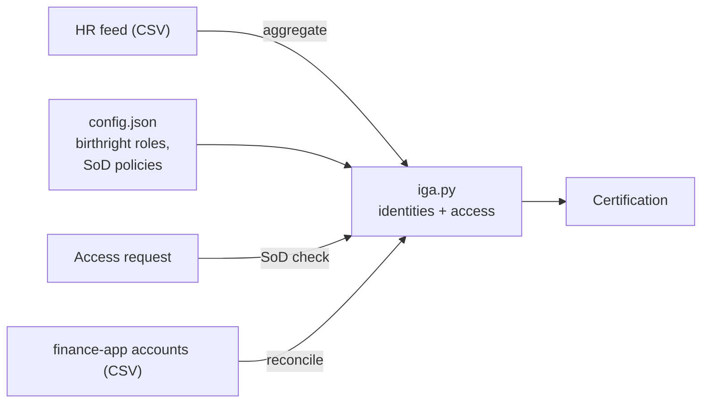

# Lab 04. SailPoint-style IGA: joiner, mover, leaver, SoD and certification

## Goal

Run a small identity governance engine and watch a mover create a separation-of-duties violation, then catch it with a scan, a certification and a reconciliation.

Read [chapter 05](../../docs/05-identity-governance.md) first.

## Why a simulator

SailPoint has no free self-service edition. `iga.py` is about 200 lines of Python that does what an IGA product does, in the same vocabulary, so you can read every decision it makes.

| SailPoint term | Meaning | In this lab |
|---|---|---|
| **Source** (authoritative) | A system identities are read from | `feeds/day1.csv`, `feeds/day2.csv` (the HR feed) |
| **Aggregation** | Reading accounts from a source | `iga.py aggregate` |
| **Identity** (identity cube) | One person, with all their accounts and access | An entry in `state.json` |
| **Entitlement** | One grantable item in an application | `finance-app:approve-payment` |
| **Role / access profile** | A bundle of entitlements | `birthright` in `config.json` |
| **Lifecycle state** | active, inactive | `status` |
| **Access request** | A user asking for more | `iga.py request` |
| **SoD policy** | A forbidden combination | `sod_policies` in `config.json` |
| **Certification campaign** | A periodic access review | `iga.py certify` |
| **Account aggregation / reconciliation** | Comparing an app's real accounts with what is expected | `iga.py reconcile` |

## What you are building



## Before you start

Python 3 only. Run every command from this folder (`labs/04-sailpoint-iga`). Read `config.json` first: it holds the birthright roles and one SoD policy (creating a vendor and approving a payment must not be held together).

## Step 1. Day 1: joiners

```bash
python3 iga.py aggregate feeds/day1.csv
```

Expected: four `JOINER` lines. Each person gets email and intranet (everyone's birthright) plus their department's access. Priya in Finance gets `finance-app:reader`; Asha in Procurement gets `finance-app:create-vendor`.

## Step 2. An access request that is approved

Priya needs to approve payments.

```bash
python3 iga.py request E001 finance-app:approve-payment
```

Expected: `GRANTED`. She holds `reader` and `approve-payment`, which do not conflict.

## Step 3. An access request that is blocked

Asha, who can create vendors, asks for the same thing.

```bash
python3 iga.py request E003 finance-app:approve-payment
```

Expected: `BLOCKED by SoD policy 'Vendor fraud'`. This is a **preventive** control: the toxic combination is stopped before it exists.

## Step 4. Day 2: a mover, a joiner and a leaver

Open `feeds/day2.csv`. Priya's department is now Procurement, Tom is missing, Lena is new.

```bash
python3 iga.py aggregate feeds/day2.csv
```

Expected:

- `MOVER` Priya: old birthright removed, new birthright (`create-vendor`) added, and her earlier request for `approve-payment` **kept and flagged for review**.
- `JOINER` Lena.
- `LEAVER` Tom: all access removed, status inactive.

## Step 5. The violation nobody requested

```bash
python3 iga.py sod
```

Expected: `VIOLATION E001 Priya Shah: 'Vendor fraud'`.

Nobody asked for a toxic combination. Each grant was valid when it was made. The move created the conflict. This is the privilege creep from chapter 05, and it is why a **detective** scan is needed as well as the preventive check in step 3.

## Step 6. Certification

Priya's new manager reviews her non-birthright access.

```bash
python3 iga.py certify
```

The line is flagged as an SoD violation. Record the decision to revoke:

```bash
python3 iga.py certify --revoke E001 finance-app:approve-payment
```

```bash
python3 iga.py sod
```

Expected: `No SoD violations`.

## Step 7. Reconciliation: what the application really has

So far you have looked at what the IGA engine *believes*. `feeds/finance-app-accounts.csv` is what the finance application *actually* contains.

```bash
python3 iga.py reconcile finance-app feeds/finance-app-accounts.csv
```

Expected:

| Finding | Account | Meaning |
|---|---|---|
| `OUT OF BAND` | asha.rao | Someone granted `approve-payment` directly in the app, bypassing the SoD check from step 3 |
| `LEAVER ACTIVE` | tom.lee | Tom left, but his account in the app was never disabled |
| `ORPHAN` | svc-legacy | An account with powerful access and no owner |

These three are the findings auditors and attackers both look for.

## Break it

1. In `config.json`, delete the entry in `sod_policies` so the list is empty (`[]`).
2. Run `python3 iga.py reset`, then repeat steps 1 to 5. Asha's request in step 3 is now granted and the scan in step 5 reports nothing. The risk has not gone; you have stopped looking for it.
3. Restore the policy with `git checkout config.json`.

## What you proved

- Lifecycle events come from an authoritative source, not from tickets.
- Birthright access follows the role; requested access needs review on every move.
- SoD needs both a preventive check (at request time) and a detective scan (after changes).
- Reconciliation finds what governance missed: out-of-band grants, leaver accounts and orphans.

Interview phrasing: "I modelled joiner, mover and leaver processing from an HR source, showed how a mover can create an SoD violation from two individually valid grants, and used certification and reconciliation to detect and remediate it."

## With a real SailPoint tenant

If you get access to SailPoint Identity Security Cloud through an employer or partner programme, the same steps map to its REST API. Create a personal access token in the tenant, then:

```bash
export TENANT=your-tenant
export TOKEN=$(curl -s -X POST "https://$TENANT.api.identitynow.com/oauth/token" \
  -d grant_type=client_credentials -d client_id="$SP_CLIENT_ID" -d client_secret="$SP_CLIENT_SECRET" \
  | jq -r .access_token)
```

```bash
curl -s -H "Authorization: Bearer $TOKEN" "https://$TENANT.api.identitynow.com/v3/sources" | jq '.[].name'
```

The same pattern lists `/v3/access-profiles` and `/v3/roles`. Check the paths against the current reference at developer.sailpoint.com before relying on them; they have not been tested from this repo.

For a full open-source IGA product with a web interface, look at Evolveum midPoint.

## Clean up

```bash
python3 iga.py reset
```
