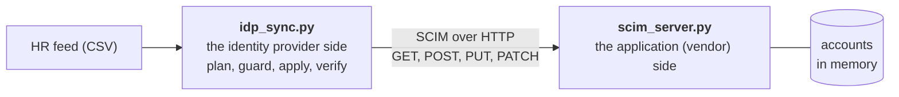

# Lab 05. SCIM provisioning: both sides of the wire

## Goal

Run an application's SCIM server and an identity provider's sync job, and watch joiners, movers and leavers flow from an HR feed into application accounts, including the ways it goes wrong.

Read chapters [13](../../docs/13-workforce-identity-lifecycle.md) and [14](../../docs/14-provisioning-and-integration-patterns.md) first.

## What you are building



| File | Plays the part of |
|---|---|
| `scim_server.py` | A third-party application's SCIM API |
| `idp_sync.py` | Okta, Entra ID or SailPoint pushing changes |
| `feeds/day1.csv`, `feeds/day2.csv` | The HCM |
| `feeds/empty.csv` | An HR export that failed |

Read both scripts. Together they are about 250 lines, and every idea in chapters 13 and 14 is visible in them.

## Before you start

Python 3 only. You need two terminals, both in this folder (`labs/05-scim-provisioning`).

## Step 1. Start the application

Terminal 1:

```bash
python3 scim_server.py
```

Leave it running. It logs every request it receives, which is how you see the protocol.

## Step 2. Dry run

Terminal 2:

```bash
python3 idp_sync.py feeds/day1.csv --dry-run
```

Expected: four `CREATE` lines and `Dry run: no changes made`. In terminal 1 you see a single `GET /scim/v2/Users`: the sync read the actual state and changed nothing.

## Step 3. Joiners

```bash
python3 idp_sync.py feeds/day1.csv
```

Expected: `Applied 4 of 4 changes`. Terminal 1 shows four `POST` requests answered `201`.

## Step 4. Idempotency

Run exactly the same command again:

```bash
python3 idp_sync.py feeds/day1.csv
```

Expected: `In sync: nothing to do`. No duplicates. A sync that is safe to repeat can be retried after any failure.

## Step 5. Look at a user the way an identity provider does

```bash
curl -s -H "Authorization: Bearer lab-token" \
  'http://127.0.0.1:8081/scim/v2/Users?filter=userName%20eq%20%22tom.lee@example.com%22' | python3 -m json.tool
```

Find these in the output:

| Field | Set by | Purpose |
|---|---|---|
| `id` | The application | Used in the URL for later updates |
| `externalId` | The identity provider | The worker ID: the matching key |
| `userName` | The identity provider | Login name |
| `active` | The identity provider | `true` until the person leaves |

## Step 6. Day 2: mover, joiner, leaver

Compare `feeds/day1.csv` with `feeds/day2.csv`: Priya changed department, Tom is gone, Lena is new.

```bash
python3 idp_sync.py feeds/day2.csv
```

Expected:

| Line | Request in terminal 1 | Meaning |
|---|---|---|
| `UPDATE priya.shah@example.com` | `PUT` | Mover: department replaced |
| `CREATE lena.park@example.com` | `POST` | Joiner |
| `DEACTIVATE tom.lee@example.com` | `PATCH` | Leaver: `active` set to `false`, account kept |

Repeat the curl from step 5. Tom still exists, with `"active": false`.

## Step 7. The bad feed

One night the HR export fails and produces a file with a header and no rows.

```bash
python3 idp_sync.py feeds/empty.csv
```

Expected: `HALTED: this run would deactivate 4 of 4 active accounts, above the 50% limit.` Nothing was changed.

Without this guard the job would have locked out the whole company. See it for yourself with a dry run:

```bash
python3 idp_sync.py feeds/empty.csv --max-deactivate-pct 100 --dry-run
```

## Step 8. Rehire

Tom comes back. Sync day 1 again:

```bash
python3 idp_sync.py feeds/day1.csv
```

Expected: `REACTIVATE tom.lee@example.com`. The same account is switched back on, matched by worker ID. No second account was created.

## Break it

### A. Wrong credentials

```bash
python3 idp_sync.py feeds/day1.csv --token wrong
```

Expected: `HTTP 401`. The SCIM bearer token is a powerful secret: whoever holds it can create and disable accounts in the application.

### B. A vendor that does not really deactivate

Stop the server in terminal 1 with Ctrl+C and restart it imitating a vendor whose SCIM accepts deactivation, answers success, and does nothing:

```bash
SCIM_NO_DEACTIVATE=1 python3 scim_server.py
```

Terminal 2:

```bash
python3 idp_sync.py feeds/day1.csv
python3 idp_sync.py feeds/day2.csv
```

Expected on the second command: `FAILED tom.lee@example.com: the app answered 200 but the account is still active`, and a non-zero exit code.

The request succeeded and the leaver still has an account. The sync caught it only because it checks the result instead of trusting the status code. Run it again and the same `DEACTIVATE` is planned again: that repeated, never-clearing plan line is what **drift** looks like, and it is the evidence you take to the vendor.

This is the case from chapter 14: a vendor that says "we support SCIM" must be tested for deactivation specifically.

## What you proved

- SCIM is ordinary REST: look up, create, replace, patch.
- The matching key is the worker ID in `externalId`, so rehires and renames do not create duplicates.
- Leavers are deactivated, not deleted.
- A provisioning job needs a dry run, idempotency, a guard against a bad feed and verification of results.
- A `200` response is not proof.

Interview phrasing: "I built both sides of a SCIM integration. The client plans from desired versus actual state, is idempotent, halts if a feed would deactivate too many accounts, and verifies deactivations, which is how it caught a server that acknowledged the request without disabling the account."

## Going further

- Add a `/Groups` endpoint and push department groups.
- Add retry with backoff to `Scim.call` for `429` and `5xx` responses.
- Expose the server over HTTPS and point a free Okta tenant's SCIM provisioning at it (not tested in this repo).

## Clean up

Stop the server with Ctrl+C. Nothing is stored on disk.
